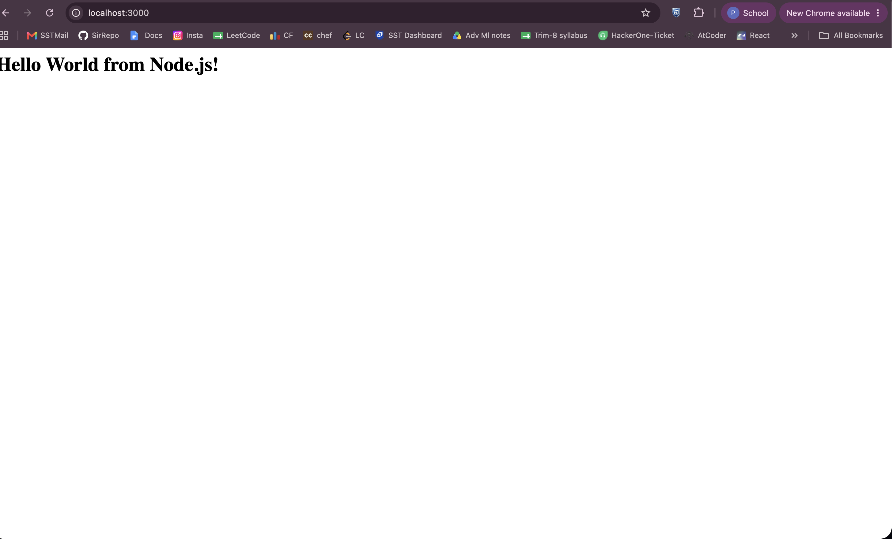
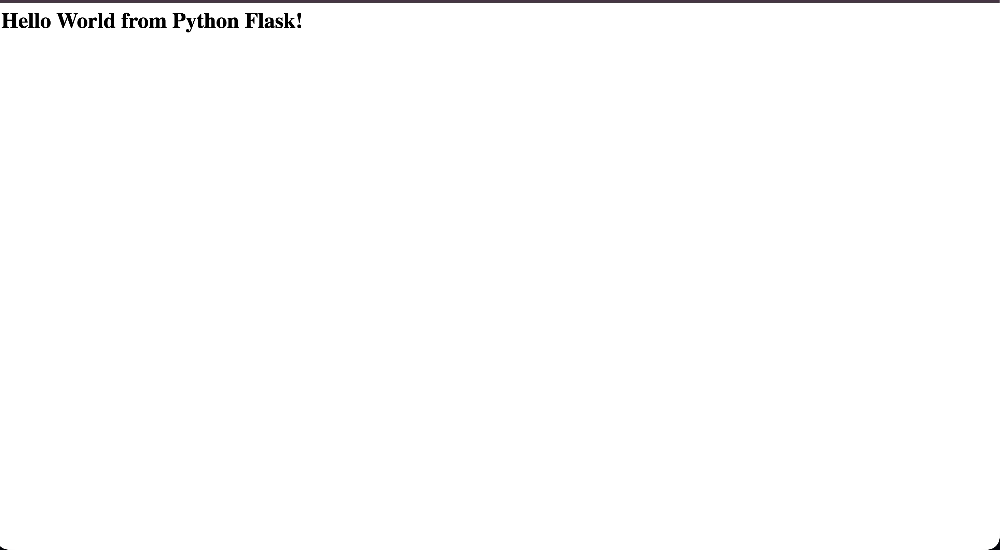
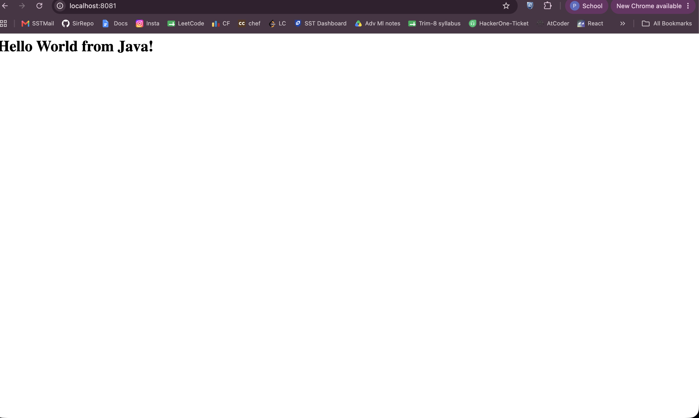
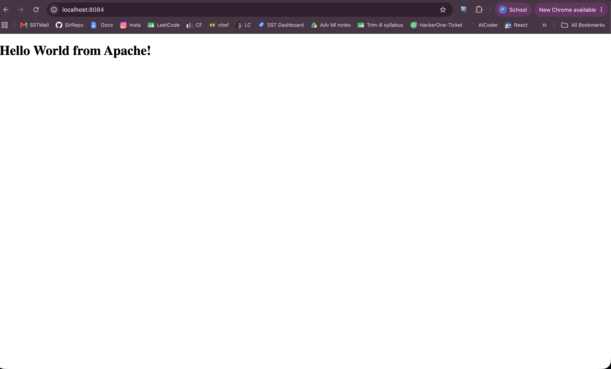
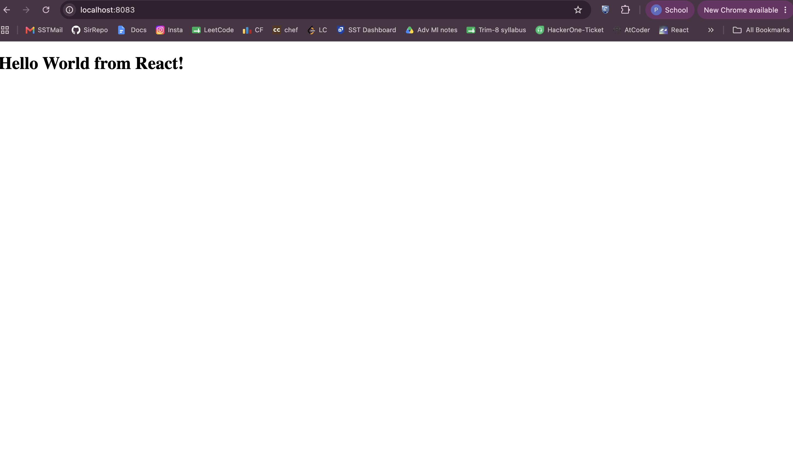

**Author:** Sathwik Perla 

**Roll no. :** 590

**mail:** perla.24bcs10590@sst.scaler.com

# Session 6 - Docker Fundamentals Lab

Created and containerized simple Hello World web applications across 6 different technology stacks using Docker: Node.js, Python (Flask), Nginx, Java, Apache HTTP Server, and React.

---

## 1. Node.js — `node-app`

```bash
cd node-app
docker build -t node-app .
docker run -d -p 3000:3000 --name node-container node-app
```



---

## 2. Python (Flask) — `python-app`

```bash
cd python-app
docker build -t python-app .
docker run -d -p 5001:5000 --name python-container python-app
```



---

## 3. Nginx — `nginx-app`

```bash
cd nginx-app
docker build -t nginx-app .
docker run -d -p 8080:80 --name nginx-container nginx-app
```


---

## 4. Java — `java-app`

```bash
cd java-app
docker build -t java-app .
docker run -d -p 8081:8080 --name java-container java-app
```



---

## 5. Apache — `Apache-app`

```bash
cd Apache-app
docker build -t apache-app .
docker run -d -p 8084:80 --name apache-container apache-app
```



---

## 6. React — `React-app`

```bash
cd React-app
docker build -t react-app .
docker run -d -p 8083:80 --name react-container react-app
```


