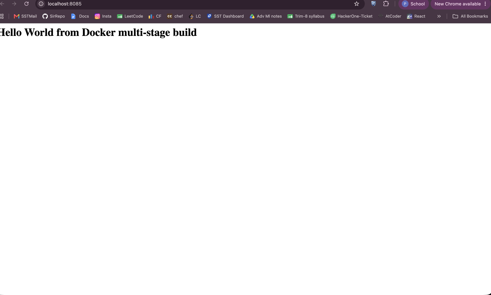
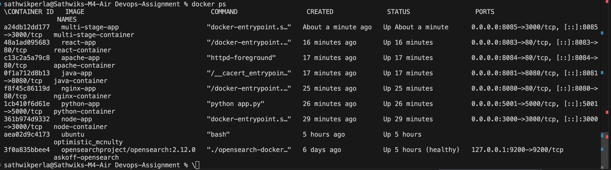

# Session 7 - Docker Multi-Stage Build Assignment

**Author:** Sathwik Perla  
**Roll Number:** 590  
**Email:** perla.24bcs10590@sst.scaler.com  

---

## Task 1: Multi-Stage Dockerfile

A multi-stage Dockerfile optimizes image size and security by separating the build environment from the final runtime container:
- **Stage 1 (Builder):** Assembles code, dependencies, and build artifacts.
- **Stage 2 (Runner):** Copies only the bare essentials needed to execute the application, discarding compilers, temporary build tools, and cache.

### Build & Run Commands
```bash
cd multi-stage-dockerfile
docker build -t multi-stage-app .
docker run -d -p 8085:3000 --name multi-stage-container multi-stage-app
curl http://localhost:8085
```

Application running at **http://localhost:8085**:



`docker ps` output confirming the container is running:



---

## Task 2: Why Multi-Stage Builds?

A standard single-stage Dockerfile bundles everything — compilers, dev dependencies, source code, and intermediate files — into the final image, resulting in image bloat and a wider attack surface.

A **multi-stage build** solves this by:
1. **Minimizing Image Size:** Only the compiled binaries and necessary production runtime assets are included in the final layer.
2. **Improving Security Posture:** Build tools (such as npm, gcc, git) do not exist in the production container, drastically reducing vulnerabilities.
3. **Simplified Pipeline:** Eliminates the need for separate external CI build scripts by handling the entire build-and-package pipeline inside a single Dockerfile.

---

## Task 3: Docker Application Deployment

Successfully deployed 3 distinct application stacks containerized using Docker in Session 6:

- **Node.js** — `Docker-Fundamentals-6/node-app/` — Node.js HTTP server running on port 3000
- **Python (Flask)** — `Docker-Fundamentals-6/python-app/` — Python web application running on port 5001  
- **Java** — `Docker-Fundamentals-6/java-app/` — Standalone Java HTTP server running on port 8081
