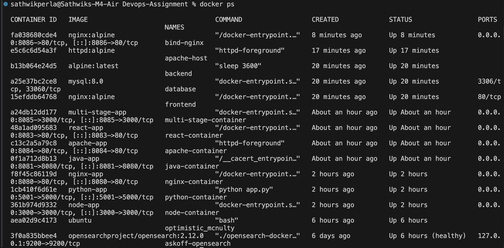
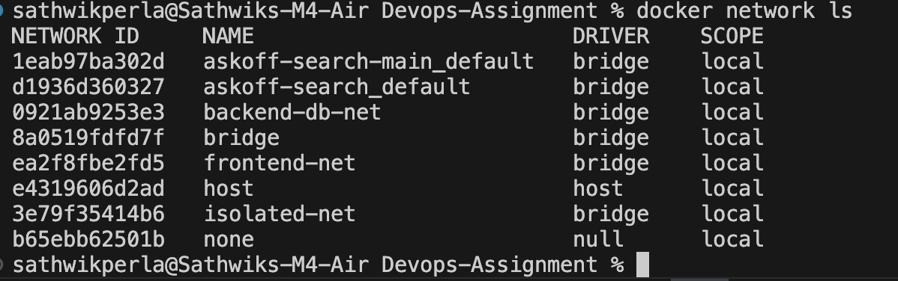
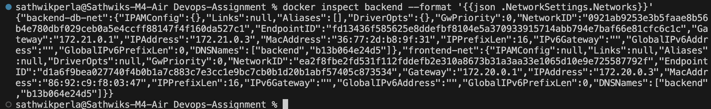
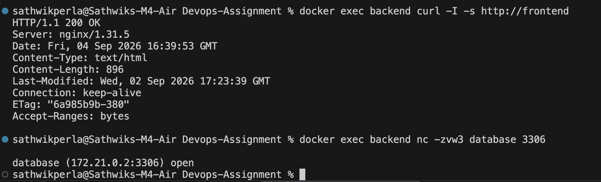

# Session 8 - Docker Networking & Volume Homework

## Student Details

- **Name:** Sathwik Perla
- **Roll Number:** 590
- **Email:** perla.24bcs10590@sst.scaler.com

---

# Task 1: Docker Container Networking

Three custom Docker bridge networks were created to establish isolated container communication:
- `frontend-net`
- `backend-db-net`
- `isolated-net`

Three containers were deployed across these networks:
- **Frontend:** `nginx:alpine` (connected to `frontend-net` and `isolated-net`)
- **Backend:** `alpine:latest` (connected to `frontend-net` and `backend-db-net`)
- **Database:** `mysql:8.0` (connected to `backend-db-net`)

### Commands Executed

```bash
# 1. Create custom Docker networks
docker network create frontend-net
docker network create backend-db-net
docker network create isolated-net

# 2. Launch frontend container and attach networks
docker run -d --name frontend --network frontend-net nginx:alpine
docker network connect isolated-net frontend

# 3. Launch database container
docker run -d --name database --network backend-db-net -e MYSQL_ROOT_PASSWORD=password mysql:8.0

# 4. Launch backend container and attach both networks
docker run -d --name backend --network frontend-net alpine:latest sleep 3600
docker network connect backend-db-net backend
```

### Connectivity Verification

1. **Backend to Frontend Connectivity:**
   ```bash
   docker exec backend curl -I -s http://frontend
   ```
   Successfully returned `HTTP/1.1 200 OK` and verified HTTP response headers over `frontend-net`.

2. **Backend to Database Connectivity:**
   ```bash
   docker exec backend nc -zvw3 database 3306
   ```
   Output: `database (172.21.0.2:3306) open` confirming TCP connectivity on port 3306 over `backend-db-net`.

3. **Network Isolation Verification:**
   ```bash
   docker exec frontend nc -zvw3 database 3306
   ```
   Output: `nc: bad address 'database'`, verifying that the database container is strictly isolated from the frontend container.

### Evidence









---

# Task 2: Host Network

The Apache HTTP Server image was pulled from Docker Hub (`httpd:alpine`) and launched using Docker's host networking mode:

```bash
docker pull httpd:alpine
docker run -d --name apache-host --network host httpd:alpine
```

In host networking mode (`--network host`), the container shares the network namespace of the host machine rather than receiving its own isolated network stack or requiring port publishing (`-p`).

### Verification

Accessing Apache on port 80:
```bash
docker exec apache-host wget -qO- http://localhost:80
```
Output:
```html
<html><body><h1>It works!</h1></body></html>
```
Confirming that Apache is actively listening directly on port 80.

### Evidence


---

# Task 3: Bind Mount

A local directory named `bind-mount-site` was created on the host containing an `index.html` file.

Initially, the file contained:
```html
<h1>Hello students</h1>
```

The directory was bind-mounted into an Nginx container named `bind-nginx` and mapped to host port 8086:
```bash
docker run -d --name bind-nginx -p 8086:80 -v $(pwd)/bind-mount-site:/usr/share/nginx/html nginx:alpine
```

Accessing `http://localhost:8086` displayed: **Hello students**.


### Dynamic File Modification

The host `index.html` file was updated directly on the host machine:
```html
<h1>Hello students - Updated!</h1>
```

Because of the direct bind mount (`-v`), the modification was reflected immediately inside the running container at `http://localhost:8086` without restarting or rebuilding the container:

```bash
curl http://localhost:8086
# Output: <h1>Hello students - Updated!</h1>
```


---

# Task 4: Overlay Network

An **overlay network** is a distributed Docker network driver that enables containers running across multiple separate Docker daemon hosts to communicate seamlessly without requiring OS-level routing configurations.

### Key Concepts and Architecture

1. **Multi-Host Clustering:**
   Overlay networks create an encrypted VXLAN (Virtual Extensible LAN) tunnel between Docker hosts, effectively encapsulating Layer 2 traffic within Layer 4 UDP packets (port 4789).

2. **Docker Swarm Integration:**
   Overlay networks are the foundational networking layer for Docker Swarm services, enabling service discovery, load balancing, and routing mesh across worker and manager nodes.

3. **Standalone Container Support (`--attachable`):**
   By specifying the `--attachable` flag during creation, standalone Docker containers can connect to the overlay network alongside Swarm services:
   ```bash
   docker network create --driver overlay --attachable multi-host-net
   ```

4. **Security & Traffic Isolation:**
   Each overlay network is completely isolated from other networks on the swarm. Docker also supports native data plane encryption using IPsec ESP with the `--opt encrypted` flag.

### Use Cases
- Distributed microservices architectures spanning multi-cloud or hybrid-cloud infrastructures.
- Clustered database topologies (e.g., MySQL replication, Cassandra nodes) across different virtual machines.
- Resilient production deployments requiring automatic rolling updates and service mesh routing.

Official Docker documentation: https://docs.docker.com/engine/network/drivers/overlay/

---

# Summary Checklist

- [x] Three Docker bridge networks created (`frontend-net`, `backend-db-net`, `isolated-net`)
- [x] Frontend, backend, and database containers deployed
- [x] Backend container successfully connected to two networks
- [x] Container connectivity and network isolation verified
- [x] Apache deployed with host networking on port 80
- [x] Nginx container deployed with local bind mount
- [x] Bind mount live file updates verified without container restart
- [x] Comprehensive research and documentation on Overlay networks
