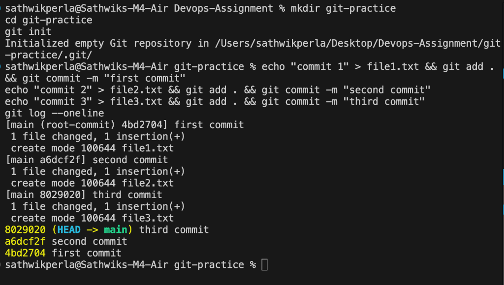
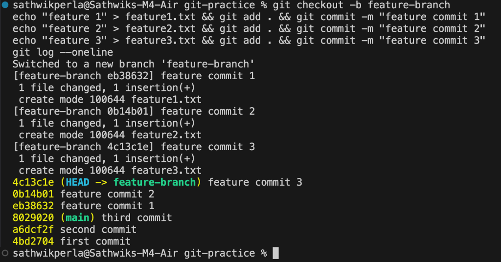
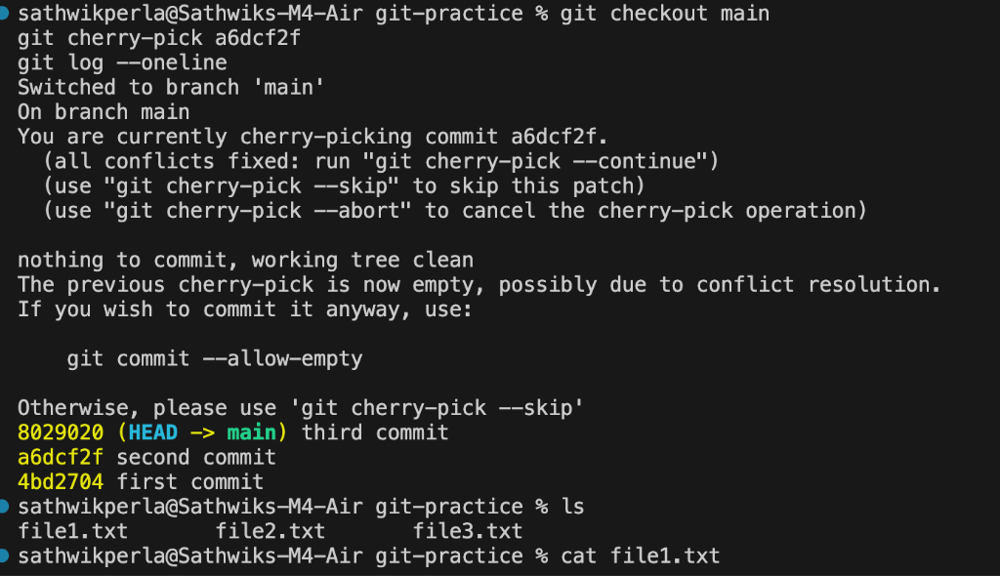

**Author:** Sathwik Perla 

**Roll no. :** 590

**mail:** perla.24bcs10590@sst.scaler.com

# Session 5 - Git & GitHub Assignment

---

## Task 1: `git commit -a -m` vs `git commit -m`

### Key Differences
- **`git commit -m "message"`**:
  Only commits files that have been explicitly staged in the index using `git add`. Untracked files and unstaged modifications are ignored.
- **`git commit -a -m "message"`**:
  Automatically stages all modified and deleted **already tracked** files and commits them in a single step, skipping manual `git add`.
- **Critical Catch:** `git commit -a -m` does **NOT** stage newly created (untracked) files. New files must always be introduced with `git add` at least once.

### Practical Demonstration

```bash
# 1. Standard workflow (required for new/untracked files)
git add file.txt
git commit -m "Commit staged files"

# 2. Fast-track shortcut (skips git add for already tracked files)
git commit -a -m "Automatically stage and commit tracked changes"
```

---

## Task 2: Git Cherry-Pick

`git cherry-pick` allows you to selectively apply a specific commit from any branch onto your current branch by commit hash, without merging the entire history of that branch.

### Step 1 — Initialize a practice repository

```bash
mkdir git-practice
cd git-practice
git init
```

### Step 2 — Create commits on `main`

```bash
echo "commit 1" > file1.txt && git add . && git commit -m "first commit"
echo "commit 2" > file2.txt && git add . && git commit -m "second commit"
echo "commit 3" > file3.txt && git add . && git commit -m "third commit"
git log --oneline
```



### Step 3 — Create a feature branch and make commits

```bash
git checkout -b feature-branch
echo "feature 1" > feature1.txt && git add . && git commit -m "feature commit 1"
echo "feature 2" > feature2.txt && git add . && git commit -m "feature commit 2"
echo "feature 3" > feature3.txt && git add . && git commit -m "feature commit 3"
git log --oneline
```



### Step 4 — Cherry-pick a specific commit into `main`

Switch back to `main` and cherry-pick the desired commit:

```bash
git checkout main
git cherry-pick <commit-hash>
git log --oneline
```


