# Session 12: Ingress, ConfigMaps & Secrets

## Part 1: ConfigMap — Decoupling Plain-Text Configuration

### Step 1: Apply and Inspect ConfigMap
Apply the configuration manifest and inspect the created ConfigMap:
```bash
kubectl apply -f 01-configmap/app-config.yaml
kubectl get configmap yatri-app-config
kubectl describe configmap yatri-app-config
```
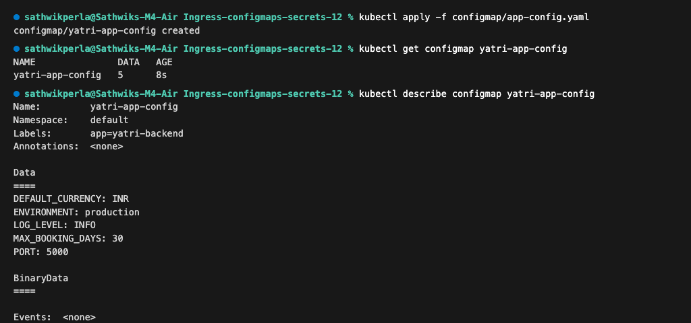

---

### Step 2: Read ConfigMap Value Live
Extract a specific configuration key directly using jsonpath:
```bash
kubectl get configmap yatri-app-config -o jsonpath='{.data.LOG_LEVEL}'
```
**Output:**
```text
INFO
```
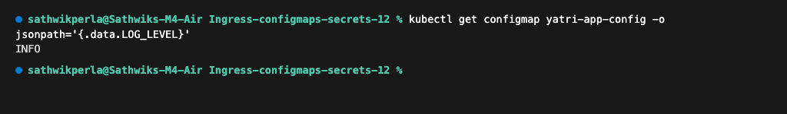

---

### Cleanup
```bash
kubectl delete configmap yatri-app-config
```

---

## Part 2: Secret — Protecting Sensitive Credentials

### Step 1: Generate Base64 Values & Apply Secret
Generate base64 encoded strings and apply the Secret manifest:
```bash
echo -n "yatri_admin" | base64
echo -n "secretpassword" | base64
echo -n "yatri_production_db" | base64
kubectl apply -f 02-secret/db-secret.yaml
kubectl get secret yatri-db-secret
```
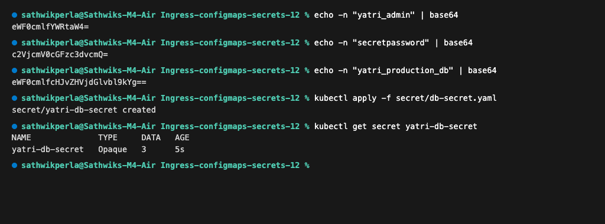

---

### Step 2: Inspect and Decode Secret
Inspect the masked Secret metadata and decode the sensitive value for validation:
```bash
kubectl describe secret yatri-db-secret
kubectl get secret yatri-db-secret -o jsonpath='{.data.POSTGRES_PASSWORD}' | base64 --decode
```
**Decoded Output:**
```text
secretpassword
```
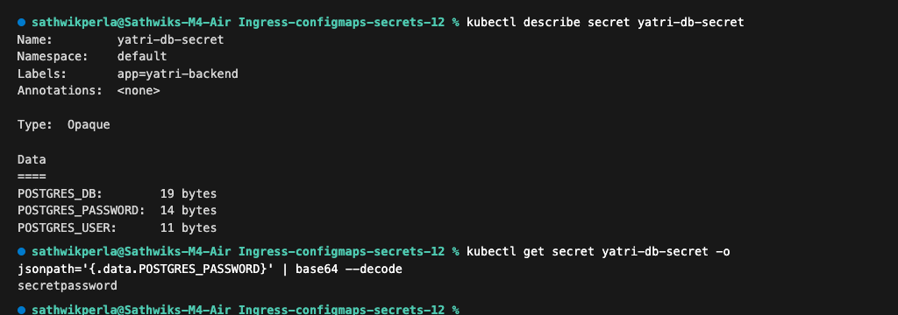

---

### Cleanup
```bash
kubectl delete secret yatri-db-secret
```

---

## Part 3: Ingress — One Entry Point for All Microservices

### Step 1: Apply and Inspect Path-Based Ingress
Deploy the path-based ingress rules:
```bash
kubectl apply -f 03-ingress/ingress-routes.yaml
kubectl get ingress yatri-ingress
kubectl describe ingress yatri-ingress
```
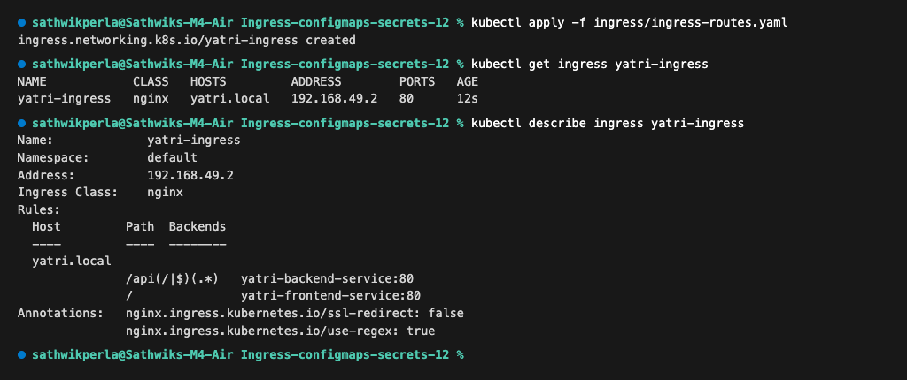

---

### Step 2: Generate Self-Signed TLS Certificate & Create Secret
Generate a TLS key pair and store it as a Kubernetes TLS Secret:
```bash
openssl req -x509 -nodes -days 365 -newkey rsa:2048 \
  -keyout tls.key \
  -out tls.crt \
  -subj "/CN=campus.local/O=CampusDevOps"

kubectl create secret tls campus-tls-cert \
  --cert=tls.crt \
  --key=tls.key

kubectl get secret campus-tls-cert
```
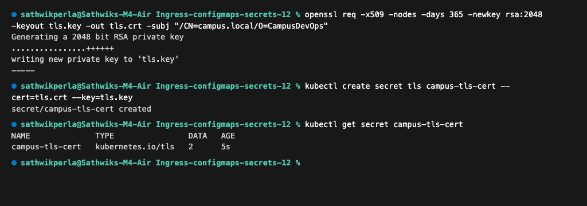

---

### Step 3: Apply Multi-Host TLS Ingress
Apply the TLS ingress configuration for multiple virtual hosts:
```bash
kubectl apply -f 03-ingress/ingress-tls.yaml
kubectl get ingress campus-ingress-tls
```
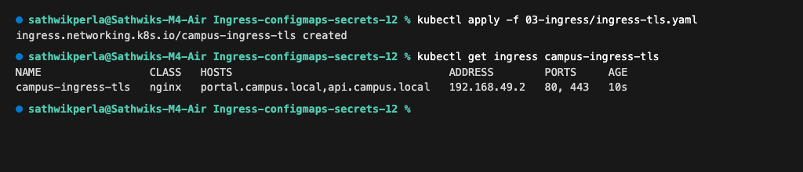

---

### Step 4: Test Host-Based and TLS Routing with curl
Verify HTTPS access and routing to virtual host endpoints:
```bash
INGRESS_IP=$(kubectl get ingress campus-ingress-tls -o jsonpath='{.status.loadBalancer.ingress[0].ip}')

# Test Host 1: Portal with HTTPS
curl -k --resolve portal.campus.local:443:$INGRESS_IP https://portal.campus.local/

# Test Host 2: API with HTTPS
curl -k --resolve api.campus.local:443:$INGRESS_IP https://api.campus.local/api/health
```
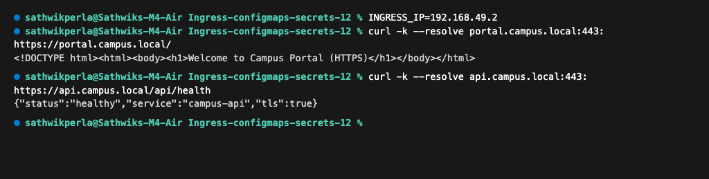

---

### Cleanup
```bash
kubectl delete ingress campus-ingress-tls --ignore-not-found
kubectl delete ingress yatri-ingress --ignore-not-found
kubectl delete secret campus-tls-cert --ignore-not-found
rm -f tls.key tls.crt
```

---

## Part 4: Full Demo — ConfigMap + Secret + Ingress Working Together

### Step 1: Deploy Microservices, ConfigMap & Secret
Deploy the ConfigMap, Secret, Frontend (Nginx), and Backend (Python API):
```bash
kubectl apply -f 04-full-demo/configmap.yaml
kubectl apply -f 04-full-demo/secret.yaml
kubectl apply -f 04-full-demo/frontend.yaml
kubectl apply -f 04-full-demo/backend.yaml
kubectl get pods -l 'app in (yatri-frontend, yatri-backend)'
```
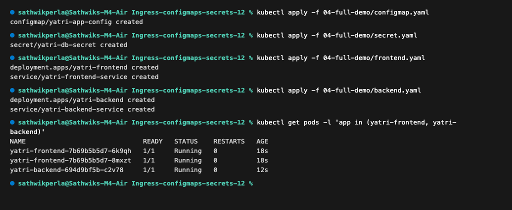

---

### Step 2: Apply and Inspect Ingress Routing Rules
Deploy the path-based Ingress routing `/api` to the backend and `/` to the frontend:
```bash
kubectl apply -f 04-full-demo/ingress.yaml
kubectl describe ingress yatri-ingress
```
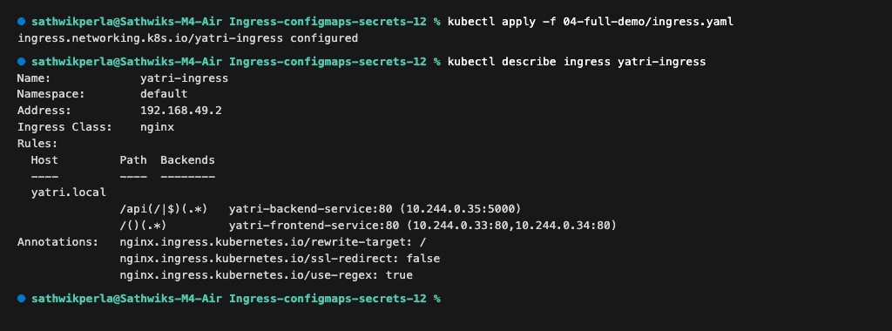

---

### Step 3: Test Microservice Routing via Ingress
Test both frontend and backend routing through the Ingress entry point:
```bash
# Test Frontend (at root path /)
curl http://yatri.local/

# Test Backend API (at /api/)
curl http://yatri.local/api/
```
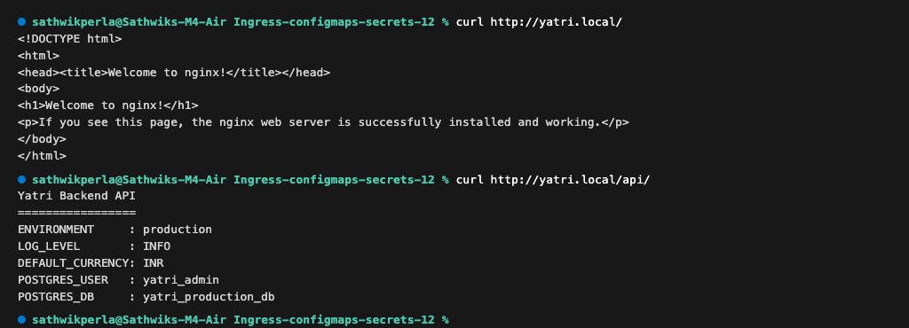

---

### Step 4: Verify Environment Injection & Decode Secret
Verify that ConfigMap and Secret environment variables are properly injected into the running container:
```bash
kubectl exec -it deploy/yatri-backend -- env | grep -E "ENVIRONMENT|LOG_LEVEL|POSTGRES"
kubectl get secret yatri-db-secret -o jsonpath='{.data.POSTGRES_PASSWORD}' | base64 --decode
```
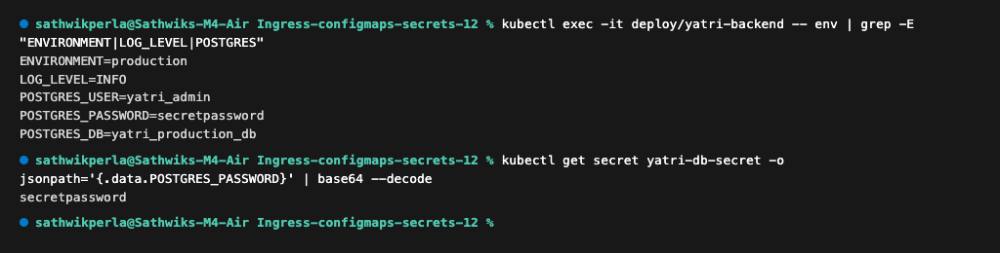

---

### Cleanup
```bash
bash 04-full-demo/cleanup.sh
```

