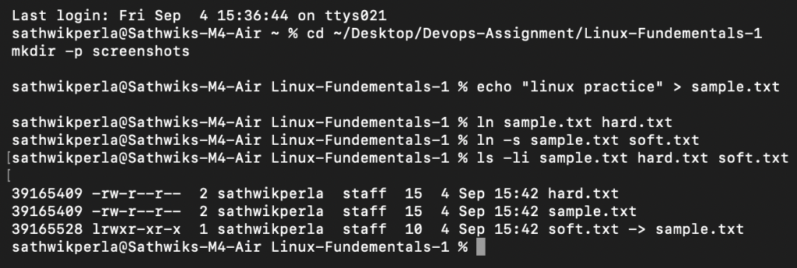
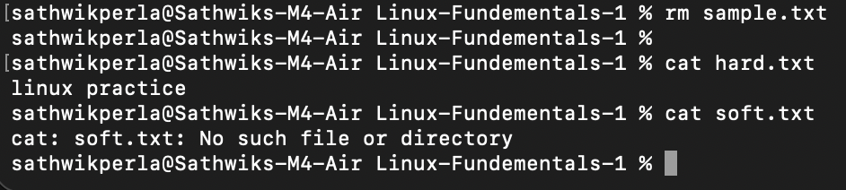
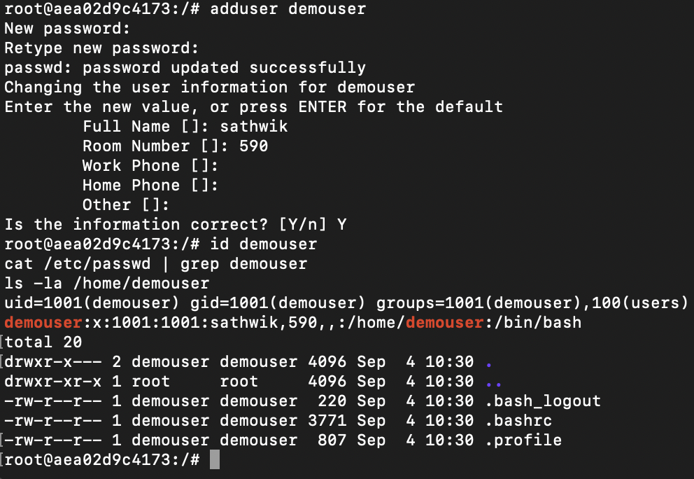

**Author:** Sathwik Perla 

**Roll no. :** 590

**mail:** perla.24bcs10590@sst.scaler.com

# Linux Fundamentals - s2 - Lab Assignment


## Task 1: Soft Links & Hard Links

A hard link points directly to the file's data (inode) on disk. A soft link (symbolic link) works like a shortcut that points to the file path.

If the original file is removed:
- The **hard link** still works and keeps the file content intact.
- The **soft link** breaks because the target file path no longer exists.

### Practice Commands

```bash
# 1. Create a sample file
echo "linux practice" > sample.txt

# 2. Create a hard link
ln sample.txt hard.txt

# 3. Create a soft link
ln -s sample.txt soft.txt

# 4. Check inodes and link count
ls -li sample.txt hard.txt soft.txt
```

> **Note:** `sample.txt` and `hard.txt` share the same inode number and have a link count of `2`. `soft.txt` has a different inode number and shows `soft.txt -> sample.txt`.

Now delete `sample.txt` to test the links:

```bash
# Remove the original file
rm sample.txt

# Check content
cat hard.txt   # still works and prints content
cat soft.txt   # fails: No such file or directory
```




## test


---

## Task 2: `adduser` vs `useradd`

- **`useradd`**: A low-level binary common across all Linux distros. It runs silently and does not create a home directory or prompt for a password unless you pass specific flags (`-m`, `-s`, etc.). It is best suited for automation scripts.
- **`adduser`**: A user-friendly interactive wrapper used on Ubuntu and Debian. It automatically creates the `/home` directory, copies starter config files from `/etc/skel`, sets the default shell to `/bin/bash`, and prompts for a password.

On Ubuntu, **`adduser`** is the recommended command for creating standard user accounts.

### Practice Commands

```bash
# Create a new user interactively
sudo adduser demouser

# Verify account details
id demouser
cat /etc/passwd | grep demouser
ls -la /home/demouser

# Cleanup after testing
sudo deluser --remove-home demouser
```



---

## Task 3: `journalctl`

`journalctl` is the command-line tool used to query logs collected by `systemd-journald`. Instead of searching through separate log files in `/var/log/`, it centralizes system and service logs in an indexed binary format.

### Helpful Commands

```bash
journalctl              # view all logs
journalctl -b           # logs from the current boot only
journalctl -f           # follow logs in real time
journalctl -u ssh       # logs for a specific service
journalctl -u ssh -n 20 # last 20 log lines for ssh
journalctl -p err       # show only error logs
journalctl --since "1 hour ago"
```

### Practice

Checked the last 20 log entries for the SSH service:

```bash
journalctl -u ssh -n 20 --no-pager
```

*(If `ssh` is not installed on your system, you can check `cron` or `systemd-resolved` using `journalctl -u cron -n 20 --no-pager`)*


---

## Task 4: Linux Command Cheat Sheet

Core Linux commands reviewed and practiced for routine DevOps tasks:

```bash
# files and directories
ls -la        # list everything including hidden files
pwd           # where am i
mkdir -p a/b  # create nested dirs
cp -r src/ dest/
mv old new
rm -rf dir

# viewing files
cat file.txt
head -n 10 file
tail -f file   # follow a file live, useful for logs
grep "word" file
grep -r "word" .

# permissions
chmod +x script.sh
chmod 755 file
chown user:group file

# processes
ps aux
top
kill -9 PID

# disk and system
df -h
du -sh *
free -h
uname -a

# networking
ip a
ping google.com
ss -tuln    # open ports

# users
whoami
id username
sudo command

# packages (ubuntu)
sudo apt update
sudo apt install package
sudo apt remove package
```

