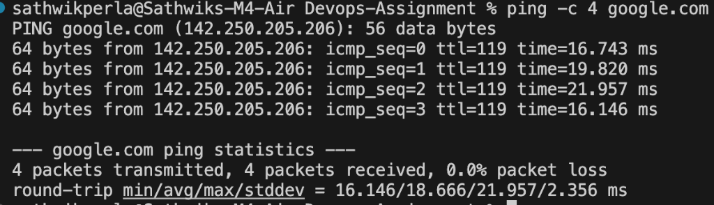
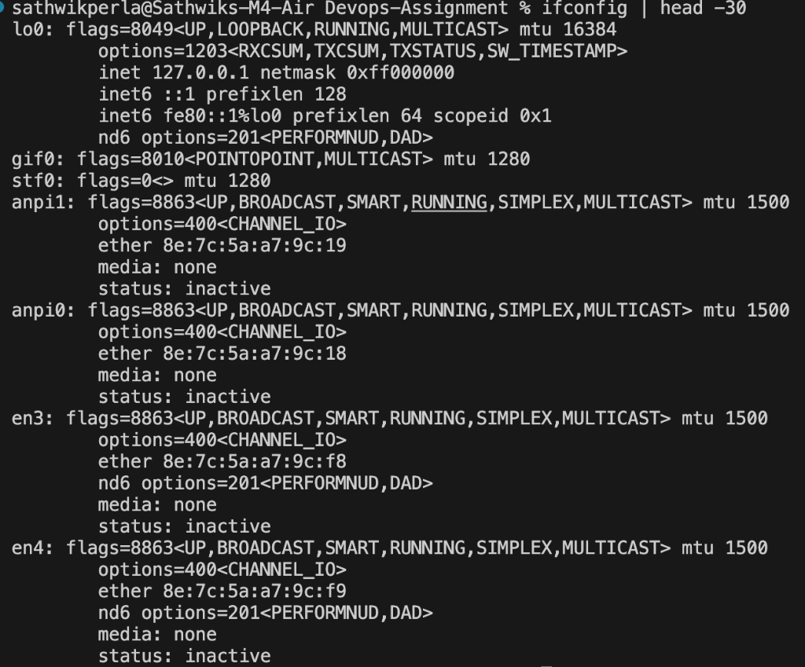
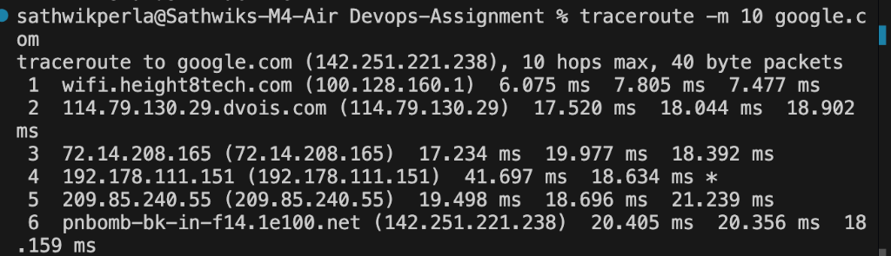
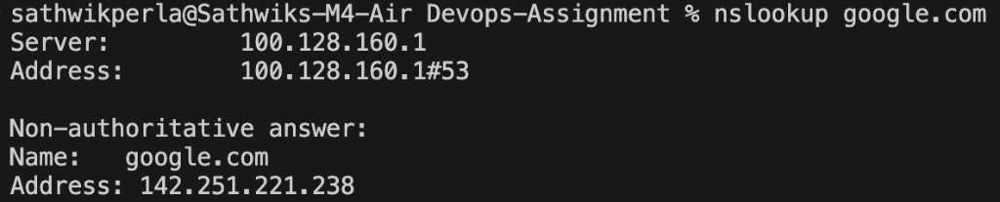
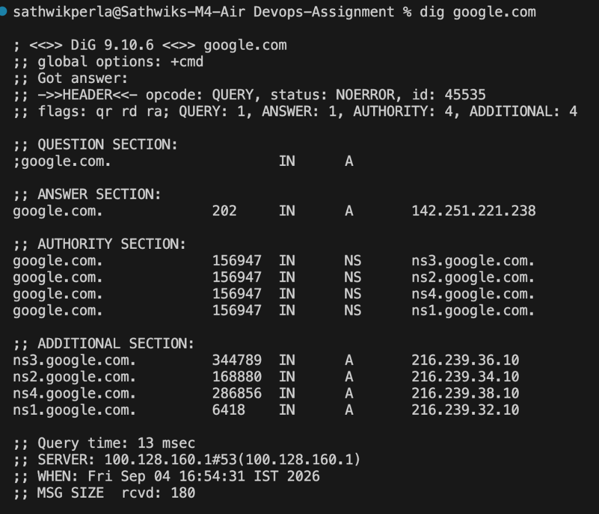
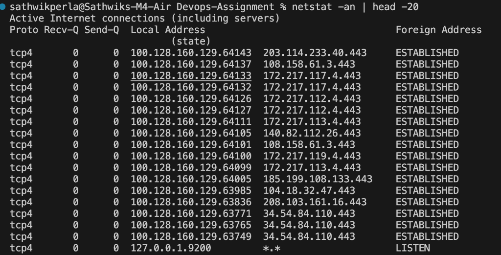
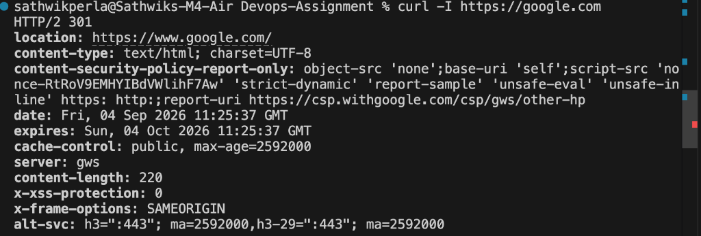
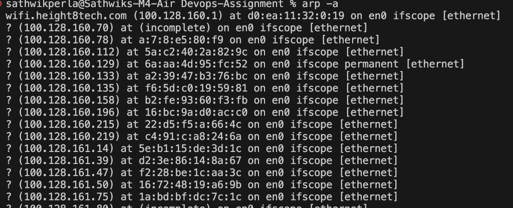
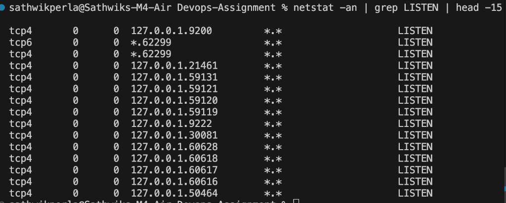

**Author:** Sathwik Perla 

**Roll no. :** 590

**mail:** perla.24bcs10590@sst.scaler.com

# Session 4 - Networking Fundamentals Lab

Hands-on exploration of core networking utilities and protocols used for diagnostics, DNS resolution, connection tracing, and socket inspection.

---

## 1. `ping`

Sends ICMP ECHO_REQUEST packets to a network host to verify end-to-end reachability and measure round-trip latency (RTT).

```bash
ping -c 4 google.com
```



---

## 2. `ifconfig` / `ip a`

Displays active network interface controllers (NICs), hardware MAC addresses, assigned IP addresses (IPv4/IPv6), and subnet masks.

```bash
ifconfig
```



---

## 3. `traceroute`

Traces the network route packets traverse to reach a remote server, displaying each intermediate router hop and latency by incrementing IP TTL (Time To Live).

```bash
traceroute google.com
```



---

## 4. `nslookup`

Queries DNS name servers interactively or directly to resolve domain names to IP addresses (A records) or perform reverse lookups (PTR records).

```bash
nslookup google.com
```



---

## 5. `dig` (Domain Information Groper)

A flexible CLI tool for probing DNS servers. It returns complete DNS query responses, including query flags, answer sections, authority records, TTL, and the responding DNS server IP.

```bash
dig google.com
```



---

## 6. `netstat`

Network statistics utility that provides insights into incoming and outgoing network connections, routing tables, and interface statistics.

```bash
netstat -an | head -20
```



---

## 7. `curl`

Command-line tool for transferring data using network protocols (HTTP/HTTPS, FTP). Used to inspect HTTP response headers, verify endpoints, and test REST APIs.

```bash
curl -I https://google.com
```



---

## 8. `arp -a`

Displays the local Address Resolution Protocol (ARP) cache table, showing the dynamic mapping between IPv4 network addresses and physical MAC hardware addresses on the local subnet.

```bash
arp -a
```



---

## 9. `ss` (Socket Statistics)

A faster, modern utility replacing `netstat` on Linux for inspecting open socket connections, TCP states, and listening daemon ports.  
*(Note: `ss` is Linux-specific. On macOS, `netstat -an | grep LISTEN` is used to inspect listening TCP sockets).*

```bash
netstat -an | grep LISTEN | head -15
```


