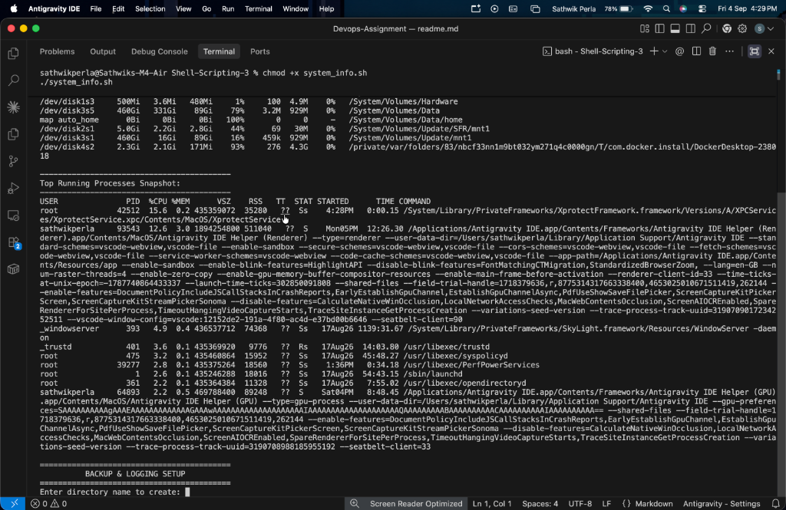
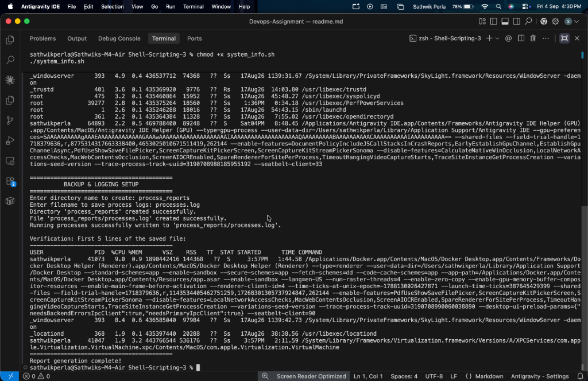

**Author:** Sathwik Perla 

**Roll no. :** 590

**mail:** perla.24bcs10590@sst.scaler.com

# Shell Scripting - System Information Script

---

## Task Overview

Create an interactive Bash shell script named `system_info.sh` that automates system diagnostics and process reporting.

### Core Requirements:
- [x] Prints the current date (`date`).
- [x] Prints the system hostname (`hostname`).
- [x] Prints the logged-in username (`whoami`).
- [x] Prints disk usage (`df -h`).
- [x] Prints running processes (`ps aux`).
- [x] Uses shell variables to store and display information.
- [x] Takes user input using `read -p`.
- [x] Creates a directory using `mkdir`.
- [x] Creates a file using `touch`.
- [x] Stores running process information in the file using `>` output redirection.

---

## Script Implementation (`system_info.sh`)

```bash
#!/bin/bash

# ==============================================================================
# Script Name: system_info.sh
# Description: Gathers system details (date, hostname, user, disk, processes)
#              and saves process information to a user-defined directory and file.
# Author: Sathwik Perla
# ==============================================================================

echo "=========================================="
echo "      SYSTEM INFORMATION REPORT          "
echo "=========================================="

# 1. Variables to store system information
current_date=$(date)
system_hostname=$(hostname)
current_user=$(whoami)

# 2. Print basic system information using echo and variables
echo "Current Date & Time : $current_date"
echo "System Hostname     : $system_hostname"
echo "Current User        : $current_user"
echo ""

# 3. Print disk usage using df
echo "------------------------------------------"
echo "Disk Usage Summary:"
echo "------------------------------------------"
df -h
echo ""

# 4. Print running processes using ps
echo "------------------------------------------"
echo "Top Running Processes Snapshot:"
echo "------------------------------------------"
ps aux | head -n 10
echo ""

# 5. User Input using read -p
echo "=========================================="
echo "          BACKUP & LOGGING SETUP          "
echo "=========================================="
read -p "Enter directory name to create: " dir_name
read -p "Enter filename to save process logs: " file_name

# 6. Create directory using mkdir
mkdir -p "$dir_name"
echo "Directory '$dir_name' created successfully."

# 7. Create file using touch
touch "$dir_name/$file_name"
echo "File '$dir_name/$file_name' created successfully."

# 8. Store running processes in the file using > output redirection
ps aux > "$dir_name/$file_name"
echo "Running processes successfully written to '$dir_name/$file_name'."

echo ""
echo "Verification: First 5 lines of the saved file:"
echo "------------------------------------------"
head -n 5 "$dir_name/$file_name"
echo "=========================================="
echo "Report generation complete!"
```

---

## Execution & Verification Commands

```bash
# 1. Grant execute permissions to the script
chmod +x system_info.sh

# 2. Execute the script
./system_info.sh

# 3. Verify created directory and file output
ls -la process_reports
head -n 10 process_reports/processes.log
```

---

## Screenshots

### 1. Script Execution & User Input Prompt


### 2. Directory Creation & File Verification

