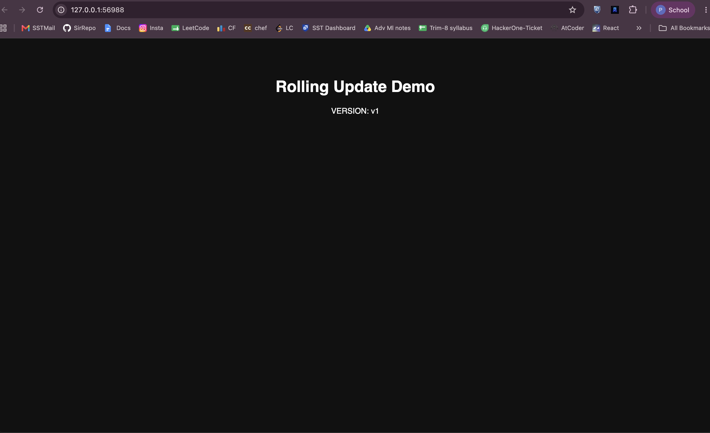
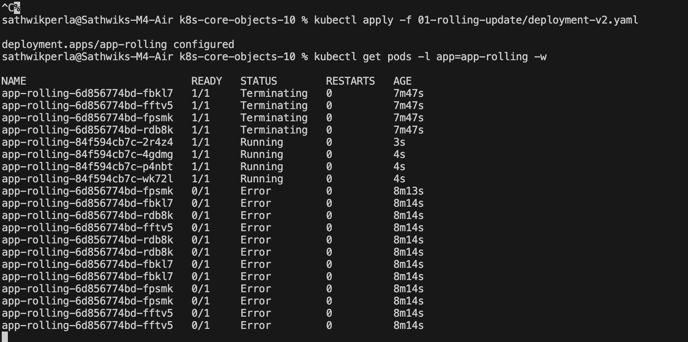
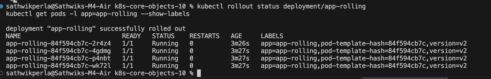
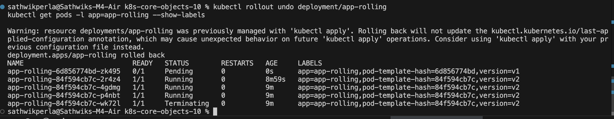
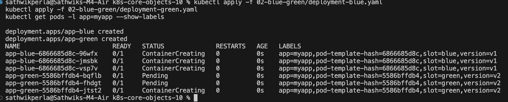
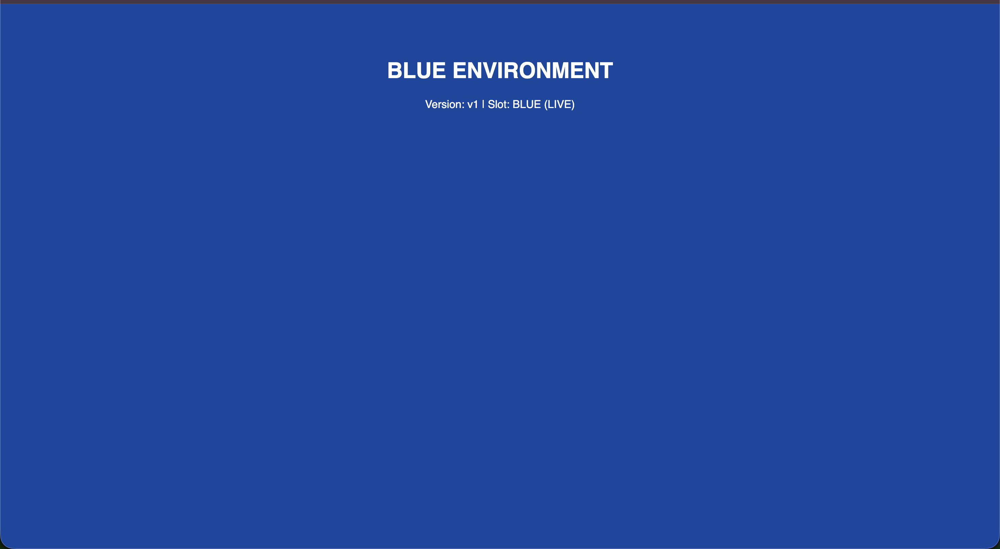
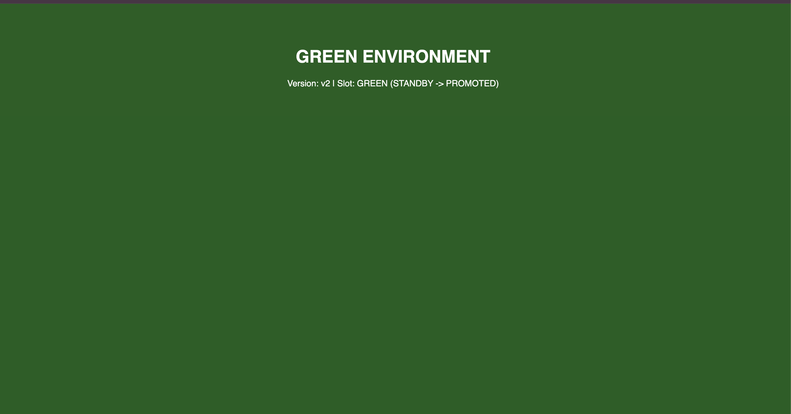
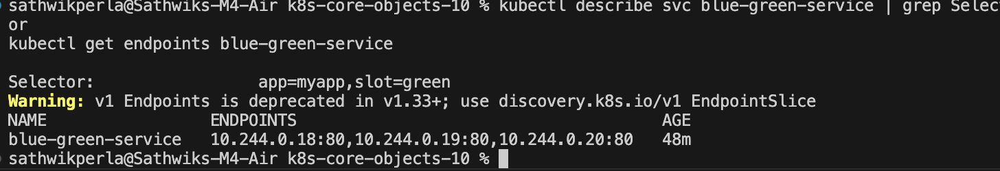
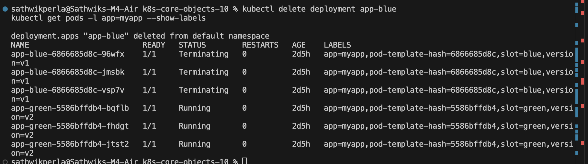

# Session 10 - Kubernetes Core Objects: Rolling Updates & Rollbacks

**Author:** Sathwik Perla  
**Roll Number:** 590  
**Email:** perla.24bcs10590@sst.scaler.com  

---

## Overview

A **Rolling Update** is the default deployment strategy in Kubernetes that updates an application with **zero downtime**. It incrementally replaces old Pod instances (v1) with new ones (v2) by carefully regulating `maxSurge` (how many extra pods can be created above desired replicas) and `maxUnavailable` (how many pods can be unavailable during the rollout). If an issue occurs, Kubernetes allows instant rollbacks to a previous stable revision using `kubectl rollout undo`.

---

# Hands-On Implementation: Rolling Update & Rollback

### Step 1: Deploy Application Version 1 (v1)
Deploy the initial v1 deployment (4 replicas) and expose it via NodePort service:
```bash
kubectl apply -f 01-rolling-update/deployment-v1.yaml
kubectl apply -f 01-rolling-update/service.yaml
```

Wait for all pods to be ready and verify the rollout status:
```bash
kubectl rollout status deployment/app-rolling
```

Inspect the running pods and their version labels:
```bash
kubectl get pods -l app=app-rolling --show-labels
```

#### Evidence: Deployment v1 Running


---

### Step 2: Verify v1 in Terminal / Browser
Access the application endpoint on NodePort `30010`:

```bash
# If using Minikube:
curl http://$(minikube ip):30010

# If using Docker Desktop / localhost:
curl http://localhost:30010
```
Or open in your browser: `http://localhost:30010` (or `minikube service app-rolling-service`).

#### Evidence: Version 1 Web Page Output


---

### Step 3 & 4: Trigger Rolling Update to v2 & Observe Real-Time Rollout
Apply the v2 deployment manifest:
```bash
kubectl apply -f 01-rolling-update/deployment-v2.yaml
```

Observe the zero-downtime transition:

**Terminal A: Watch Pod Lifecycle Transition**
```bash
kubectl get pods -l app=app-rolling -w
```
*(Notice new v2 pods transitioning from ContainerCreating to Running while v1 pods gradually terminate)*
#### Evidence: Real-Time Pod Rollout Watch


---

### Step 5: Verify v2 is Fully Deployed
Confirm that all 4 pods have transitioned to `version=v2`:
```bash
kubectl rollout status deployment/app-rolling
kubectl get pods -l app=app-rolling --show-labels
```

#### Evidence: Deployment v2 Completed


---

### Step 6: Check Rollout Revision History
Inspect the deployment revision history tracked by Kubernetes:
```bash
kubectl rollout history deployment/app-rolling
```

#### Evidence: Rollout History


---

### Step 7: Perform Rollback to Version 1 (Undo)
Perform an instant rollback to restore v1:
```bash
kubectl rollout undo deployment/app-rolling
```

Verify that all pods have rolled back to `version=v1`:
```bash
kubectl get pods -l app=app-rolling --show-labels
```

#### Evidence: Rollback to v1 Completed


---

## Key Notes & Concepts Learned

1. **Zero-Downtime Deployment:** The Service continuously distributes traffic to healthy pods. As v2 pods become ready, they are registered in the Endpoints list, and old v1 pods are safely drained.
2. **Rollout Controls (`maxSurge` & `maxUnavailable`):**
   - `maxSurge: 1`: Maximum number of pods that can be created above the desired replica count.
   - `maxUnavailable: 1`: Maximum number of pods that can be unavailable during the update.
3. **Deployment Revisions & ReplicaSets:** Every rollout updates the underlying ReplicaSet. Kubernetes retains previous ReplicaSets, enabling instant, reliable rollbacks (`rollout undo`).

---

### Cleanup
```bash
kubectl delete -f 01-rolling-update/service.yaml
kubectl delete -f 01-rolling-update/deployment-v1.yaml
```

---

# Part 2: Blue-Green Deployment

Instant traffic switching between two identical environments using Kubernetes Service label selectors.

### Step 1: Deploy Both Environments (Blue & Green)
Deploy both Blue (v1) and Green (v2) workloads simultaneously:
```bash
kubectl apply -f 02-blue-green/deployment-blue.yaml
kubectl apply -f 02-blue-green/deployment-green.yaml
kubectl get pods -l app=myapp --show-labels
```


---

### Step 2: Route Traffic to Blue (v1 Live)
Route the service to Blue pods (`slot=blue`):
```bash
kubectl apply -f 02-blue-green/service-blue.yaml
curl http://$(minikube ip):30020
```


---

### Step 3: Verify Blue Service Selector & Endpoints
Inspect the active selector and endpoints pointing to Blue pods:
```bash
kubectl describe svc myapp-service | grep Selector
kubectl get endpoints myapp-service
```


---

### Step 4: The Switch — Flip Traffic to Green (v2 Live)
Instantly redirect 100% of traffic to Green pods by updating the service selector (`slot=green`):
```bash
kubectl apply -f 02-blue-green/service-green.yaml
curl http://$(minikube ip):30020
```


---

### Step 5: Verify Green Endpoints
Confirm that the service endpoints now point to Green pods:
```bash
kubectl describe svc myapp-service | grep Selector
kubectl get endpoints myapp-service
```


---

### Step 6: Instant Rollback to Blue
Roll back to Blue in milliseconds by repointing the selector:
```bash
kubectl apply -f 02-blue-green/service-blue.yaml
curl http://$(minikube ip):30020
```


---

### Step 7: Decommission Blue Environment
Delete the old Blue deployment once Green is confirmed stable:
```bash
kubectl delete deployment app-blue
kubectl get pods -l app=myapp --show-labels
```


---

### Cleanup
```bash
kubectl delete -f 02-blue-green/service-green.yaml
kubectl delete -f 02-blue-green/deployment-green.yaml
```