# Session 10 - Kubernetes Core Objects: Rolling Updates & Rollbacks

**Author:** Sathwik Perla  
**Roll Number:** 590  
**Email:** perla.24bcs10590@sst.scaler.com  

---

## Overview

A **Rolling Update** is the default deployment strategy in Kubernetes that updates an application with **zero downtime**. It incrementally replaces old Pod instances (v1) with new ones (v2) by carefully regulating `maxSurge` (how many extra pods can be created above desired replicas) and `maxUnavailable` (how many pods can be unavailable during the rollout). If an issue occurs, Kubernetes allows instant rollbacks to a previous stable revision using `kubectl rollout undo`.

---

# Hands-On Implementation: Rolling Update & Rollback

### Step 1: Deploy Application Version 1 (v1)
Deploy the initial v1 deployment (4 replicas) and expose it via NodePort service:
```bash
kubectl apply -f 01-rolling-update/deployment-v1.yaml
kubectl apply -f 01-rolling-update/service.yaml
```

Wait for all pods to be ready and verify the rollout status:
```bash
kubectl rollout status deployment/app-rolling
```

Inspect the running pods and their version labels:
```bash
kubectl get pods -l app=app-rolling --show-labels
```

#### Evidence: Deployment v1 Running
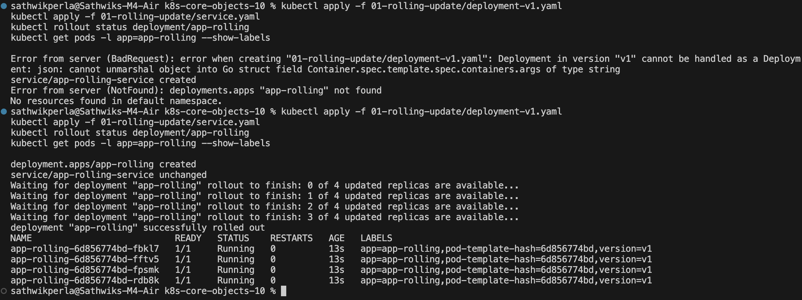


---

### Step 2: Verify v1 in Terminal / Browser
Access the application endpoint on NodePort `30010`:

```bash
# If using Minikube:
curl http://$(minikube ip):30010

# If using Docker Desktop / localhost:
curl http://localhost:30010
```
Or open in your browser: `http://localhost:30010` (or `minikube service app-rolling-service`).

#### Evidence: Version 1 Web Page Output


---

### Step 3 & 4: Trigger Rolling Update to v2 & Observe Real-Time Rollout
Apply the v2 deployment manifest:
```bash
kubectl apply -f 01-rolling-update/deployment-v2.yaml
```

Observe the zero-downtime transition:

**Terminal A: Watch Pod Lifecycle Transition**
```bash
kubectl get pods -l app=app-rolling -w
```
*(Notice new v2 pods transitioning from ContainerCreating to Running while v1 pods gradually terminate)*
#### Evidence: Real-Time Pod Rollout Watch


---

### Step 5: Verify v2 is Fully Deployed
Confirm that all 4 pods have transitioned to `version=v2`:
```bash
kubectl rollout status deployment/app-rolling
kubectl get pods -l app=app-rolling --show-labels
```

#### Evidence: Deployment v2 Completed


---

### Step 6: Check Rollout Revision History
Inspect the deployment revision history tracked by Kubernetes:
```bash
kubectl rollout history deployment/app-rolling
```

#### Evidence: Rollout History
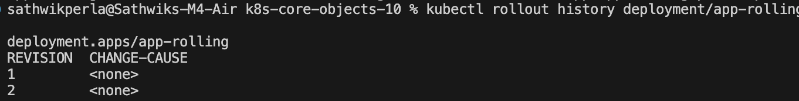

---

### Step 7: Perform Rollback to Version 1 (Undo)
Perform an instant rollback to restore v1:
```bash
kubectl rollout undo deployment/app-rolling
```

Verify that all pods have rolled back to `version=v1`:
```bash
kubectl get pods -l app=app-rolling --show-labels
```

#### Evidence: Rollback to v1 Completed


---

## Key Notes & Concepts Learned

1. **Zero-Downtime Deployment:** The Service continuously distributes traffic to healthy pods. As v2 pods become ready, they are registered in the Endpoints list, and old v1 pods are safely drained.
2. **Rollout Controls (`maxSurge` & `maxUnavailable`):**
   - `maxSurge: 1`: Maximum number of pods that can be created above the desired replica count.
   - `maxUnavailable: 1`: Maximum number of pods that can be unavailable during the update.
3. **Deployment Revisions & ReplicaSets:** Every rollout updates the underlying ReplicaSet. Kubernetes retains previous ReplicaSets, enabling instant, reliable rollbacks (`rollout undo`).

---

### Cleanup
```bash
kubectl delete -f 01-rolling-update/service.yaml
kubectl delete -f 01-rolling-update/deployment-v1.yaml
```

---

# Part 2: Blue-Green Deployment

Instant traffic switching between two identical environments using Kubernetes Service label selectors.

### Step 1: Deploy Both Environments (Blue & Green)
Deploy both Blue (v1) and Green (v2) workloads simultaneously:
```bash
kubectl apply -f 02-blue-green/deployment-blue.yaml
kubectl apply -f 02-blue-green/deployment-green.yaml
kubectl get pods -l app=myapp --show-labels
```


---

### Step 2: Route Traffic to Blue (v1 Live)
Route the service to Blue pods (`slot=blue`):
```bash
kubectl apply -f 02-blue-green/service-blue.yaml
curl http://$(minikube ip):30020
```


---

### Step 3: Verify Blue Service Selector & Endpoints
Inspect the active selector and endpoints pointing to Blue pods:
```bash
kubectl describe svc myapp-service | grep Selector
kubectl get endpoints myapp-service
```
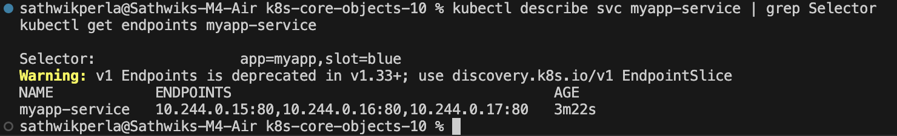

---

### Step 4: The Switch — Flip Traffic to Green (v2 Live)
Instantly redirect 100% of traffic to Green pods by updating the service selector (`slot=green`):
```bash
kubectl apply -f 02-blue-green/service-green.yaml
curl http://$(minikube ip):30020
```


---

### Step 5: Verify Green Endpoints
Confirm that the service endpoints now point to Green pods:
```bash
kubectl describe svc myapp-service | grep Selector
kubectl get endpoints myapp-service
```


---

### Step 6: Instant Rollback to Blue
Roll back to Blue in milliseconds by repointing the selector:
```bash
kubectl apply -f 02-blue-green/service-blue.yaml
curl http://$(minikube ip):30020
```
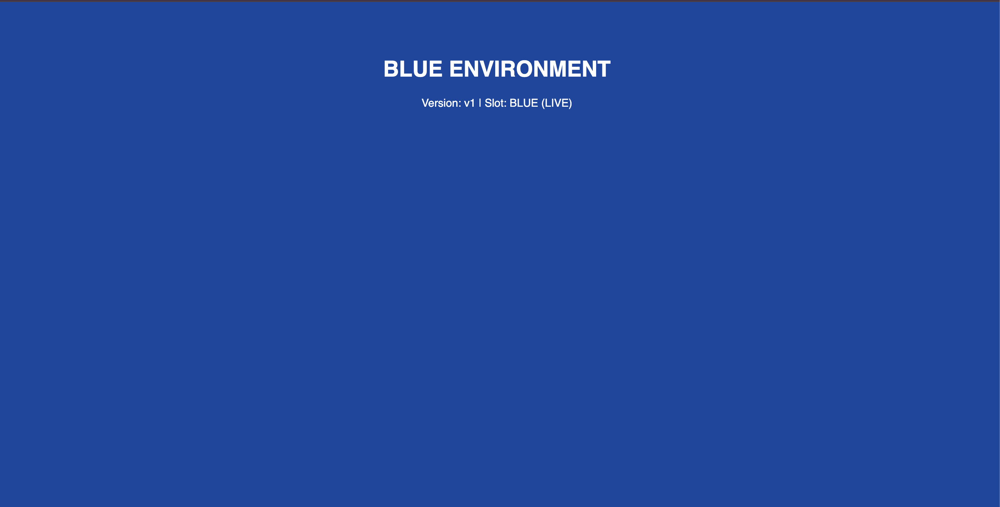

---

### Step 7: Decommission Blue Environment
Delete the old Blue deployment once Green is confirmed stable:
```bash
kubectl delete deployment app-blue
kubectl get pods -l app=myapp --show-labels
```


---

### Cleanup
```bash
kubectl delete -f 02-blue-green/service-green.yaml
kubectl delete -f 02-blue-green/deployment-green.yaml
```

---

# Part 3: Canary Deployment

## Overview
A Canary Deployment rolls out a new software version to a small percentage of users before a full release. In Kubernetes, this is achieved by running two deployments (`app-stable` and `app-canary`) behind a single Service with a common label (`app=myapp-canary`). Traffic is distributed proportionally based on replica counts (e.g., 9 stable pods vs. 1 canary pod = 90% / 10% traffic split).

---

### Step 1: Deploy Stable v1 (9 Pods = 90% Traffic)
Deploy the stable version running 9 replicas:
```bash
kubectl apply -f 03-canary/deployment-stable.yaml
kubectl rollout status deployment/app-stable
```

---

### Step 2: Deploy the Service
Create the service that routes traffic across both stable and canary pods:
```bash
kubectl apply -f 03-canary/service.yaml
```

---

### Step 3: Test — All Traffic Goes to Stable v1
Test that 100% of traffic routes to v1 before canary is introduced:
```bash
for i in $(seq 1 10); do curl -s http://localhost:8080 | grep -o "STABLE v1\|CANARY v2"; done
```
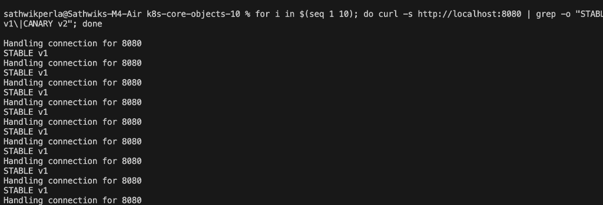

---

### Step 4: Deploy the Canary v2 Pod (1 Pod = 10% Traffic)
Deploy 1 replica of the v2 canary version to test in production with real traffic:
```bash
kubectl apply -f 03-canary/deployment-canary.yaml
kubectl get pods -l app=myapp-canary --show-labels
```
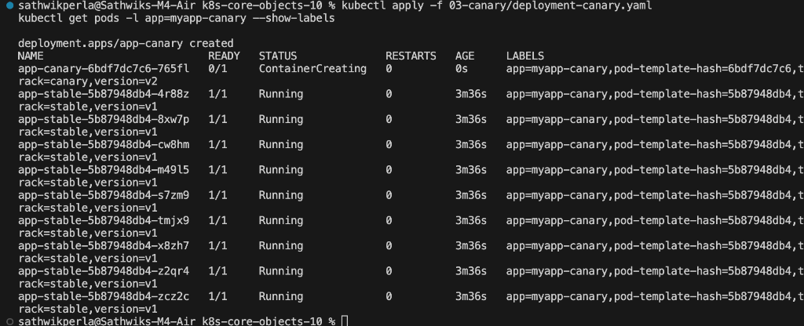

---

### Step 5: Verify Traffic Split in Real Time
Run multiple requests to verify traffic routing (~90% Stable, ~10% Canary):
```bash
for i in $(seq 1 20); do curl -s http://localhost:8080 | grep -o "STABLE v1\|CANARY v2"; done
```
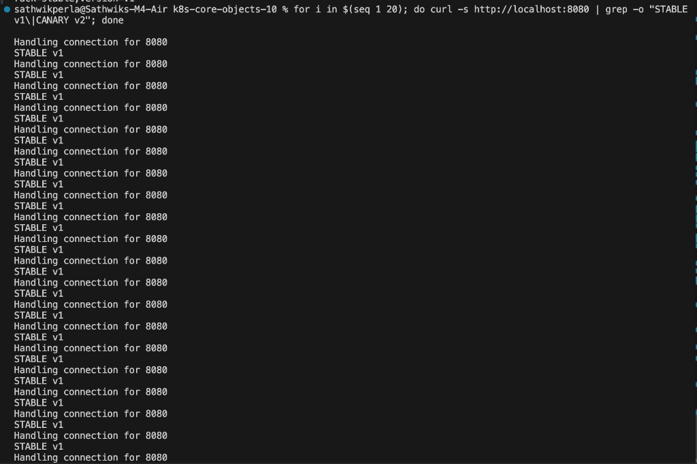

---

### Step 6: Increase Canary Traffic to 30% (3 out of 10 Pods)
Scale canary up to 3 replicas and scale stable down to 7 replicas:
```bash
kubectl scale deployment app-canary --replicas=3
kubectl scale deployment app-stable --replicas=7
kubectl get endpoints myapp-canary-service
```

Re-test the traffic distribution (~70% Stable, ~30% Canary):
```bash
for i in $(seq 1 10); do curl -s http://localhost:8080 | grep -o "STABLE v1\|CANARY v2"; done
```
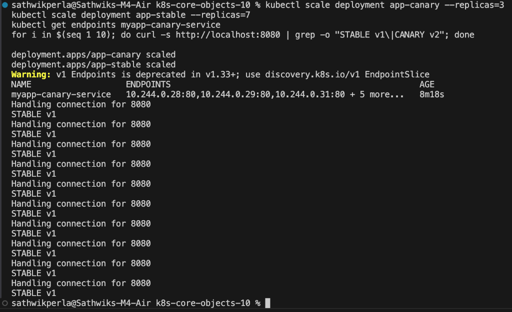

---

### Step 7A: Promote Canary to 100% (Canary is Healthy)
Once verified stable, scale canary to 100% and scale down stable:
```bash
kubectl scale deployment app-canary --replicas=9
kubectl scale deployment app-stable --replicas=0
for i in $(seq 1 5); do curl -s http://localhost:8080 | grep -o "STABLE v1\|CANARY v2"; done
```
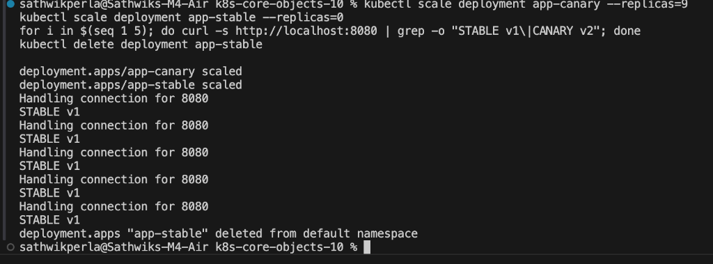

Clean up old stable deployment:
```bash
kubectl delete deployment app-stable
```

---

### Step 7B: Rollback Canary (If Canary Fails)
If errors occur during canary testing, immediately roll back by scaling canary to 0:
```bash
kubectl scale deployment app-canary --replicas=0
kubectl scale deployment app-stable --replicas=9
for i in $(seq 1 5); do curl -s http://localhost:8080 | grep -o "STABLE v1\|CANARY v2"; done
```
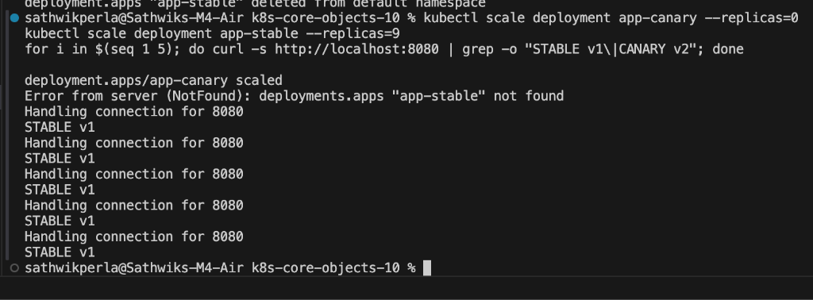

---

### Cleanup
```bash
kubectl delete -f 03-canary/service.yaml
kubectl delete -f 03-canary/deployment-canary.yaml
kubectl delete -f 03-canary/deployment-stable.yaml
```

---


---

# Part 4: Recreate Deployment Strategy

### Step 1: Deploy Version 1 (3 Replicas)
Deploy version 1 and the NodePort service:
```bash
kubectl apply -f 04-recreate/deployment-v1.yaml
kubectl apply -f 04-recreate/service.yaml
kubectl get pods -l app=app-recreate
```
Test web access:
```bash
curl http://localhost:8080
```
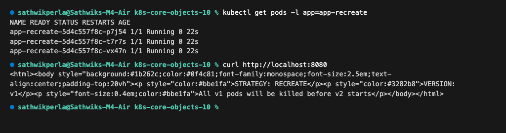

---

### Step 2: Trigger the Recreate Update & Watch Pod Lifecycle
In Terminal 1, watch the pod transitions in real-time:
```bash
kubectl get pods -l app=app-recreate -w
```
In Terminal 2, trigger the v2 update:
```bash
kubectl apply -f 04-recreate/deployment-v2.yaml
```
*(Notice the downtime window: all v1 pods terminate completely before v2 containers start)*
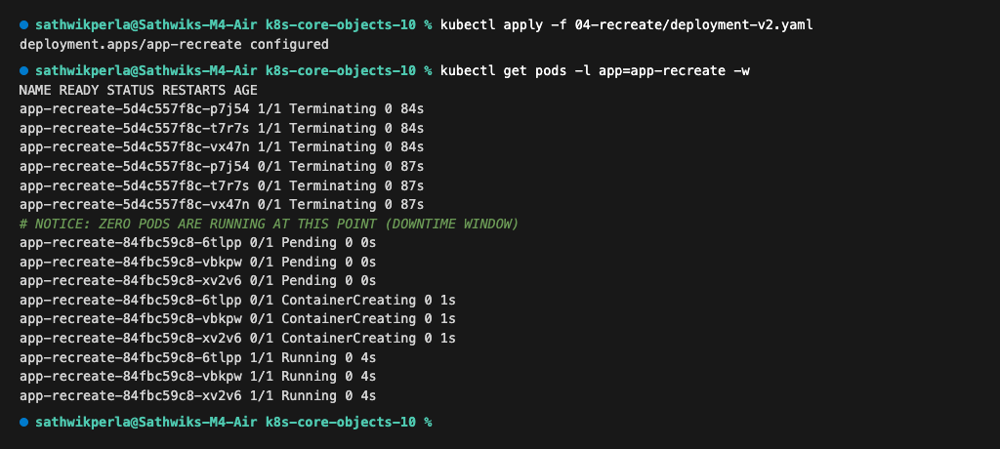

---

### Step 3: Observe Outage Window via Continuous Curl
Run a continuous loop during the recreate rollout to observe the brief outage:
```bash
while true; do curl -s --connect-timeout 1 http://localhost:8080 | grep -o 'VERSION: [^<]*' || echo "[OUTAGE] Connection failed"; sleep 0.5; done
```
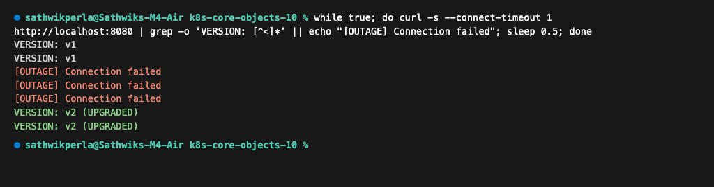

---

### Step 4: Verify Version 2 Live
Confirm all v2 pods are running and serving upgraded traffic:
```bash
curl http://localhost:8080
```
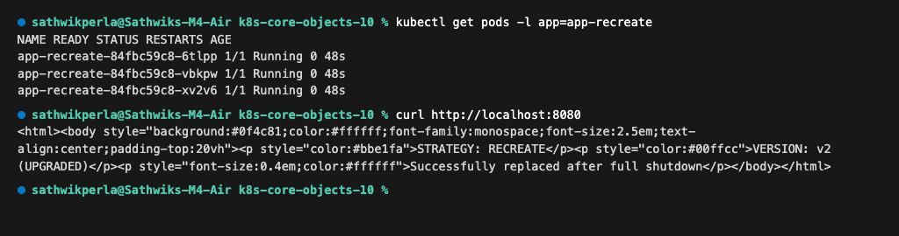

---

### Step 5: Rollback Demonstration
Revert from v2 back to v1:
```bash
kubectl rollout undo deployment/app-recreate
kubectl rollout status deployment/app-recreate
```
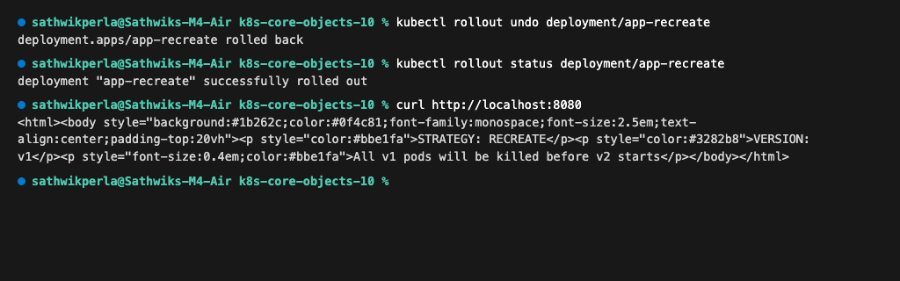

---

### Cleanup
```bash
kubectl delete -f 04-recreate/service.yaml
kubectl delete -f 04-recreate/deployment-v2.yaml
```

