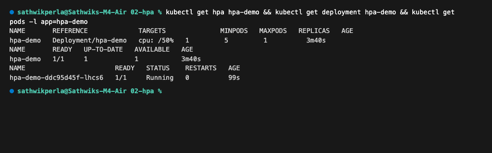
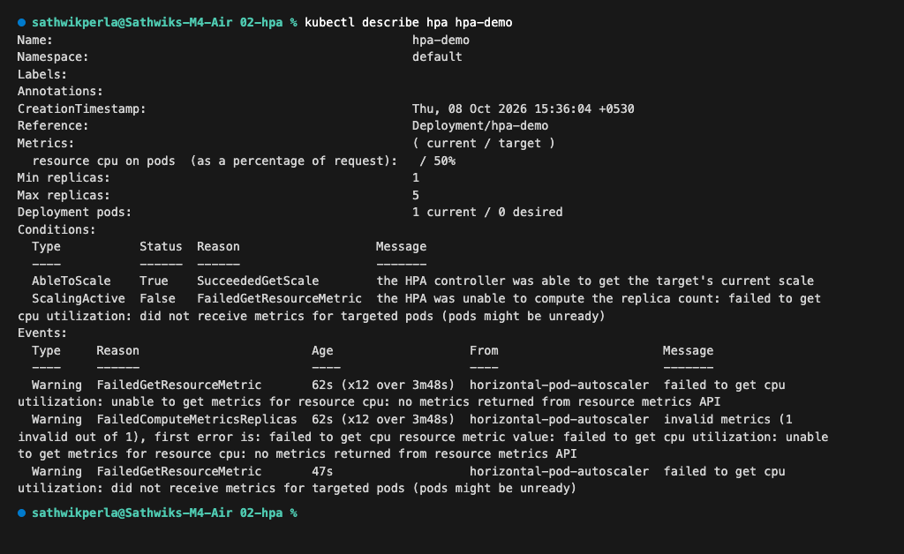
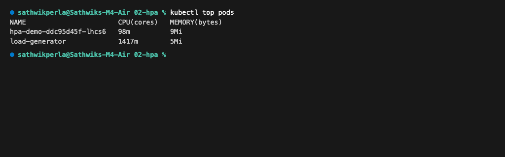
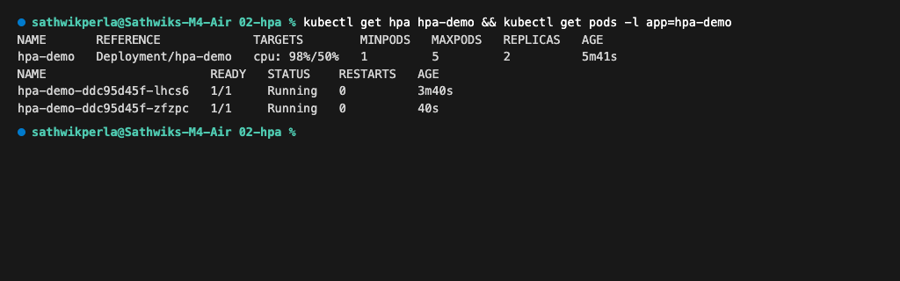
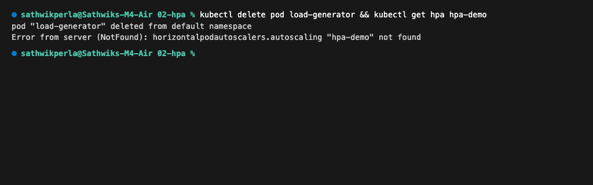
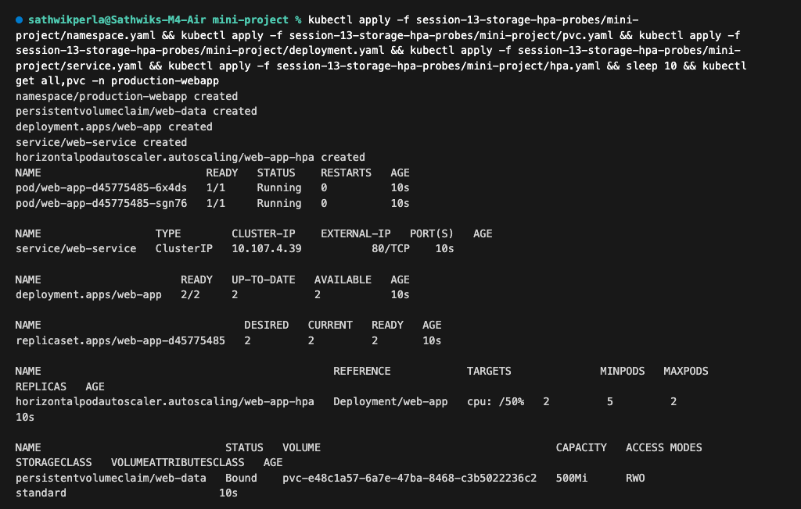
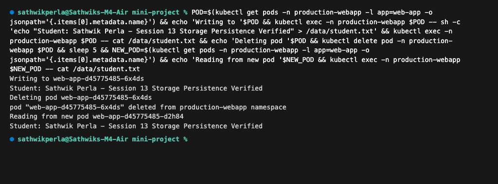
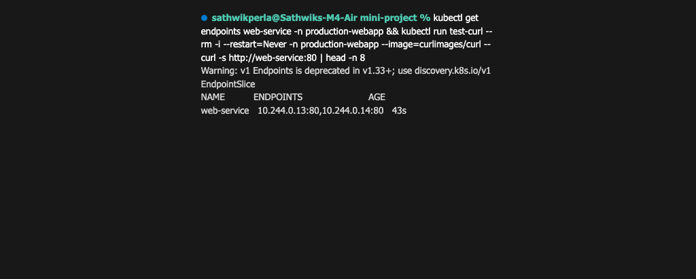
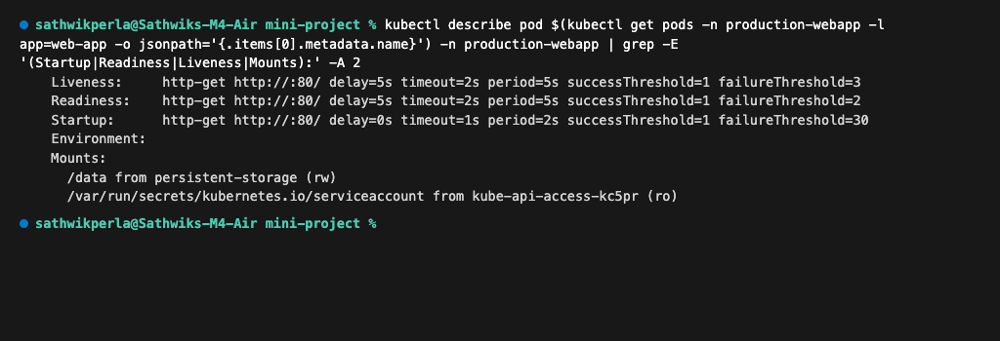
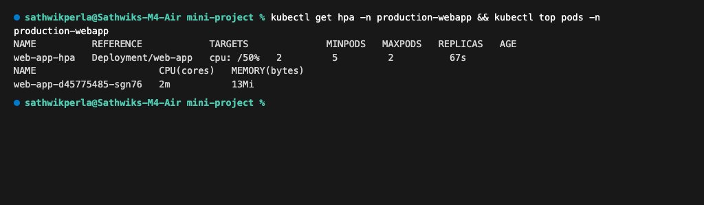

# Session 13 — Kubernetes Storage, HPA & Probes

## What Was Learned
- **Storage Primitives**: `emptyDir` provides pod-ephemeral shared scratch space, `hostPath` mounts node-level filesystems, while `PV`/`PVC` decouple durable persistent storage from pod lifecycles.
- **Dynamic Provisioning**: StorageClasses automate the creation and binding of persistent volumes on-demand without manual administrator intervention.
- **Horizontal Pod Autoscaling**: HPA utilizes Kubernetes `metrics-server` to track real-time container CPU utilization and elastically scales pod replicas to meet demand.
- **Health Diagnostic Probes**: `startupProbe` handles slow application bootstrap, `readinessProbe` controls service traffic routing, and `livenessProbe` automatically restarts unhealthy or deadlocked containers.

---

## Task 1: Kubernetes Volumes

Comprehensive documentation and practical manifest examples for `emptyDir`, `hostPath`, `PersistentVolume`, `PersistentVolumeClaim`, `StorageClass`, and dynamic provisioning are documented in:
- [`01-kubernetes-volumes/README.md`](01-kubernetes-volumes/README.md)

---

## Task 2: HPA Hands-on

### 1. Initial HPA Status & Baseline Deployment
```bash
kubectl apply -f 02-hpa/deployment.yaml
kubectl apply -f 02-hpa/service.yaml
kubectl apply -f 02-hpa/hpa.yaml
kubectl get hpa hpa-demo && kubectl get deployment hpa-demo && kubectl get pods -l app=hpa-demo
```


### 2. HPA Detailed Description & Scaling Conditions
```bash
kubectl describe hpa hpa-demo
```


### 3. Real-Time CPU Utilization Under Load
```bash
kubectl run load-generator --image=busybox:1.36 --restart=Never -- /bin/sh -c "while true; do wget -q -O- http://hpa-demo-service; done"
kubectl top pods
```


### 4. Automated Scale-Out to Multiple Replicas
```bash
kubectl get hpa hpa-demo && kubectl get pods -l app=hpa-demo
```


### 5. Load Generator Termination & Scale Stabilization
```bash
kubectl delete pod load-generator && kubectl get hpa hpa-demo
```


---

## Task 3: Mini Project — Production Web App

### 1. Production Stack Deployment in Dedicated Namespace
```bash
kubectl apply -f mini-project/namespace.yaml
kubectl apply -f mini-project/pvc.yaml
kubectl apply -f mini-project/deployment.yaml
kubectl apply -f mini-project/service.yaml
kubectl apply -f mini-project/hpa.yaml
kubectl get all,pvc -n production-webapp
```


### 2. Storage Persistence Across Pod Deletion & Rescheduling
```bash
POD=$(kubectl get pods -n production-webapp -l app=web-app -o jsonpath='{.items[0].metadata.name}')
kubectl exec -n production-webapp $POD -- sh -c 'echo "Student: Sathwik Perla - Session 13 Storage Persistence Verified" > /data/student.txt'
kubectl exec -n production-webapp $POD -- cat /data/student.txt
kubectl delete pod -n production-webapp $POD
NEW_POD=$(kubectl get pods -n production-webapp -l app=web-app -o jsonpath='{.items[0].metadata.name}')
kubectl exec -n production-webapp $NEW_POD -- cat /data/student.txt
```


### 3. Service Endpoints & Connectivity Verification
```bash
kubectl get endpoints web-service -n production-webapp
kubectl run test-curl --rm -i --restart=Never -n production-webapp --image=curlimages/curl -- curl -s http://web-service:80
```


### 4. Health Probes Diagnostic Configuration (`kubectl describe pod`)
```bash
kubectl describe pod $(kubectl get pods -n production-webapp -l app=web-app -o jsonpath='{.items[0].metadata.name}') -n production-webapp | grep -E '(Startup|Readiness|Liveness|Mounts):' -A 2
```


### 5. Production HPA Status & Resource Tracking
```bash
kubectl get hpa -n production-webapp && kubectl top pods -n production-webapp
```

