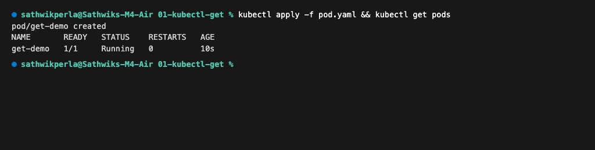
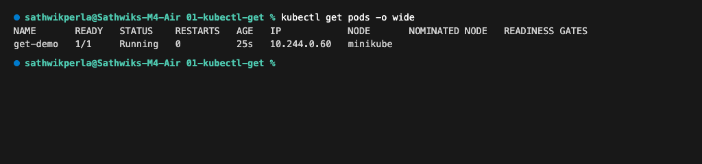
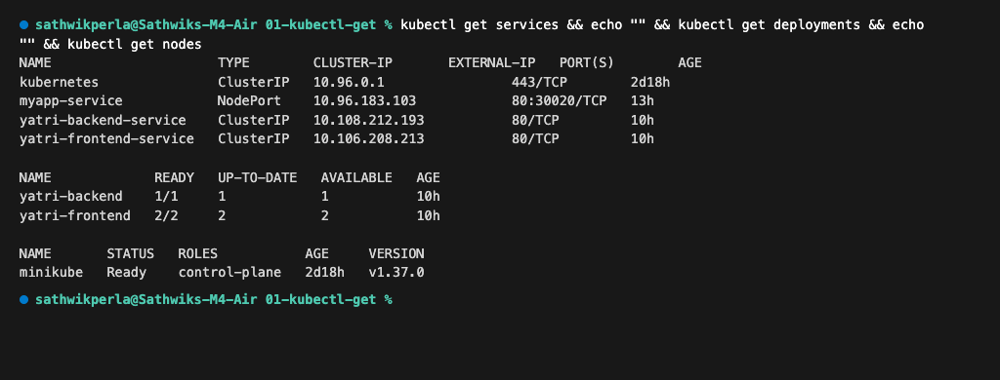
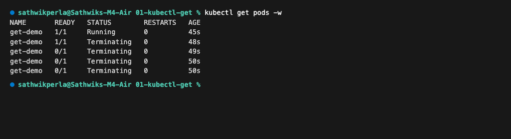

# `kubectl get`

```bash
kubectl get
```

Think of `kubectl get` as:

> "Kubernetes, show me what is currently happening."

---

## 1. Create the Pod

Run:
```bash
kubectl apply -f pod.yaml
```

Expected output:
```text
pod/get-demo created
```

---

## 2. Check Pods

Run:
```bash
kubectl get pods
```

Expected output:
```text
NAME       READY   STATUS    RESTARTS   AGE
get-demo   1/1     Running   0          10s
```



---

## 3. Understand The Output

* **NAME**: Name of the Pod.
* **READY**: Number of ready containers.
* **STATUS**: Current Pod status.
* **RESTARTS**: Number of container restarts.
* **AGE**: How long the Pod has existed.

---

## 4. Get More Information

Run:
```bash
kubectl get pods -o wide
```

Output shows Pod IP, Node placement, and readiness gates:
```text
NAME       READY   STATUS    RESTARTS   AGE   IP            NODE       NOMINATED NODE   READINESS GATES
get-demo   1/1     Running   0          25s   10.244.0.60   minikube   <none>           <none>
```



---

## 5. Check Different Resources

**Pods:**
```bash
kubectl get pods
```

**Services:**
```bash
kubectl get services
```

**Deployments:**
```bash
kubectl get deployments
```

**Nodes:**
```bash
kubectl get nodes
```

**All resources:**
```bash
kubectl get all
```



---

## 6. Watch Changes

Run:
```bash
kubectl get pods -w
```

Delete the Pod:
```bash
kubectl delete pod get-demo
```

You can watch the Pod transition from `Running` to `Terminating` in real time.



---

## 7. Troubleshooting Habit

When something is not working, start with:
```bash
kubectl get pods
```

Then look at:
* `STATUS`
* `READY`
* `RESTARTS`

For example:
```text
NAME       READY   STATUS             RESTARTS
my-app     0/1     CrashLoopBackOff   5
```

This immediately signals container failure. Use `kubectl describe` and `kubectl logs` to discover root causes.

---

## Useful Commands

```bash
kubectl get pods
kubectl get pods -o wide
kubectl get all
kubectl get nodes
kubectl get services
kubectl get deployments
kubectl get pods -w
```

---

## Key Learning

```text
kubectl get
     │
     ▼
"What is happening?"
```

It provides the current observed state of Kubernetes resources.
