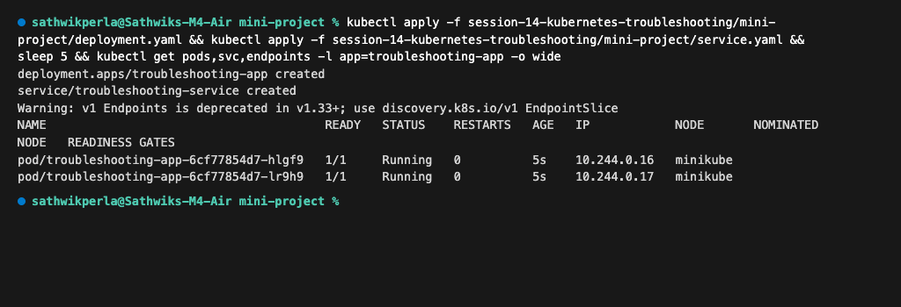
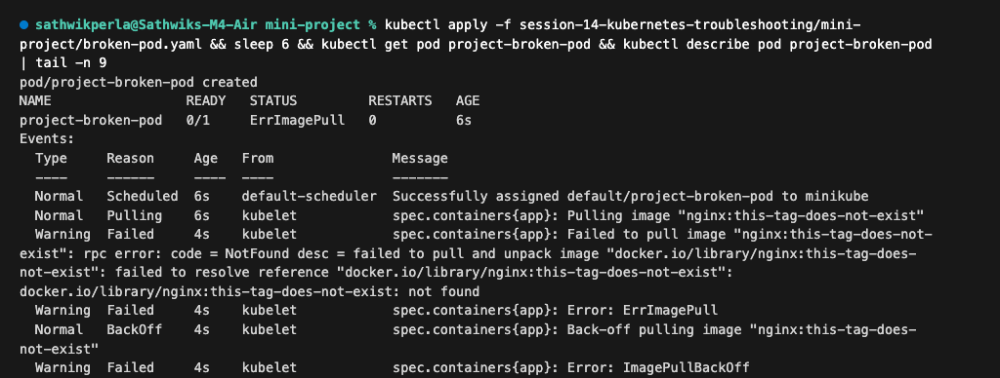
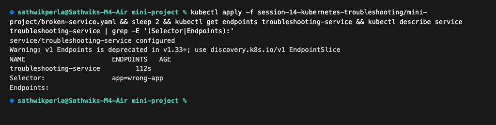
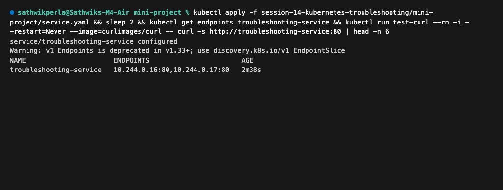

# Session 14 — Kubernetes Troubleshooting

## Task 1: Essential Troubleshooting Commands

Important troubleshooting commands covered in hands-on practice:
```bash
# Check status, IP, and node assignment
kubectl get pods -o wide

# Inspect container state, lifecycle, and event logs
kubectl describe pod <pod-name>

# View container logs (current or previous crash)
kubectl logs <pod-name>
kubectl logs <pod-name> --previous

# Interactive debugging inside a running container
kubectl exec -it <pod-name> -- sh

# View chronological cluster warning and error events
kubectl events

# Inspect API resource specifications and schemas
kubectl explain pod.spec.containers

# Monitor live CPU and memory utilization
kubectl top nodes
kubectl top pods
```

---

## Task 2: Troubleshooting Common Issues

Commands and investigation flow for common Kubernetes issues:

* **CrashLoopBackOff**:
  * Investigate: `kubectl describe pod <pod>` & `kubectl logs <pod> --previous`
  * Cause & Fix: Application crash or missing env/entrypoint; fix application command or configuration.
* **ImagePullBackOff / ErrImagePull**:
  * Investigate: `kubectl describe pod <pod>` (inspect `Events`)
  * Cause & Fix: Non-existent image tag or missing pull secret; fix image tag or add `imagePullSecrets`.
* **Pending**:
  * Investigate: `kubectl describe pod <pod>` (inspect `Events`)
  * Cause & Fix: Insufficient CPU/memory or unbound PVC; adjust resource requests or attach storage.
* **ContainerCreating**:
  * Investigate: `kubectl describe pod <pod>` (inspect `Events`)
  * Cause & Fix: Delayed PVC attachment or missing ConfigMap/Secret; resolve volume lock or create missing secret.
* **Service Connectivity**:
  * Investigate: `kubectl get endpoints <service>` & `kubectl describe svc <service>`
  * Cause & Fix: Selector does not match pod labels; align Service `spec.selector` with Pod labels.
* **DNS Issues**:
  * Investigate: `kubectl get pods -n kube-system -l k8s-app=kube-dns` & `nslookup <service>`
  * Cause & Fix: CoreDNS unready or domain mismatch; verify CoreDNS pods and cluster local domain.
* **Pod Networking**:
  * Investigate: `kubectl get pods -o wide` & pod-to-pod ping
  * Cause & Fix: CNI plugin failure or NetworkPolicy blocking traffic; verify CNI state and policy rules.
* **Configuration Issues**:
  * Investigate: `kubectl describe pod <pod>` (`CreateContainerConfigError`)
  * Cause & Fix: Missing ConfigMap/Secret key; create the referenced key or correct name in YAML.

---

## Task 3: Mini Project — Troubleshooting Challenge

### 1. Application & Service Deployment
```bash
kubectl apply -f mini-project/deployment.yaml
kubectl apply -f mini-project/service.yaml
kubectl get pods,svc,endpoints -l app=troubleshooting-app -o wide
```


### 2. Broken Pod Investigation (`ImagePullBackOff`)
* **Problem**: Pod stuck in `ErrImagePull` / `ImagePullBackOff`.
* **Investigation Command**:
```bash
kubectl apply -f mini-project/broken-pod.yaml
kubectl get pod project-broken-pod
kubectl describe pod project-broken-pod | tail -n 9
```
* **Root Cause**: Invalid image tag `nginx:this-tag-does-not-exist`.


### 3. Broken Pod Fixed
* **Fix**: Updated image tag to `nginx:alpine` in `fixed-pod.yaml`.
* **Verification Command**:
```bash
kubectl apply -f mini-project/fixed-pod.yaml
kubectl wait --for=condition=Ready pod/project-broken-pod --timeout=20s
kubectl get pod project-broken-pod
```


### 4. Service Selector Mismatch Investigation
* **Problem**: Service active but endpoints list is `<none>` (traffic fails).
* **Investigation Command**:
```bash
kubectl apply -f mini-project/broken-service.yaml
kubectl get endpoints troubleshooting-service
kubectl describe service troubleshooting-service | grep -E '(Selector|Endpoints):'
```
* **Root Cause**: Service selector `app: wrong-app` did not match Pod label `app: troubleshooting-app`.


### 5. Service Fixed & Verified
* **Fix**: Restored selector `app: troubleshooting-app` in `service.yaml`.
* **Verification Command**:
```bash
kubectl apply -f mini-project/service.yaml
kubectl get endpoints troubleshooting-service
kubectl run test-curl --rm -i --restart=Never --image=curlimages/curl -- curl -s http://troubleshooting-service:80 | head -n 6
```

