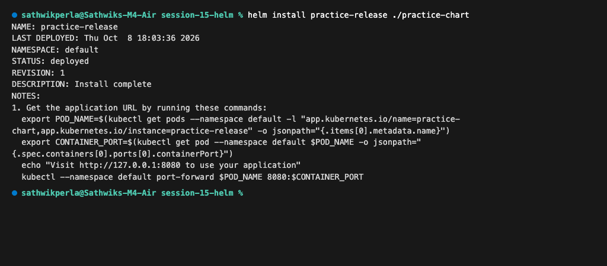
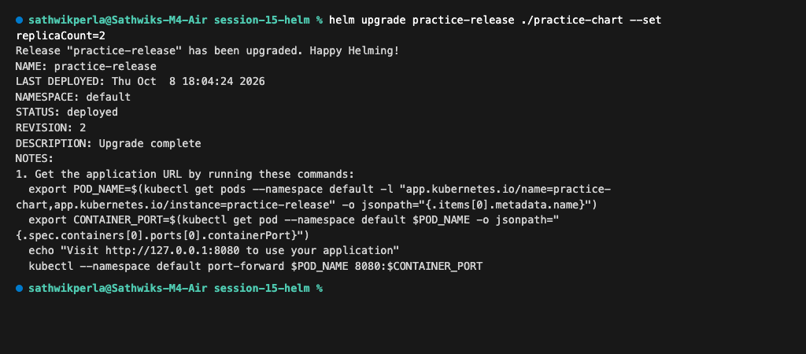
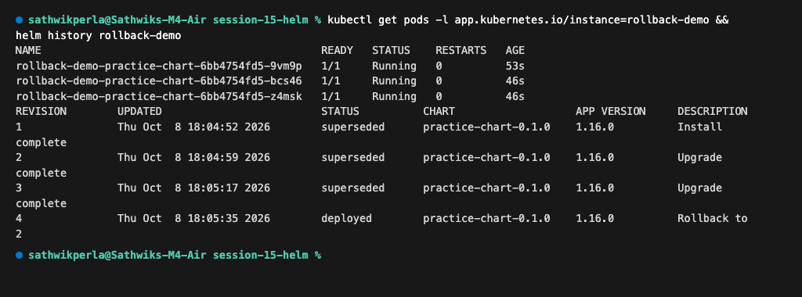
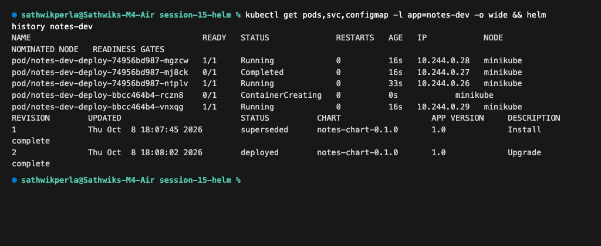
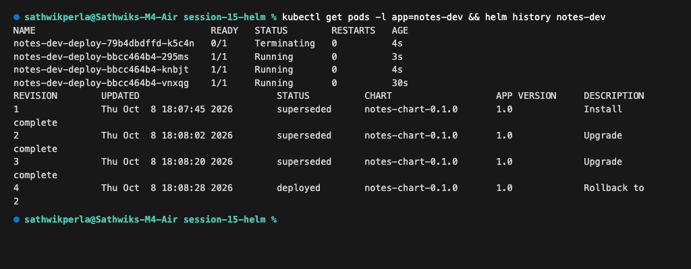

# Session 15 — Helm: Package Manager for Kubernetes

**Author:** Sathwik Perla  
**Roll Number:** 590  
**Email:** perla.24bcs10590@sst.scaler.com  

---

## Executive Summary

Managing standalone Kubernetes YAML files across multiple environments (Dev, Staging, Production) introduces configuration drift, duplicate manifests, and elevated operational risk. **Helm** acts as the package manager for Kubernetes by introducing parameterized **Charts** that bundle YAML templates with environment-specific variables (**Values**).

This document covers:
1. **Task 1: Helm Commands** — Hands-on execution, syntax, and outputs for all core Helm commands.
2. **Task 2: Helm Rollback** — End-to-end rollback workflow demonstrating release versioning and atomic state recovery.
3. **Task 3: Mini Project** — Designing, templating, deploying, upgrading, and rolling back a custom multi-tier `notes-chart`.

---

# Task 1: Helm Commands

### Core Command Matrix

| Command | Purpose | Key Flags | Primary Diagnostic Role |
| :--- | :--- | :--- | :--- |
| `helm create` | Generates a standard chart boilerplate | None | Scaffolds directory layout, `Chart.yaml`, and templates |
| `helm repo` | Manages remote chart repositories | `add`, `list`, `update` | Connects cluster to trusted public or internal registries |
| `helm search` | Discovers charts in registries or Hub | `repo`, `hub` | Locates available chart versions and keywords |
| `helm install` | Packages and deploys a chart release | `-f`, `--set`, `--atomic` | Provisions Kubernetes resources from templates |
| `helm list` | Lists all active releases | `-A`, `--deployed`, `-a` | Checks release statuses, revisions, and namespaces |
| `helm status` | Displays detailed status of a release | None | Examines deployed resources and chart notes |
| `helm get` | Fetches runtime information of a release | `values`, `manifest`, `all`| Audits deployed YAML manifests and active value overrides |
| `helm upgrade` | Modifies configuration or chart version | `-f`, `--set`, `--atomic` | Applies rolling changes to an existing release |
| `helm history` | Chronological log of release revisions | `--max` | Tracks release timeline and deployment outcomes |
| `helm rollback` | Reverts a release to a prior revision | `--wait`, `--cleanup-on-fail`| Restores cluster state from unexpected outages |
| `helm uninstall`| Deletes a release and its resources | `--keep-history` | Tears down associated workloads and services |

---

### 1. `helm create`
Creates a standard chart directory skeleton containing `Chart.yaml`, `values.yaml`, and the `templates/` folder.
```bash
helm create practice-chart
```
Output:
```text
Creating practice-chart
```

---

### 2. `helm repo`
Adds and lists remote chart repositories to access community and third-party charts.
```bash
helm repo add bitnami https://charts.bitnami.com/bitnami
helm repo list
```
Output:
```text
"bitnami" has been added to your repositories
NAME     URL
bitnami  https://charts.bitnami.com/bitnami
```

---

### 3. `helm search`
Queries added repositories for available charts, chart versions, and app versions.
```bash
helm search repo nginx | head -n 8
```
Output:
```text
NAME                                CHART VERSION   APP VERSION   DESCRIPTION
bitnami/nginx                       25.2.1          1.31.6        NGINX Open Source is a web server that can be a...
bitnami/nginx-ingress-controller    12.0.7          1.13.1        NGINX Ingress Controller is an Ingress controll...
bitnami/nginx-intel                 2.1.15          0.4.9         DEPRECATED NGINX Open Source for Intel is a lig...
```

---

### 4. `helm install`
Deploys an instance of the chart into the Kubernetes cluster as a named release.
```bash
helm install practice-release ./practice-chart
```
Output:
```text
NAME: practice-release
LAST DEPLOYED: Thu Oct  8 18:03:36 2026
NAMESPACE: default
STATUS: deployed
REVISION: 1
DESCRIPTION: Install complete
NOTES:
1. Get the application URL by running these commands:
  export POD_NAME=$(kubectl get pods --namespace default -l "app.kubernetes.io/name=practice-chart,app.kubernetes.io/instance=practice-release" -o jsonpath="{.items[0].metadata.name}")
  export CONTAINER_PORT=$(kubectl get pod --namespace default $POD_NAME -o jsonpath="{.spec.containers[0].ports[0].containerPort}")
  echo "Visit http://127.0.0.1:8080 to use your application"
  kubectl --namespace default port-forward $POD_NAME 8080:$CONTAINER_PORT
```



---

### 5. `helm list`
Displays all deployed releases, their active revisions, and current status.
```bash
helm list
```
Output:
```text
NAME              NAMESPACE  REVISION  UPDATED                               STATUS    CHART                 APP VERSION
practice-release  default    1         2026-10-08 18:03:36.402989 +0530 IST  deployed  practice-chart-0.1.0  1.16.0
```

---

### 6. `helm status`
Shows real-time health, deployed Kubernetes resources, and connection notes for a release.
```bash
helm status practice-release
```
Output:
```text
NAME: practice-release
LAST DEPLOYED: Thu Oct  8 18:03:36 2026
NAMESPACE: default
STATUS: deployed
REVISION: 1
DESCRIPTION: Install complete
RESOURCES:
==> v1/Deployment
NAME                             READY   UP-TO-DATE   AVAILABLE   AGE
practice-release-practice-chart  1/1     1            1           22s
==> v1/Pod(related)
NAME                                              READY   STATUS    RESTARTS   AGE
practice-release-practice-chart-5796ccd76b-2tcn2  1/1     Running   0          22s
==> v1/Service
NAME                             TYPE        CLUSTER-IP      EXTERNAL-IP   PORT(S)   AGE
practice-release-practice-chart  ClusterIP   10.109.120.125  <none>        80/TCP    22s
```

---

### 7. `helm get`
Inspects user-supplied values and the rendered Kubernetes manifests running in the cluster.
```bash
helm get values practice-release
helm get manifest practice-release | head -n 18
```
Output:
```text
USER-SUPPLIED VALUES:
null
---
# Source: practice-chart/templates/serviceaccount.yaml
apiVersion: v1
kind: ServiceAccount
metadata:
  name: practice-release-practice-chart
  labels:
    helm.sh/chart: practice-chart-0.1.0
    app.kubernetes.io/name: practice-chart
    app.kubernetes.io/instance: practice-release
    app.kubernetes.io/version: "1.16.0"
    app.kubernetes.io/managed-by: Helm
automountServiceAccountToken: true
---
# Source: practice-chart/templates/service.yaml
apiVersion: v1
kind: Service
```

---

### 8. `helm upgrade`
Applies configuration changes (scaling replicas to 2) and records a new revision.
```bash
helm upgrade practice-release ./practice-chart --set replicaCount=2
```
Output:
```text
Release "practice-release" has been upgraded. Happy Helming!
NAME: practice-release
LAST DEPLOYED: Thu Oct  8 18:04:24 2026
NAMESPACE: default
STATUS: deployed
REVISION: 2
DESCRIPTION: Upgrade complete
```



---

### 9. `helm history`
Tracks revision increments, timestamps, and deployment descriptions.
```bash
helm history practice-release
```
Output:
```text
REVISION  UPDATED                   STATUS      CHART                 APP VERSION  DESCRIPTION
1         Thu Oct  8 18:03:36 2026  superseded  practice-chart-0.1.0  1.16.0       Install complete
2         Thu Oct  8 18:04:24 2026  deployed    practice-chart-0.1.0  1.16.0       Upgrade complete
```

---

### 10. `helm rollback`
Rolls back the active release to Revision 1, incrementing the release log to Revision 3.
```bash
helm rollback practice-release 1
helm history practice-release
```
Output:
```text
Rollback was a success! Happy Helming!
REVISION  UPDATED                   STATUS      CHART                 APP VERSION  DESCRIPTION
1         Thu Oct  8 18:03:36 2026  superseded  practice-chart-0.1.0  1.16.0       Install complete
2         Thu Oct  8 18:04:24 2026  superseded  practice-chart-0.1.0  1.16.0       Upgrade complete
3         Thu Oct  8 18:04:36 2026  deployed    practice-chart-0.1.0  1.16.0       Rollback to 1
```

---

### 11. `helm uninstall`
Completely deletes the release and purges all underlying workloads and services.
```bash
helm uninstall practice-release
helm list
```
Output:
```text
release "practice-release" uninstalled
NAME  NAMESPACE  REVISION  UPDATED  STATUS  CHART  APP VERSION
```

---

# Task 2: Helm Rollback Workflow

### Workflow Progression
```text
Install (Rev 1) ──► Upgrade (Rev 2) ──► Verify (3 Pods) ──► Upgrade Again (Rev 3: Bad Tag)
                                                                       │
                                                                       ▼
Verify Restored ◄── Rollback to Rev 2 ◄── Verify Failure (ErrImagePull / Rev 3)
```

---

### Step 1: Install Revision 1
Deploy base workload with 1 replica:
```bash
helm install rollback-demo ./practice-chart --set replicaCount=1 --set service.type=ClusterIP
```

---

### Step 2: Upgrade to Revision 2
Scale the workload to 3 replicas:
```bash
helm upgrade rollback-demo ./practice-chart --set replicaCount=3 --set service.type=ClusterIP
```

---

### Step 3: Verify Revision 2
Confirm 3 healthy running pods and revision history:
```bash
kubectl get pods -l app.kubernetes.io/instance=rollback-demo
helm history rollback-demo
```
Output:
```text
NAME                                           READY   STATUS    RESTARTS   AGE
rollback-demo-practice-chart-6bb4754fd5-9vm9p  1/1     Running   0          17s
rollback-demo-practice-chart-6bb4754fd5-bcs46  1/1     Running   0          10s
rollback-demo-practice-chart-6bb4754fd5-z4msk  1/1     Running   0          10s

REVISION  UPDATED                   STATUS      CHART                 APP VERSION  DESCRIPTION
1         Thu Oct  8 18:04:52 2026  superseded  practice-chart-0.1.0  1.16.0       Install complete
2         Thu Oct  8 18:04:59 2026  deployed    practice-chart-0.1.0  1.16.0       Upgrade complete
```

---

### Step 4: Upgrade Again (Simulate Failure in Revision 3)
Inject a non-existent container image tag (`invalid-tag-v999`):
```bash
helm upgrade rollback-demo ./practice-chart --set image.tag=invalid-tag-v999 --set replicaCount=3
```

---

### Step 5: Verify Failure in Revision 3
Inspect cluster status to confirm `ErrImagePull` state:
```bash
kubectl get pods -l app.kubernetes.io/instance=rollback-demo
helm history rollback-demo
```
Output:
```text
NAME                                           READY   STATUS         RESTARTS   AGE
rollback-demo-practice-chart-6bb4754fd5-9vm9p  1/1     Running        0          36s
rollback-demo-practice-chart-6bb4754fd5-bcs46  1/1     Running        0          29s
rollback-demo-practice-chart-6bb4754fd5-z4msk  1/1     Running        0          29s
rollback-demo-practice-chart-8457bf97fc-9hv4t  0/1     ErrImagePull   0          11s

REVISION  UPDATED                   STATUS      CHART                 APP VERSION  DESCRIPTION
1         Thu Oct  8 18:04:52 2026  superseded  practice-chart-0.1.0  1.16.0       Install complete
2         Thu Oct  8 18:04:59 2026  superseded  practice-chart-0.1.0  1.16.0       Upgrade complete
3         Thu Oct  8 18:05:17 2026  deployed    practice-chart-0.1.0  1.16.0       Upgrade complete
```

---

### Step 6: Rollback to Healthy Revision 2
Revert the release to the known working Revision 2:
```bash
helm rollback rollback-demo 2
```

---

### Step 7: Verify Healthy State After Rollback
Verify that faulty pods have been terminated and 3/3 healthy pods remain running:
```bash
kubectl get pods -l app.kubernetes.io/instance=rollback-demo
helm history rollback-demo
```
Output:
```text
NAME                                           READY   STATUS    RESTARTS   AGE
rollback-demo-practice-chart-6bb4754fd5-9vm9p  1/1     Running   0          53s
rollback-demo-practice-chart-6bb4754fd5-bcs46  1/1     Running   0          46s
rollback-demo-practice-chart-6bb4754fd5-z4msk  1/1     Running   0          46s

REVISION  UPDATED                   STATUS      CHART                 APP VERSION  DESCRIPTION
1         Thu Oct  8 18:04:52 2026  superseded  practice-chart-0.1.0  1.16.0       Install complete
2         Thu Oct  8 18:04:59 2026  superseded  practice-chart-0.1.0  1.16.0       Upgrade complete
3         Thu Oct  8 18:05:17 2026  superseded  practice-chart-0.1.0  1.16.0       Upgrade complete
4         Thu Oct  8 18:05:35 2026  deployed    practice-chart-0.1.0  1.16.0       Rollback to 2
```



```bash
helm uninstall rollback-demo
```

---

# Task 3: Mini Project — Notes App Helm Chart

### 1. Chart Architecture & Structure
```text
mini-project/notes-chart/
├── Chart.yaml              # Chart metadata
├── values.yaml             # Development configurations (1 replica, NGINX 1.24)
├── values-prod.yaml        # Production configurations (3 replicas, NGINX 1.25)
└── templates/
    ├── configmap.yaml      # Environment variable injection
    ├── deployment.yaml     # Application deployment with volume config
    └── service.yaml        # ClusterIP routing
```

---

### 2. Chart Files

#### `Chart.yaml`
```yaml
apiVersion: v2
name: notes-chart
description: A simple Notes application Helm chart
type: application
version: 0.1.0
appVersion: "1.0"
```

#### `values.yaml` (Development Defaults)
```yaml
replicaCount: 1

image:
  repository: nginx
  tag: "1.24"

service:
  type: ClusterIP
  port: 80

app:
  name: notes-app
  environment: development
```

#### `values-prod.yaml` (Production Overrides)
```yaml
replicaCount: 3

image:
  repository: nginx
  tag: "1.25"

service:
  type: ClusterIP
  port: 80

app:
  name: notes-app
  environment: production
```

#### `templates/configmap.yaml`
```yaml
apiVersion: v1
kind: ConfigMap
metadata:
  name: {{ .Release.Name }}-config
data:
  APP_NAME: {{ .Values.app.name | quote }}
  ENVIRONMENT: {{ .Values.app.environment | quote }}
```

#### `templates/deployment.yaml`
```yaml
apiVersion: apps/v1
kind: Deployment
metadata:
  name: {{ .Release.Name }}-deploy
  labels:
    app: {{ .Release.Name }}
    environment: {{ .Values.app.environment }}
spec:
  replicas: {{ .Values.replicaCount }}
  selector:
    matchLabels:
      app: {{ .Release.Name }}
  template:
    metadata:
      labels:
        app: {{ .Release.Name }}
    spec:
      containers:
        - name: notes
          image: "{{ .Values.image.repository }}:{{ .Values.image.tag }}"
          ports:
            - containerPort: {{ .Values.service.port }}
          envFrom:
            - configMapRef:
                name: {{ .Release.Name }}-config
```

#### `templates/service.yaml`
```yaml
apiVersion: v1
kind: Service
metadata:
  name: {{ .Release.Name }}-svc
spec:
  type: {{ .Values.service.type | default "ClusterIP" }}
  selector:
    app: {{ .Release.Name }}
  ports:
    - port: {{ .Values.service.port }}
      targetPort: {{ .Values.service.port }}
```

---

### 3. Step-by-Step Hands-on Execution

#### Step 1: Lint the Chart
Validates YAML formatting, semantics, and Go templating:
```bash
helm lint mini-project/notes-chart
```
Output:
```text
==> Linting mini-project/notes-chart
[INFO] Chart.yaml: icon is recommended

1 chart(s) linted, 0 chart(s) failed
```

---

#### Step 2: Render Templates Locally
Inspects generated Kubernetes YAML without connecting to cluster:
```bash
helm template notes-dev mini-project/notes-chart | head -n 30
```

---

#### Step 3: Install in Development Mode & Verify
Deploys the application with development values:
```bash
helm install notes-dev mini-project/notes-chart
kubectl get pods,svc,configmap -l app=notes-dev -o wide
```

---

#### Step 4: Upgrade to Production (`values-prod.yaml`) & Verify
Applies production settings (scaling to 3 replicas with NGINX 1.25):
```bash
helm upgrade notes-dev mini-project/notes-chart -f mini-project/notes-chart/values-prod.yaml
kubectl get pods,svc,configmap -l app=notes-dev -o wide
helm history notes-dev
```
Output:
```text
NAME                                    READY   STATUS    RESTARTS   AGE   IP            NODE       NOMINATED NODE   READINESS GATES
pod/notes-dev-deploy-74956bd987-mgzcw   1/1     Running   0          16s   10.244.0.28   minikube   <none>           <none>
pod/notes-dev-deploy-74956bd987-mj8ck   1/1     Running   0          16s   10.244.0.27   minikube   <none>           <none>
pod/notes-dev-deploy-74956bd987-ntplv   1/1     Running   0          33s   10.244.0.26   minikube   <none>           <none>

REVISION  UPDATED                   STATUS      CHART              APP VERSION  DESCRIPTION
1         Thu Oct  8 18:07:45 2026  superseded  notes-chart-0.1.0  1.0          Install complete
2         Thu Oct  8 18:08:02 2026  deployed    notes-chart-0.1.0  1.0          Upgrade complete
```



---

#### Step 5: Simulate Faulty Upgrade, Rollback & Recovery
Deploy an invalid image tag, observe `ErrImagePull`, and roll back to Revision 2:
```bash
# Faulty upgrade
helm upgrade notes-dev mini-project/notes-chart --set image.tag=broken-tag-does-not-exist

# Rollback to Revision 2
helm rollback notes-dev 2

# Verify restored pods and history
kubectl get pods -l app=notes-dev
helm history notes-dev
```
Output:
```text
NAME                                READY   STATUS    RESTARTS   AGE
notes-dev-deploy-bbcc464b4-295ms    1/1     Running   0          3s
notes-dev-deploy-bbcc464b4-knbjt    1/1     Running   0          4s
notes-dev-deploy-bbcc464b4-vnxqg    1/1     Running   0          30s

REVISION  UPDATED                   STATUS      CHART              APP VERSION  DESCRIPTION
1         Thu Oct  8 18:07:45 2026  superseded  notes-chart-0.1.0  1.0          Install complete
2         Thu Oct  8 18:08:02 2026  superseded  notes-chart-0.1.0  1.0          Upgrade complete
3         Thu Oct  8 18:08:20 2026  superseded  notes-chart-0.1.0  1.0          Upgrade complete
4         Thu Oct  8 18:08:28 2026  deployed    notes-chart-0.1.0  1.0          Rollback to 2
```



---

#### Step 6: Cleanup
Uninstall the release to free all Kubernetes resources:
```bash
helm uninstall notes-dev
```
