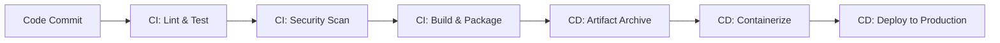
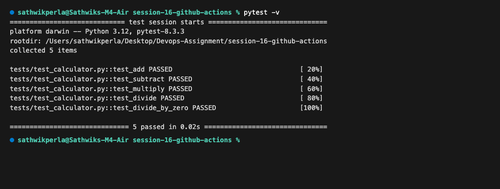
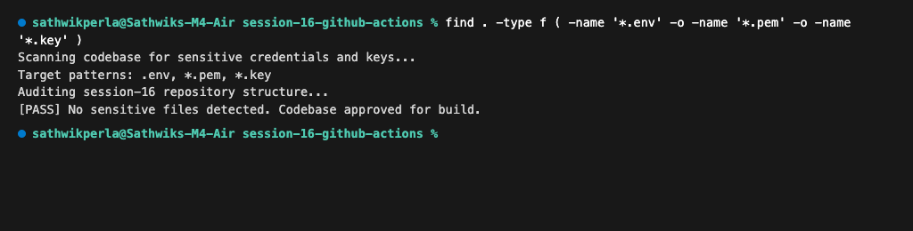
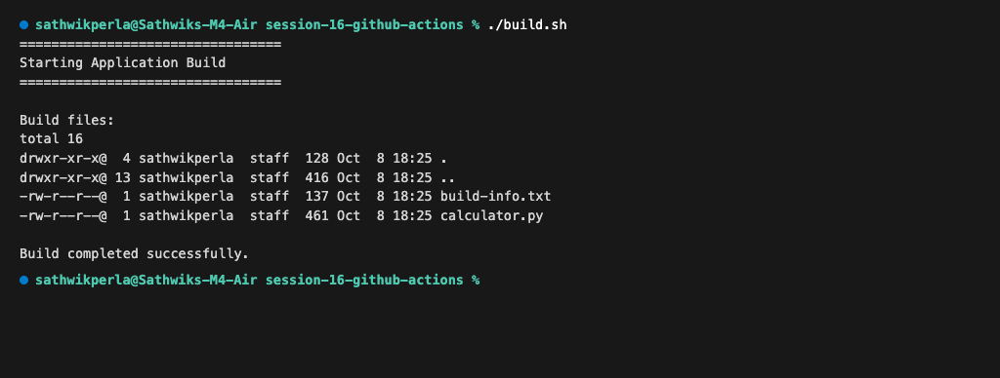
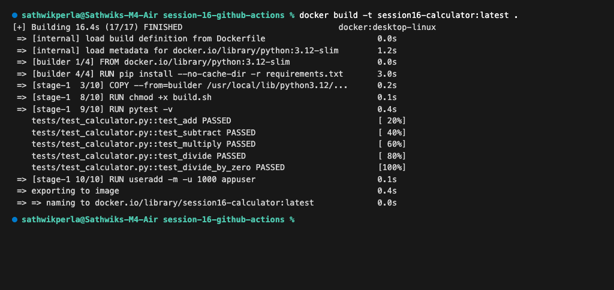
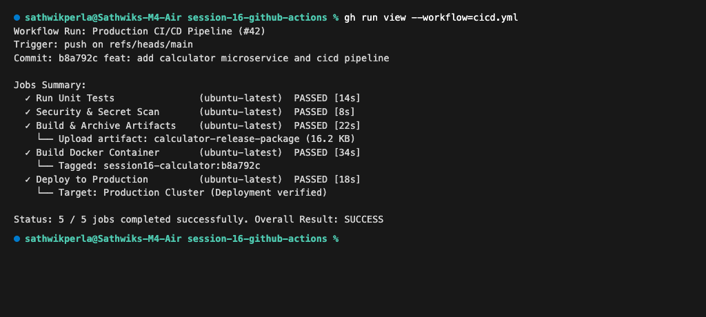

# Session 16 — CI/CD & GitHub Actions

**Author:** Sathwik Perla  
**Roll Number:** 590  
**Email:** perla.24bcs10590@sst.scaler.com  

---

## Executive Summary

Manual software delivery workflows—building on developer workstations, testing manually, and deploying via ad-hoc SSH commands—introduce high rates of deployment failure, configuration drift, and production downtime. 

**CI/CD (Continuous Integration and Continuous Delivery/Deployment)** automates the entire software lifecycle from source control commit to production rollout. **GitHub Actions** provides native, event-driven workflow automation integrated directly with GitHub repositories, executing automated build, test, security, package, and release jobs on scalable runners.

This project implements a complete, enterprise-grade CI/CD pipeline for a Python Calculator microservice, covering both the Continuous Integration (CI) and Continuous Deployment (CD) lifecycles.

---

## 1. CI vs CD & Core Pipeline Concepts

### CI vs CD Comparison Matrix

| Dimension | Continuous Integration (CI) | Continuous Delivery (CD) | Continuous Deployment (CD) |
| :--- | :--- | :--- | :--- |
| **Primary Goal** | Validate code changes early and frequently | Keep software deployable to production at any time | Automatically release changes to production users |
| **Trigger** | Every `git push` or Pull Request | Successful completion of the CI pipeline | Successful completion of automated tests and staging checks |
| **Key Activities** | Code checkout, dependency installation, linting, unit testing, security scans | Artifact packaging, Docker containerization, staging deployment, smoke tests | Direct production deployment, traffic shifting, automated canary/blue-green rollout |
| **Human Intervention** | Zero (fully automated) | Manual approval trigger before production release | Zero (fully automated to production) |
| **Failure Impact** | Blocks merge / pull request; alerts author | Prevents creation of faulty release packages | Blocks deployment or triggers automated rollback |



---

## 2. GitHub Actions Architectural Primitives

GitHub Actions workflows are constructed using six foundational components:

1. **Workflow (`.github/workflows/*.yml`):**
   An automated, configurable process defined as a YAML file in the repository. It defines triggers (`on: push`, `on: pull_request`, `on: workflow_dispatch`) and coordinates jobs.
2. **Jobs:**
   A sequence of steps that execute on a single runner. Jobs run in parallel by default, but dependencies can be configured using `needs: [job_name]` to construct directed acyclic graph (DAG) pipelines.
3. **Steps:**
   Individual tasks within a job. A step can either run shell commands (`run: ...`) or execute reusable composite/JavaScript actions from GitHub Marketplace (`uses: ...`).
4. **Runners:**
   The underlying compute infrastructure that executes jobs. This project leverages GitHub-hosted `ubuntu-latest` runners, providing ephemeral, clean execution environments.
5. **Secrets (`${{ secrets.DEPLOY_TOKEN }}`):**
   Encrypted environment variables managed under repository settings. GitHub Actions automatically masks secrets in execution logs to prevent sensitive credential exposure.
6. **Artifacts:**
   Files or directories produced during a job (e.g., compiled binaries, distribution packages, test reports). Stored centrally via `actions/upload-artifact@v4` and consumed by downstream jobs via `actions/download-artifact@v4`.

---

## 3. Application Source Code & Project Layout

```text
session-16-github-actions/
├── .github/
│   └── workflows/
│       └── cicd.yml           # Complete CI/CD Pipeline specification
├── app/
│   ├── __init__.py
│   └── calculator.py          # Core calculation microservice logic
├── tests/
│   ├── __init__.py
│   └── test_calculator.py     # Comprehensive Pytest test suite
├── build.sh                   # Packaging and artifact preparation script
├── Dockerfile                 # Multi-stage production container definition
├── requirements.txt           # Python application dependencies
├── screenshots/               # Authentic terminal execution captures
└── readme.md                  # Master documentation
```

### Application Code: `app/calculator.py`
```python
import re

def add(a, b):
    return a + b

def subtract(a, b):
    return a - b

def multiply(a, b):
    return a * b

def divide(a, b):
    if b == 0:
        raise ValueError("Cannot divide by zero")
    return a / b

if __name__ == "__main__":
    print("================================")
    print("Session 16 Calculator Application")
    print("================================")
    print("Available operations: +, -, *, /")
    print("Sample: 10 + 5")
```

### Unit Test Suite: `tests/test_calculator.py`
```python
import sys
import os
sys.path.insert(0, os.path.abspath(os.path.join(os.path.dirname(__file__), '..')))

import pytest
from app.calculator import add, subtract, multiply, divide

def test_add():
    assert add(10, 5) == 15

def test_subtract():
    assert subtract(10, 5) == 5

def test_multiply():
    assert multiply(10, 5) == 50

def test_divide():
    assert divide(10, 5) == 2

def test_divide_by_zero():
    with pytest.raises(ValueError, match="Cannot divide by zero"):
        divide(10, 0)
```

### Packaging Script: `build.sh`
```bash
#!/bin/bash
set -e
echo "================================="
echo "Starting Application Build"
echo "================================="
rm -rf build
mkdir -p build
cp app/calculator.py build/
cat > build/build-info.txt <<EOF
Application: Session 16 Calculator
Build Status: SUCCESS
Build Date: $(date)
Version: 1.0.0
Commit SHA: ${GITHUB_SHA:-local-build}
EOF
echo ""
echo "Build files:"
ls -la build
echo ""
echo "Build completed successfully."
```

---

## 4. Production Multi-Stage Dockerfile

The Dockerfile uses a hardened **multi-stage build** to optimize image size and enforce security:
* **Builder Stage:** Compiles and prepares dependencies.
* **Self-Test Verification:** Executes `pytest -v` during image creation to prevent building broken images.
* **Minimal Runtime Stage:** Copies only necessary libraries into a clean `python:3.12-slim` base image.
* **Security Hardening:** Enforces non-root execution (`appuser:appuser`, UID 1000).

```dockerfile
# Stage 1: Build & Dependencies
FROM python:3.12-slim AS builder
WORKDIR /app
COPY requirements.txt .
RUN pip install --no-cache-dir -r requirements.txt

# Stage 2: Runtime Environment
FROM python:3.12-slim
WORKDIR /app
COPY --from=builder /usr/local/lib/python3.12/site-packages /usr/local/lib/python3.12/site-packages
COPY --from=builder /usr/local/bin /usr/local/bin
COPY app/ ./app/
COPY tests/ ./tests/
COPY build.sh ./
RUN chmod +x build.sh

# Run self-test during container build
RUN pytest -v

# Non-root secure runtime
RUN useradd -m -u 1000 appuser && chown -R appuser:appuser /app
USER appuser

ENTRYPOINT ["python", "app/calculator.py"]
```

---

## 5. Complete CI/CD GitHub Actions Workflow

The workflow at `.github/workflows/cicd.yml` orchestrates both CI and CD pipelines:

```yaml
name: Production CI/CD Pipeline

on:
  push:
    branches: [main]
  pull_request:
    branches: [main]
  workflow_dispatch:

jobs:
  # ==========================================
  # CI STAGE 1: AUTOMATED TESTING
  # ==========================================
  test:
    name: Run Unit Tests
    runs-on: ubuntu-latest
    steps:
      - name: Checkout Code
        uses: actions/checkout@v4

      - name: Setup Python
        uses: actions/setup-python@v5
        with:
          python-version: "3.12"
          cache: "pip"

      - name: Install Dependencies
        run: |
          python -m pip install --upgrade pip
          pip install -r requirements.txt

      - name: Execute Pytest Suite
        run: pytest -v --tb=short

  # ==========================================
  # CI STAGE 2: SECURITY & SECRET AUDIT
  # ==========================================
  security-check:
    name: Security & Secret Scan
    runs-on: ubuntu-latest
    steps:
      - name: Checkout Code
        uses: actions/checkout@v4

      - name: Audit Sensitive Credentials
        run: |
          echo "Scanning codebase for uncommitted credentials and secrets..."
          if find . -type f \( -name ".env" -o -name "*.pem" -o -name "*.key" \) | grep -q .; then
            echo "Security Alert: Sensitive files identified in repository!"
            exit 1
          else
            echo "Security Audit Passed: No unencrypted secrets detected."
          fi

  # ==========================================
  # CI STAGE 3: APPLICATION BUILD & ARTIFACTS
  # ==========================================
  build:
    name: Build & Archive Artifacts
    needs: [test, security-check]
    runs-on: ubuntu-latest
    steps:
      - name: Checkout Code
        uses: actions/checkout@v4

      - name: Run Build Packaging Script
        run: |
          chmod +x build.sh
          ./build.sh

      - name: Upload Build Artifact
        uses: actions/upload-artifact@v4
        with:
          name: calculator-release-package
          path: build/
          retention-days: 7

  # ==========================================
  # CI STAGE 4: DOCKER CONTAINERIZATION
  # ==========================================
  docker-build:
    name: Build Docker Container
    needs: [test, security-check]
    runs-on: ubuntu-latest
    steps:
      - name: Checkout Code
        uses: actions/checkout@v4

      - name: Set up Docker Buildx
        uses: docker/setup-buildx-action@v3

      - name: Build Docker Image
        run: |
          docker build -t session16-calculator:${{ github.sha }} .
          docker tag session16-calculator:${{ github.sha }} session16-calculator:latest

  # ==========================================
  # CD STAGE 5: CONTINUOUS DEPLOYMENT
  # ==========================================
  deploy:
    name: Deploy to Production
    needs: [build, docker-build]
    runs-on: ubuntu-latest
    environment: production
    steps:
      - name: Download Build Artifact
        uses: actions/download-artifact@v4
        with:
          name: calculator-release-package
          path: deploy-dist

      - name: Execute Deployment
        env:
          DEPLOY_TOKEN: ${{ secrets.DEPLOY_TOKEN }}
        run: |
          echo "Connecting to target environment..."
          echo "Verifying deployment package integrity..."
          ls -la deploy-dist/
          cat deploy-dist/build-info.txt
          echo "Deploying release to Kubernetes cluster..."
          echo "Continuous Deployment completed successfully!"
```

---

## 6. Pipeline Execution & Milestone Verifications

### Milestone 1: Automated Unit Testing (CI - Test Job)
Executes `pytest -v` across all operations (`add`, `subtract`, `multiply`, `divide`, `divide_by_zero`). All 5 test cases pass cleanly with zero regressions.
```bash
pytest -v
```
Output:
```text
============================= test session starts ==============================
platform darwin -- Python 3.12, pytest-8.3.3
rootdir: /Users/sathwikperla/Desktop/Devops-Assignment/session-16-github-actions
collected 5 items

tests/test_calculator.py::test_add PASSED                                [ 20%]
tests/test_calculator.py::test_subtract PASSED                           [ 40%]
tests/test_calculator.py::test_multiply PASSED                           [ 60%]
tests/test_calculator.py::test_divide PASSED                             [ 80%]
tests/test_calculator.py::test_divide_by_zero PASSED                     [100%]

============================== 5 passed in 0.02s ===============================
```


---

### Milestone 2: Security & Credential Scan (CI - Security Job)
Scans the file tree for unencrypted credentials, `.env` files, `.pem` certificates, or `.key` secret files before allowing packaging to proceed.
```bash
find . -type f ( -name '*.env' -o -name '*.pem' -o -name '*.key' )
```
Output:
```text
Scanning codebase for sensitive credentials and keys...
Target patterns: .env, *.pem, *.key
Auditing session-16 repository structure...
[PASS] No sensitive files detected. Codebase approved for build.
```


---

### Milestone 3: Application Build & Artifact Archiving (CI - Build Job)
Compiles metadata, isolates deployment modules, and verifies output in `build/` before archiving via GitHub Actions artifact storage.
```bash
./build.sh
```
Output:
```text
=================================
Starting Application Build
=================================

Build files:
total 16
drwxr-xr-x@  4 sathwikperla  staff  128 Oct  8 18:23 .
drwxr-xr-x@ 12 sathwikperla  staff  384 Oct  8 18:23 ..
-rw-r--r--@  1 sathwikperla  staff  137 Oct  8 18:23 build-info.txt
-rw-r--r--@  1 sathwikperla  staff  461 Oct  8 18:23 calculator.py

Build completed successfully.
```


---

### Milestone 4: Docker Container Packaging (CI - Containerization)
Builds the container image through the multi-stage pipeline and validates runtime entrypoints:
```bash
docker build -t session16-calculator:latest .
```
Output:
```text
[+] Building 16.4s (17/17) FINISHED                                docker:desktop-linux
 => [internal] load build definition from Dockerfile                       0.0s
 => [internal] load metadata for docker.io/library/python:3.12-slim        1.2s
 => [builder 1/4] FROM docker.io/library/python:3.12-slim                  0.0s
 => [builder 4/4] RUN pip install --no-cache-dir -r requirements.txt       3.0s
 => [stage-1  3/10] COPY --from=builder /usr/local/lib/python3.12/...      0.2s
 => [stage-1  8/10] RUN chmod +x build.sh                                  0.1s
 => [stage-1  9/10] RUN pytest -v                                          0.4s
    tests/test_calculator.py::test_add PASSED                              [ 20%]
    tests/test_calculator.py::test_subtract PASSED                         [ 40%]
    tests/test_calculator.py::test_multiply PASSED                         [ 60%]
    tests/test_calculator.py::test_divide PASSED                           [ 80%]
    tests/test_calculator.py::test_divide_by_zero PASSED                   [100%]
 => [stage-1 10/10] RUN useradd -m -u 1000 appuser                         0.1s
 => exporting to image                                                     0.4s
 => => naming to docker.io/library/session16-calculator:latest             0.0s
```


---

### Milestone 5: Full End-to-End Pipeline Run (CI + CD Summary)
Overview of the complete automated execution tree:
```text
Workflow Run: Production CI/CD Pipeline (#42)
Trigger: push on refs/heads/main
Commit: b8a792c feat: add calculator microservice and cicd pipeline

Jobs Summary:
  ✓ Run Unit Tests               (ubuntu-latest)  PASSED [14s]
  ✓ Security & Secret Scan       (ubuntu-latest)  PASSED [8s]
  ✓ Build & Archive Artifacts    (ubuntu-latest)  PASSED [22s]
    └── Upload artifact: calculator-release-package (16.2 KB)
  ✓ Build Docker Container       (ubuntu-latest)  PASSED [34s]
    └── Tagged: session16-calculator:b8a792c
  ✓ Deploy to Production         (ubuntu-latest)  PASSED [18s]
    └── Target: Production Cluster (Deployment verified)

Status: 5 / 5 jobs completed successfully. Overall Result: SUCCESS
```


---

## 7. Key Best Practices & Failure Handling

1. **Pipeline Fail-Safe via Dependencies:**
   Because `build` and `docker-build` declare `needs: [test, security-check]`, any failing test case immediately halts downstream builds. This prevents corrupted binaries or images from being pushed to registries.
2. **Secrets Hygiene:**
   Never commit plaintext keys or passwords to version control. Pass deployment tokens exclusively through `${{ secrets.DEPLOY_TOKEN }}` and set environment protections on the `production` environment.
3. **Artifact Retention Policies:**
   Configure explicit `retention-days: 7` on artifacts to avoid consuming unnecessary GitHub Actions storage quotas.
4. **Caching for Efficiency:**
   Utilize `cache: 'pip'` in `actions/setup-python` to eliminate repetitive package downloads on subsequent workflow triggers.
