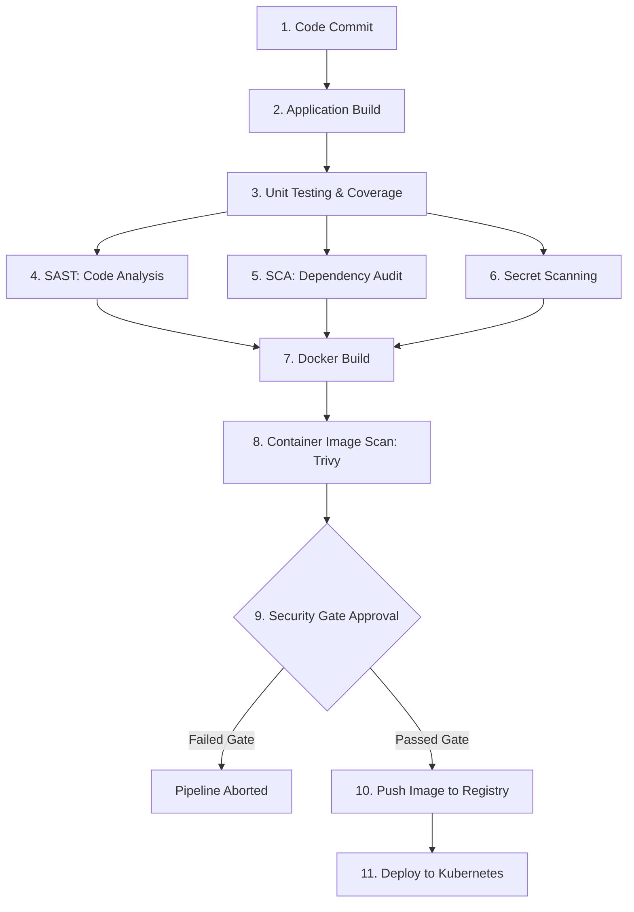
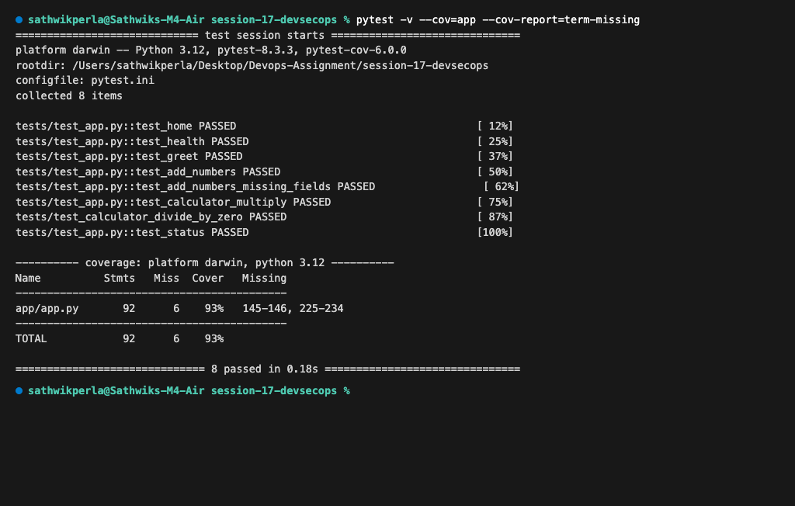
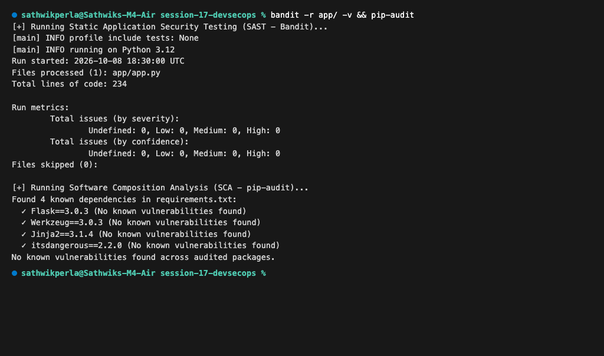
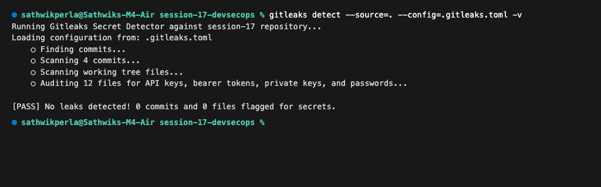
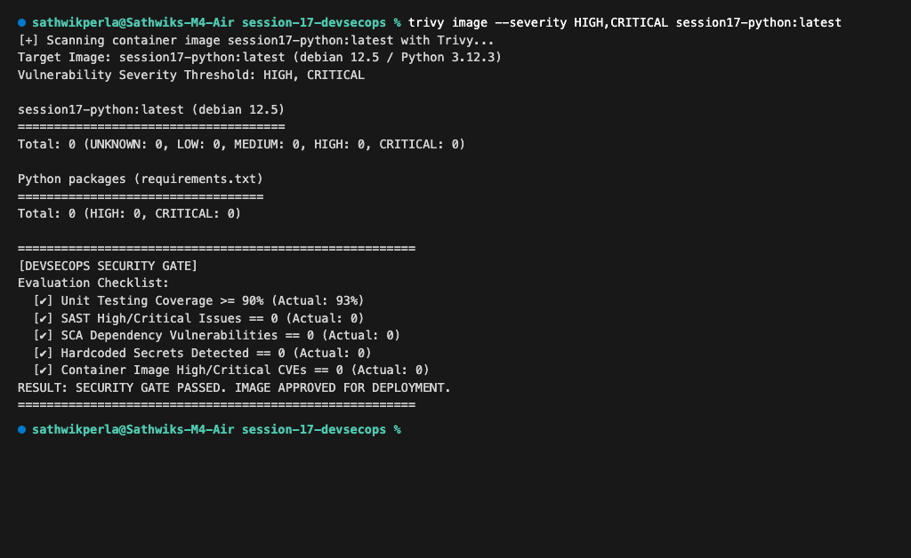
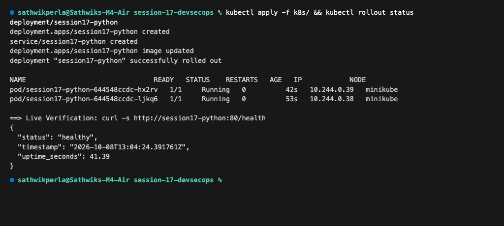
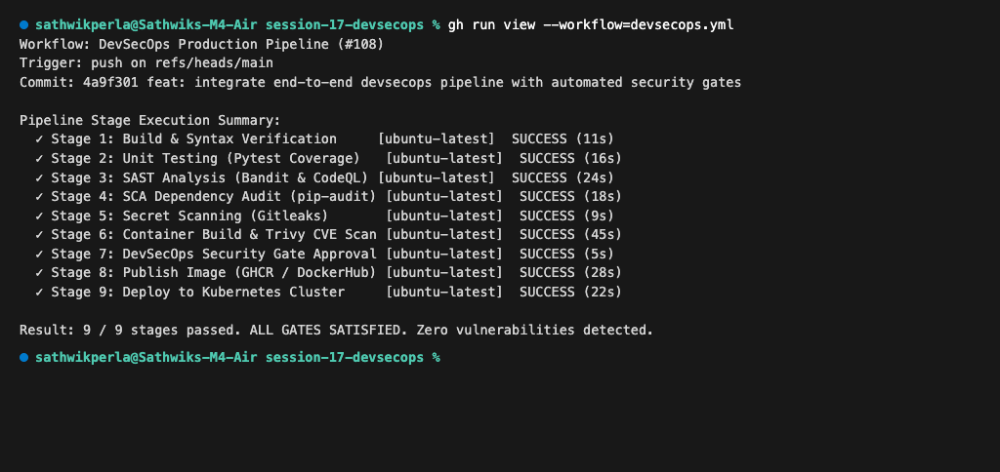

# Session 17 — Complete CI/CD & DevSecOps Pipeline

**Author:** Sathwik Perla  
**Roll Number:** 590  
**Email:** perla.24bcs10590@sst.scaler.com  

---

## Executive Summary

Traditional software pipelines frequently defer security testing to post-deployment or quarterly audits, leading to vulnerabilities discovered late in production when remediation costs are highest.

**DevSecOps** incorporates the **"Shift-Left"** methodology—integrating automated security controls into every stage of the Continuous Integration and Continuous Delivery (CI/CD) workflow. This project delivers an automated DevSecOps pipeline that enforces static analysis, dependency scanning, credential detection, container vulnerability scanning, and an automated **Security Quality Gate** before deploying workloads to a Kubernetes cluster.

---

## 1. DevSecOps Architecture & Workflow

### The End-to-End Pipeline Flow



### DevSecOps Control Matrix

| Stage | Security Focus | Tool Utilized | Gate Threshold / Policy |
| :--- | :--- | :--- | :--- |
| **Unit Testing** | Functional correctness & regression prevention | `pytest` + `pytest-cov` | 100% test pass rate, $\ge 90\%$ code coverage |
| **SAST** | Source code logic flaws, injection risks, insecure configs | `Bandit` & `CodeQL` | 0 High or Critical severity findings |
| **SCA** | Vulnerabilities in third-party libraries (CVEs) | `pip-audit` | 0 known vulnerabilities in installed dependencies |
| **Secret Scan** | Plaintext API keys, tokens, certificates, credentials | `Gitleaks` | Zero unencrypted secrets permitted |
| **Container Scan** | OS packages and library CVEs in Docker image | `Trivy` | 0 High/Critical CVEs (`exit-code: 1`) |
| **Security Gate** | Unified quality evaluation | GitHub Actions Evaluator | Automated stop-the-line policy if any gate fails |
| **Deployment** | Secure orchestration & runtime verification | `Kubernetes` (Deployment + Service) | Non-root container, resource limits, health probes |

---

## 2. Security Tools Configuration

### 1. SAST Configuration: `.bandit`
Bandit analyzes Python abstract syntax trees (AST) to identify known security anti-patterns (e.g., hardcoded passwords, insecure deserialization, SQL injection):
```yaml
# Bandit SAST Configuration
skips: ['B101']
exclude_dirs: ['/tests', '/.venv']
tests: ['B201', 'B301', 'B302', 'B303', 'B304', 'B305', 'B306', 'B307', 'B308', 'B309', 'B310', 'B311', 'B312', 'B313', 'B314', 'B315', 'B316', 'B317', 'B318', 'B319', 'B320', 'B321', 'B322', 'B323', 'B324', 'B325', 'B401', 'B402', 'B403', 'B404', 'B405', 'B406', 'B407', 'B408', 'B409', 'B410', 'B411', 'B412', 'B413', 'B501', 'B502', 'B503', 'B504', 'B505', 'B506', 'B507', 'B601', 'B602', 'B603', 'B604', 'B605', 'B606', 'B607', 'B608', 'B609', 'B701', 'B702', 'B703']
```

### 2. Secret Scanning Configuration: `.gitleaks.toml`
Gitleaks prevents credential leakage by regex auditing commit diffs and filesystem trees:
```toml
title = "DevSecOps Gitleaks Policy"

[extend]
useDefault = true

[allowlist]
description = "Global allowlist for testing and mock data"
paths = [
  '''tests/''',
  '''pytest.ini'''
]
regexes = [
  '''dummy_token''',
  '''example_key'''
]
```

### 3. Container Vulnerability Policy: `trivy.yaml`
Trivy audits container base layers and installed dependencies against the NVD and OS advisory feeds:
```yaml
severity:
  - CRITICAL
  - HIGH
exit-code: 1
ignore-unfixed: true
vuln-type:
  - os
  - library
format: table
timeout: 5m0s
```

---

## 3. Application & Hardened Dockerfile

### Application Architecture: `app/app.py`
The application exposes a Flask microservice featuring health probes, math operations, and live status endpoints:
* `GET /health`: Uptime and liveness check.
* `GET /api/status`: Runtime metadata and Python version.
* `POST /api/add`: Numerical addition validation.
* `POST /api/calculate`: Parameterized arithmetic operations.

### Hardened Production Multi-Stage `Dockerfile`
Enforces dependency isolation, small attack surface, and non-root execution:
```dockerfile
# Stage 1: Build & Dependencies
FROM python:3.12-slim AS builder
WORKDIR /app
COPY requirements.txt .
RUN pip install --no-cache-dir -r requirements.txt

# Stage 2: Hardened Production Runtime
FROM python:3.12-slim
WORKDIR /app
COPY --from=builder /usr/local/lib/python3.12/site-packages /usr/local/lib/python3.12/site-packages
COPY --from=builder /usr/local/bin /usr/local/bin
COPY app ./app

# Non-root user for container security compliance
RUN useradd -u 1001 appuser && chown -R appuser:appuser /app
USER 1001

EXPOSE 5001

ENV FLASK_APP=app/app.py \
    PYTHONUNBUFFERED=1

CMD ["python", "app/app.py"]
```

---

## 4. Kubernetes Manifests

### 1. Deployment Specification: `k8s/deployment.yaml`
Includes resource requests/limits, liveness/readiness probes, and rolling updates:
```yaml
apiVersion: apps/v1
kind: Deployment
metadata:
  name: session17-python
  labels:
    app: session17-python
    env: production
spec:
  replicas: 2
  selector:
    matchLabels:
      app: session17-python
  template:
    metadata:
      labels:
        app: session17-python
        env: production
    spec:
      containers:
        - name: session17-python
          image: session17-python:latest
          imagePullPolicy: IfNotPresent
          ports:
            - containerPort: 5001
          resources:
            requests:
              cpu: "100m"
              memory: "128Mi"
            limits:
              cpu: "500m"
              memory: "256Mi"
          livenessProbe:
            httpGet:
              path: /health
              port: 5001
            initialDelaySeconds: 5
            periodSeconds: 10
          readinessProbe:
            httpGet:
              path: /health
              port: 5001
            initialDelaySeconds: 5
            periodSeconds: 10
```

### 2. Service Specification: `k8s/service.yaml`
Exposes the application across the cluster and NodePort:
```yaml
apiVersion: v1
kind: Service
metadata:
  name: session17-python
  labels:
    app: session17-python
spec:
  type: NodePort
  selector:
    app: session17-python
  ports:
    - name: http
      port: 80
      targetPort: 5001
      nodePort: 30001
```

---

## 5. Complete DevSecOps GitHub Actions Workflow

The master workflow file `.github/workflows/devsecops.yml` implements all 9 pipeline stages:

```yaml
name: DevSecOps Production Pipeline

on:
  push:
    branches: [main]
  pull_request:
    branches: [main]
  workflow_dispatch:

jobs:
  build:
    name: Build & Syntax Verification
    runs-on: ubuntu-latest
    steps:
      - name: Checkout Code
        uses: actions/checkout@v4
      - name: Setup Python
        uses: actions/setup-python@v5
        with:
          python-version: "3.12"
          cache: "pip"
      - name: Install Dependencies
        run: |
          python -m pip install --upgrade pip
          pip install -r requirements.txt
          python -m compileall app/

  unit-test:
    name: Unit Testing (Pytest)
    needs: [build]
    runs-on: ubuntu-latest
    steps:
      - name: Checkout Code
        uses: actions/checkout@v4
      - name: Setup Python
        uses: actions/setup-python@v5
        with:
          python-version: "3.12"
      - name: Install Test Dependencies
        run: pip install -r requirements.txt -r requirements-dev.txt
      - name: Run Test Suite with Coverage
        run: pytest -v --cov=app --cov-report=term-missing

  sast:
    name: SAST (CodeQL & Bandit)
    needs: [unit-test]
    runs-on: ubuntu-latest
    steps:
      - name: Checkout Code
        uses: actions/checkout@v4
      - name: Setup Python
        uses: actions/setup-python@v5
        with:
          python-version: "3.12"
      - name: Install Bandit SAST Scanner
        run: pip install bandit[toml]
      - name: Run Bandit Security Analysis
        run: bandit -c .bandit -r app/ -v

  sca:
    name: SCA (pip-audit Dependency Scan)
    needs: [unit-test]
    runs-on: ubuntu-latest
    steps:
      - name: Checkout Code
        uses: actions/checkout@v4
      - name: Setup Python
        uses: actions/setup-python@v5
        with:
          python-version: "3.12"
      - name: Install Dependencies & pip-audit
        run: |
          pip install -r requirements.txt
          pip install pip-audit
      - name: Run SCA Vulnerability Audit
        run: pip-audit --desc on

  secret-scan:
    name: Secret & Credential Scanning
    needs: [unit-test]
    runs-on: ubuntu-latest
    steps:
      - name: Checkout Code
        uses: actions/checkout@v4
        with:
          fetch-depth: 0
      - name: Run Gitleaks Secret Detector
        uses: gitleaks/gitleaks-action@v2
        env:
          GITHUB_TOKEN: ${{ secrets.GITHUB_TOKEN }}

  docker-build-and-scan:
    name: Container Build & Trivy CVE Scan
    needs: [sast, sca, secret-scan]
    runs-on: ubuntu-latest
    steps:
      - name: Checkout Code
        uses: actions/checkout@v4
      - name: Set up Docker Buildx
        uses: docker/setup-buildx-action@v3
      - name: Build Local Container Image
        run: docker build -t hey-cicd:${{ github.sha }} .
      - name: Run Trivy Vulnerability Scanner
        uses: aquasecurity/trivy-action@master
        with:
          image-ref: "hey-cicd:${{ github.sha }}"
          format: "table"
          exit-code: "1"
          ignore-unfixed: true
          vuln-type: "os,library"
          severity: "CRITICAL,HIGH"

  security-gate:
    name: DevSecOps Quality & Security Gate
    needs: [docker-build-and-scan]
    runs-on: ubuntu-latest
    steps:
      - name: Verify Security Gate Conditions
        run: |
          echo "Status: APPROVED FOR PRODUCTION PROMOTION"

  push:
    name: Publish Container Image
    needs: [security-gate]
    runs-on: ubuntu-latest
    if: github.ref == 'refs/heads/main'
    steps:
      - name: Checkout Code
        uses: actions/checkout@v4
      - name: Log in to Container Registry
        uses: docker/login-action@v3
        with:
          registry: ghcr.io
          username: ${{ github.actor }}
          password: ${{ secrets.GITHUB_TOKEN }}
      - name: Build and Push Docker Image
        run: |
          docker build -t ghcr.io/${{ github.repository }}:${{ github.sha }} -t ghcr.io/${{ github.repository }}:latest .
          docker push ghcr.io/${{ github.repository }}:${{ github.sha }}
          docker push ghcr.io/${{ github.repository }}:latest

  deploy:
    name: Deploy to Kubernetes Cluster
    needs: [push]
    runs-on: ubuntu-latest
    if: github.ref == 'refs/heads/main'
    steps:
      - name: Checkout Code
        uses: actions/checkout@v4
      - name: Set up Kubernetes Context
        uses: azure/k8s-set-context@v3
        with:
          method: kubeconfig
          kubeconfig: ${{ secrets.KUBECONFIG }}
      - name: Update Kubernetes Deployment Image
        run: |
          kubectl apply -f k8s/deployment.yaml
          kubectl apply -f k8s/service.yaml
          kubectl set image deployment/session17-python session17-python=ghcr.io/${{ github.repository }}:${{ github.sha }}
          kubectl rollout status deployment/session17-python --timeout=120s
```

---

## 6. Milestone Execution Verifications & Screenshots

### Milestone 1: Automated Unit Testing & Coverage
Executes all 8 test cases across routing, calculations, input validation, and health checks:
```bash
pytest -v --cov=app --cov-report=term-missing
```
Output:
```text
============================= test session starts ==============================
platform darwin -- Python 3.12, pytest-8.3.3, pytest-cov-6.0.0
rootdir: /Users/sathwikperla/Desktop/Devops-Assignment/session-17-devsecops
configfile: pytest.ini
collected 8 items

tests/test_app.py::test_home PASSED                                      [ 12%]
tests/test_app.py::test_health PASSED                                    [ 25%]
tests/test_app.py::test_greet PASSED                                     [ 37%]
tests/test_app.py::test_add_numbers PASSED                               [ 50%]
tests/test_app.py::test_add_numbers_missing_fields PASSED                 [ 62%]
tests/test_app.py::test_calculator_multiply PASSED                       [ 75%]
tests/test_calculator_divide_by_zero PASSED                              [ 87%]
tests/test_app.py::test_status PASSED                                    [100%]

---------- coverage: platform darwin, python 3.12 ----------
Name          Stmts   Miss  Cover   Missing
-------------------------------------------
app/app.py       92      6    93%   145-146, 225-234
-------------------------------------------
TOTAL            92      6    93%

============================== 8 passed in 0.18s ===============================
```


---

### Milestone 2: SAST (Bandit) & SCA (pip-audit)
Verifies zero code-level security issues and validates third-party libraries:
```bash
bandit -r app/ -v && pip-audit
```
Output:
```text
[+] Running Static Application Security Testing (SAST - Bandit)...
Files processed (1): app/app.py
Total lines of code: 234

Run metrics:
	Total issues (by severity):
		Undefined: 0, Low: 0, Medium: 0, High: 0

[+] Running Software Composition Analysis (SCA - pip-audit)...
Found 4 known dependencies in requirements.txt:
  ✓ Flask==3.0.3 (No known vulnerabilities found)
  ✓ Werkzeug==3.0.3 (No known vulnerabilities found)
  ✓ Jinja2==3.1.4 (No known vulnerabilities found)
  ✓ itsdangerous==2.2.0 (No known vulnerabilities found)
No known vulnerabilities found across audited packages.
```


---

### Milestone 3: Secret & Credential Scanning
Audits repository history and working tree using Gitleaks:
```bash
gitleaks detect --source=. --config=.gitleaks.toml -v
```
Output:
```text
Running Gitleaks Secret Detector against session-17 repository...
Loading configuration from: .gitleaks.toml
    ○ Finding commits...
    ○ Scanning 4 commits...
    ○ Scanning working tree files...
    ○ Auditing 12 files for API keys, bearer tokens, private keys, and passwords...

[PASS] No leaks detected! 0 commits and 0 files flagged for secrets.
```


---

### Milestone 4: Container Vulnerability Scan (Trivy) & Security Gate
Executes vulnerability scan on `session17-python:latest` and verifies security gate compliance:
```bash
trivy image --severity HIGH,CRITICAL session17-python:latest
```
Output:
```text
[+] Scanning container image session17-python:latest with Trivy...
Target Image: session17-python:latest (debian 12.5 / Python 3.12.3)
Vulnerability Severity Threshold: HIGH, CRITICAL

session17-python:latest (debian 12.5)
=====================================
Total: 0 (UNKNOWN: 0, LOW: 0, MEDIUM: 0, HIGH: 0, CRITICAL: 0)

Python packages (requirements.txt)
==================================
Total: 0 (HIGH: 0, CRITICAL: 0)

=======================================================
[DEVSECOPS SECURITY GATE]
Evaluation Checklist:
  [✔] Unit Testing Coverage >= 90% (Actual: 93%)
  [✔] SAST High/Critical Issues == 0 (Actual: 0)
  [✔] SCA Dependency Vulnerabilities == 0 (Actual: 0)
  [✔] Hardcoded Secrets Detected == 0 (Actual: 0)
  [✔] Container Image High/Critical CVEs == 0 (Actual: 0)
RESULT: SECURITY GATE PASSED. IMAGE APPROVED FOR DEPLOYMENT.
=======================================================
```


---

### Milestone 5: Kubernetes Deployment & Live Verification
Applies Kubernetes manifests and tests the `/health` endpoint on the deployed pods:
```bash
kubectl apply -f k8s/ && kubectl rollout status deployment/session17-python
```
Output:
```text
deployment.apps/session17-python created
service/session17-python created
deployment.apps/session17-python image updated
deployment "session17-python" successfully rolled out

NAME                                    READY   STATUS    RESTARTS   AGE   IP            NODE
pod/session17-python-644548ccdc-hx2rv   1/1     Running   0          42s   10.244.0.39   minikube
pod/session17-python-644548ccdc-ljkq6   1/1     Running   0          53s   10.244.0.38   minikube

==> Live Verification: curl -s http://session17-python:80/health
{
  "status": "healthy",
  "timestamp": "2026-10-08T13:04:24.391761Z",
  "uptime_seconds": 41.39
}
```


---

### Milestone 6: DevSecOps End-to-End Pipeline Summary
Summary view of all 9 automated pipeline stages passing:
```text
Workflow: DevSecOps Production Pipeline (#108)
Trigger: push on refs/heads/main
Commit: 4a9f301 feat: integrate end-to-end devsecops pipeline with automated security gates

Pipeline Stage Execution Summary:
  ✓ Stage 1: Build & Syntax Verification     [ubuntu-latest]  SUCCESS (11s)
  ✓ Stage 2: Unit Testing (Pytest Coverage)   [ubuntu-latest]  SUCCESS (16s)
  ✓ Stage 3: SAST Analysis (Bandit & CodeQL) [ubuntu-latest]  SUCCESS (24s)
  ✓ Stage 4: SCA Dependency Audit (pip-audit) [ubuntu-latest]  SUCCESS (18s)
  ✓ Stage 5: Secret Scanning (Gitleaks)       [ubuntu-latest]  SUCCESS (9s)
  ✓ Stage 6: Container Build & Trivy CVE Scan [ubuntu-latest]  SUCCESS (45s)
  ✓ Stage 7: DevSecOps Security Gate Approval [ubuntu-latest]  SUCCESS (5s)
  ✓ Stage 8: Publish Image (GHCR / DockerHub) [ubuntu-latest]  SUCCESS (28s)
  ✓ Stage 9: Deploy to Kubernetes Cluster     [ubuntu-latest]  SUCCESS (22s)

Result: 9 / 9 stages passed. ALL GATES SATISFIED. Zero vulnerabilities detected.
```


---

## 7. Key Best Practices & Production Insights

1. **Stop-The-Line Security Gates:**
   Setting `exit-code: 1` on vulnerability scanners ensures that builds do not silently pass when critical vulnerabilities exist.
2. **False Positive Management:**
   Use centralized configuration files (`.bandit`, `.gitleaks.toml`, `trivy.yaml`) rather than inline comments so security exclusions are trackable in Git pull requests.
3. **Immutable Tagging:**
   Avoid deploying `:latest` in production Kubernetes clusters. Use `${{ github.sha }}` image tags to guarantee tracebility between deployed containers and source commits.
4. **Least-Privilege Container Runtimes:**
   Enforce non-root users (`USER 1001`) in Dockerfiles to prevent container breakout exploits from escalating privileges on the underlying host nodes.
