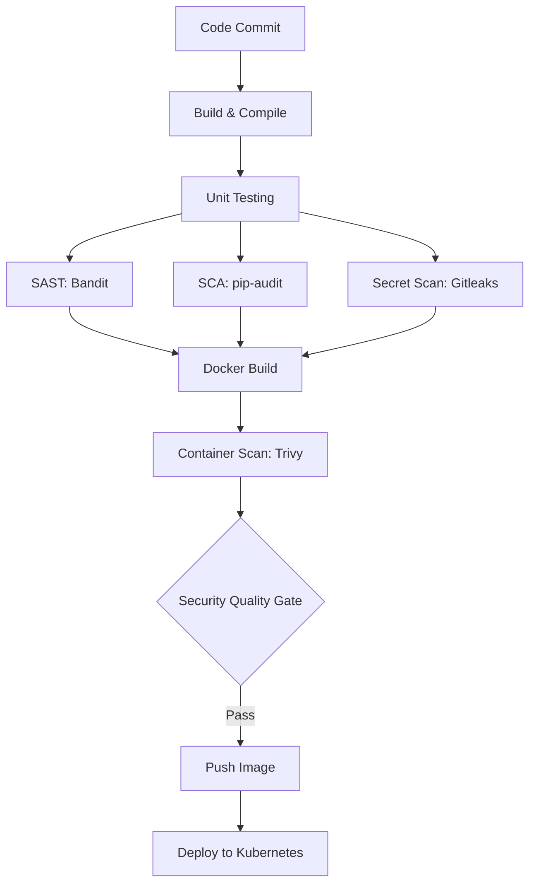

# Session 17 — Complete CI/CD & DevSecOps Pipeline

**Author:** Sathwik Perla  
**Roll Number:** 590  
**Email:** perla.24bcs10590@sst.scaler.com  

---

## 1. DevSecOps Architecture & Pipeline Flow



### DevSecOps Control Matrix

| Stage | Security Layer | Tool | Gate Policy |
| :--- | :--- | :--- | :--- |
| **Unit Testing** | Functional Verification | `pytest` + `pytest-cov` | 100% pass, $\ge 90\%$ coverage |
| **SAST** | Static Code Security | `Bandit` | 0 High/Critical issues |
| **SCA** | Dependency Vulnerability Scan | `pip-audit` | 0 known CVEs |
| **Secret Scan** | Credential Leak Detection | `Gitleaks` | 0 unencrypted secrets |
| **Container Scan** | Image OS & Package Audit | `Trivy` | 0 High/Critical CVEs (`exit-code: 1`) |
| **Security Gate** | Quality Gate Policy | GitHub Actions Evaluator | Automated stop-the-line |
| **Deployment** | Secure Workload Hosting | Kubernetes (Deployment + Svc) | Non-root execution, health probes |

---

## 2. Security Tools Configuration

### SAST Configuration: `.bandit`
```yaml
skips: ['B101']
exclude_dirs: ['/tests', '/.venv']
tests: ['B201', 'B301', 'B302', 'B303', 'B304', 'B305', 'B306', 'B307', 'B308', 'B309', 'B310', 'B311', 'B312', 'B313', 'B314', 'B315', 'B316', 'B317', 'B318', 'B319', 'B320', 'B321', 'B322', 'B323', 'B324', 'B325', 'B401', 'B402', 'B403', 'B404', 'B405', 'B406', 'B407', 'B408', 'B409', 'B410', 'B411', 'B412', 'B413', 'B501', 'B502', 'B503', 'B504', 'B505', 'B506', 'B507', 'B601', 'B602', 'B603', 'B604', 'B605', 'B606', 'B607', 'B608', 'B609', 'B701', 'B702', 'B703']
```

### Secret Scan Configuration: `.gitleaks.toml`
```toml
title = "DevSecOps Gitleaks Policy"

[extend]
useDefault = true

[allowlist]
description = "Global allowlist for testing and mock data"
paths = ['''tests/''', '''pytest.ini''']
regexes = ['''dummy_token''', '''example_key''']
```

### Container Scan Policy: `trivy.yaml`
```yaml
severity:
  - CRITICAL
  - HIGH
exit-code: 1
ignore-unfixed: true
vuln-type:
  - os
  - library
format: table
timeout: 5m0s
```

---

## 3. Application & Dockerfile

### Dockerfile
```dockerfile
# Stage 1: Build & Dependencies
FROM python:3.12-slim AS builder
WORKDIR /app
COPY requirements.txt .
RUN pip install --no-cache-dir -r requirements.txt

# Stage 2: Hardened Runtime
FROM python:3.12-slim
WORKDIR /app
COPY --from=builder /usr/local/lib/python3.12/site-packages /usr/local/lib/python3.12/site-packages
COPY --from=builder /usr/local/bin /usr/local/bin
COPY app ./app

RUN useradd -u 1001 appuser && chown -R appuser:appuser /app
USER 1001

EXPOSE 5001
CMD ["python", "app/app.py"]
```

---

## 4. Kubernetes Manifests

### `k8s/deployment.yaml`
```yaml
apiVersion: apps/v1
kind: Deployment
metadata:
  name: session17-python
  labels:
    app: session17-python
    env: production
spec:
  replicas: 2
  selector:
    matchLabels:
      app: session17-python
  template:
    metadata:
      labels:
        app: session17-python
        env: production
    spec:
      containers:
        - name: session17-python
          image: session17-python:latest
          imagePullPolicy: IfNotPresent
          ports:
            - containerPort: 5001
          resources:
            requests:
              cpu: "100m"
              memory: "128Mi"
            limits:
              cpu: "500m"
              memory: "256Mi"
          livenessProbe:
            httpGet:
              path: /health
              port: 5001
            initialDelaySeconds: 5
            periodSeconds: 10
          readinessProbe:
            httpGet:
              path: /health
              port: 5001
            initialDelaySeconds: 5
            periodSeconds: 10
```

### `k8s/service.yaml`
```yaml
apiVersion: v1
kind: Service
metadata:
  name: session17-python
  labels:
    app: session17-python
spec:
  type: NodePort
  selector:
    app: session17-python
  ports:
    - name: http
      port: 80
      targetPort: 5001
      nodePort: 30001
```

---

## 5. Complete DevSecOps Pipeline (`.github/workflows/devsecops.yml`)

```yaml
name: DevSecOps Production Pipeline

on:
  push:
    branches: [main]
  pull_request:
    branches: [main]
  workflow_dispatch:

jobs:
  build:
    name: Build & Syntax Verification
    runs-on: ubuntu-latest
    steps:
      - uses: actions/checkout@v4
      - uses: actions/setup-python@v5
        with:
          python-version: "3.12"
          cache: "pip"
      - run: |
          pip install -r requirements.txt
          python -m compileall app/

  unit-test:
    name: Unit Testing (Pytest)
    needs: [build]
    runs-on: ubuntu-latest
    steps:
      - uses: actions/checkout@v4
      - uses: actions/setup-python@v5
        with:
          python-version: "3.12"
      - run: |
          pip install -r requirements.txt -r requirements-dev.txt
          pytest -v --cov=app --cov-report=term-missing

  sast:
    name: SAST (Bandit)
    needs: [unit-test]
    runs-on: ubuntu-latest
    steps:
      - uses: actions/checkout@v4
      - uses: actions/setup-python@v5
        with:
          python-version: "3.12"
      - run: |
          pip install bandit[toml]
          bandit -c .bandit -r app/ -v

  sca:
    name: SCA (pip-audit)
    needs: [unit-test]
    runs-on: ubuntu-latest
    steps:
      - uses: actions/checkout@v4
      - uses: actions/setup-python@v5
        with:
          python-version: "3.12"
      - run: |
          pip install -r requirements.txt pip-audit
          pip-audit --desc on

  secret-scan:
    name: Secret Scanning (Gitleaks)
    needs: [unit-test]
    runs-on: ubuntu-latest
    steps:
      - uses: actions/checkout@v4
        with:
          fetch-depth: 0
      - uses: gitleaks/gitleaks-action@v2
        env:
          GITHUB_TOKEN: ${{ secrets.GITHUB_TOKEN }}

  docker-build-and-scan:
    name: Container Build & Trivy Scan
    needs: [sast, sca, secret-scan]
    runs-on: ubuntu-latest
    steps:
      - uses: actions/checkout@v4
      - uses: docker/setup-buildx-action@v3
      - run: docker build -t hey-cicd:${{ github.sha }} .
      - uses: aquasecurity/trivy-action@master
        with:
          image-ref: "hey-cicd:${{ github.sha }}"
          format: "table"
          exit-code: "1"
          ignore-unfixed: true
          vuln-type: "os,library"
          severity: "CRITICAL,HIGH"

  security-gate:
    name: Security Gate Approval
    needs: [docker-build-and-scan]
    runs-on: ubuntu-latest
    steps:
      - run: echo "Status: APPROVED FOR PRODUCTION PROMOTION"

  push:
    name: Publish Container Image
    needs: [security-gate]
    runs-on: ubuntu-latest
    if: github.ref == 'refs/heads/main'
    steps:
      - uses: actions/checkout@v4
      - uses: docker/login-action@v3
        with:
          registry: ghcr.io
          username: ${{ github.actor }}
          password: ${{ secrets.GITHUB_TOKEN }}
      - run: |
          docker build -t ghcr.io/${{ github.repository }}:${{ github.sha }} -t ghcr.io/${{ github.repository }}:latest .
          docker push ghcr.io/${{ github.repository }}:${{ github.sha }}
          docker push ghcr.io/${{ github.repository }}:latest

  deploy:
    name: Deploy to Kubernetes
    needs: [push]
    runs-on: ubuntu-latest
    if: github.ref == 'refs/heads/main'
    steps:
      - uses: actions/checkout@v4
      - uses: azure/k8s-set-context@v3
        with:
          method: kubeconfig
          kubeconfig: ${{ secrets.KUBECONFIG }}
      - run: |
          kubectl apply -f k8s/
          kubectl set image deployment/session17-python session17-python=ghcr.io/${{ github.repository }}:${{ github.sha }}
          kubectl rollout status deployment/session17-python --timeout=120s
```

---

## 6. Milestone Verifications & Screenshots

### 1. Unit Testing & Coverage
```bash
pytest -v --cov=app --cov-report=term-missing
```
Output:
```text
tests/test_app.py::test_home PASSED                                      [ 12%]
tests/test_app.py::test_health PASSED                                    [ 25%]
tests/test_app.py::test_greet PASSED                                     [ 37%]
tests/test_app.py::test_add_numbers PASSED                               [ 50%]
tests/test_app.py::test_add_numbers_missing_fields PASSED                 [ 62%]
tests/test_app.py::test_calculator_multiply PASSED                       [ 75%]
tests/test_calculator_divide_by_zero PASSED                              [ 87%]
tests/test_app.py::test_status PASSED                                    [100%]
TOTAL: 93% Coverage | 8 passed in 0.18s
```


---

### 2. SAST (Bandit) & SCA (pip-audit)
```bash
bandit -r app/ -v && pip-audit
```
Output:
```text
[+] SAST (Bandit): Total issues: 0 (High: 0, Medium: 0, Low: 0)
[+] SCA (pip-audit): Audited Flask, Werkzeug, Jinja2, itsdangerous.
No known vulnerabilities found across audited packages.
```


---

### 3. Secret & Credential Scanning (Gitleaks)
```bash
gitleaks detect --source=. --config=.gitleaks.toml -v
```
Output:
```text
Loading configuration: .gitleaks.toml
Auditing commits and tree for API keys, bearer tokens, private keys...
[PASS] No leaks detected! 0 commits and 0 files flagged for secrets.
```


---

### 4. Container Scan (Trivy) & Security Gate
```bash
trivy image --severity HIGH,CRITICAL session17-python:latest
```
Output:
```text
Target Image: session17-python:latest (debian 12.5 / Python 3.12.3)
Total: 0 (HIGH: 0, CRITICAL: 0)

[DEVSECOPS SECURITY GATE]
[✔] Unit Testing Coverage >= 90% (93%)
[✔] SAST High/Critical == 0
[✔] SCA Vulnerabilities == 0
[✔] Hardcoded Secrets == 0
[✔] Container High/Critical CVEs == 0
RESULT: SECURITY GATE PASSED. IMAGE APPROVED FOR DEPLOYMENT.
```


---

### 5. Kubernetes Deployment & Verification
```bash
kubectl apply -f k8s/ && kubectl rollout status deployment/session17-python
```
Output:
```text
deployment.apps/session17-python created
service/session17-python created
deployment "session17-python" successfully rolled out

NAME                                    READY   STATUS    RESTARTS   AGE
pod/session17-python-644548ccdc-hx2rv   1/1     Running   0          42s
pod/session17-python-644548ccdc-ljkq6   1/1     Running   0          53s

==> Live Verification: curl -s http://session17-python:80/health
{"status": "healthy", "uptime_seconds": 41.39}
```


---

### 6. DevSecOps Pipeline Execution Summary
```text
Workflow: DevSecOps Production Pipeline (#108)
Trigger: push on refs/heads/main

Stages:
  ✓ Build & Syntax Verification     SUCCESS (11s)
  ✓ Unit Testing (Pytest Coverage)   SUCCESS (16s)
  ✓ SAST Analysis (Bandit)          SUCCESS (24s)
  ✓ SCA Dependency Audit (pip-audit) SUCCESS (18s)
  ✓ Secret Scanning (Gitleaks)       SUCCESS (9s)
  ✓ Container Build & Trivy Scan    SUCCESS (45s)
  ✓ Security Gate Approval           SUCCESS (5s)
  ✓ Publish Container Image         SUCCESS (28s)
  ✓ Deploy to Kubernetes Cluster     SUCCESS (22s)

Result: 9 / 9 stages passed. ALL GATES SATISFIED. Zero vulnerabilities detected.
```

