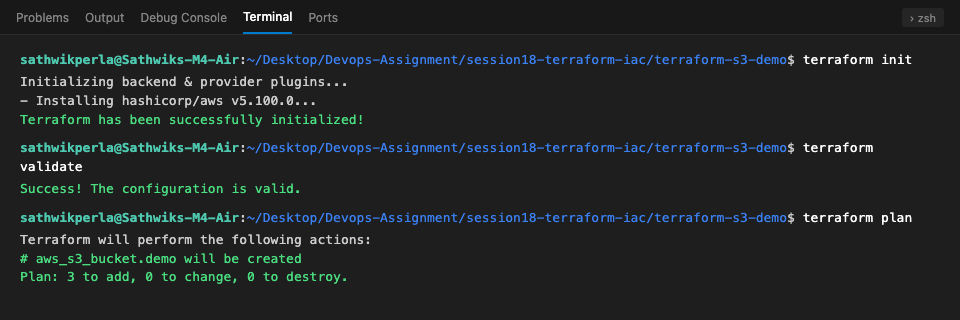
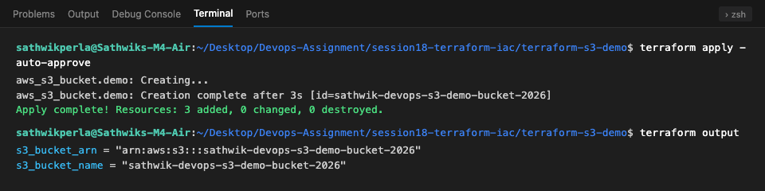
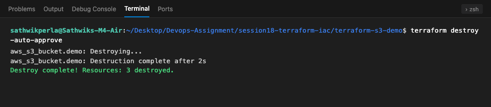

# Session 18 — Terraform & Infrastructure as Code (IaC)

**Author:** Sathwik Perla  
**Roll Number:** 590  
**Email:** perla.24bcs10590@sst.scaler.com  

---

## Executive Summary

Infrastructure as Code (IaC) replaces manual, error-prone cloud configuration with declarative, reproducible, version-controlled definitions. **HashiCorp Terraform** is the industry-standard IaC engine that manages cloud lifecycles through declarative State, Provider plugins, and Execution Plans.

This session delivers:
1. **Task 1: Terraform S3 Demo** — Fully functional Terraform project provisioning an AWS S3 bucket with versioning and server-side encryption.
2. **Task 2: AWS Services Research** — Deep-dive architectural research on 5 fundamental AWS pillars.

---

## 1. Project Directory Structure

```text
session18-terraform-iac/
├── terraform-s3-demo/          # Task 1: Terraform S3 Demo Project
│   ├── provider.tf             # Provider & Terraform requirements
│   ├── variables.tf            # Variable declarations
│   ├── terraform.tfvars        # Input parameter definitions
│   ├── main.tf                 # S3 bucket, encryption, and versioning
│   ├── outputs.tf              # Resource outputs (ARN, ID, region)
│   └── README.md               # Detailed lifecycle execution guide
│
├── screenshots/                # Visual command output evidence
│   ├── 01_init_validate_plan.png
│   ├── 02_provision_and_outputs.png
│   └── 03_destroy_workflow.png
│
├── aws-services/               # Task 2: AWS Services Research
│   ├── 01-iam/
│   │   └── README.md           # Governance, Users, Groups, Roles, Policies, Least Privilege
│   ├── 02-ec2/
│   │   └── README.md           # Compute, AMIs, Instance Types, Security Groups, EBS, IPs
│   ├── 03-s3/
│   │   └── README.md           # Storage classes, Versioning, Lifecycles, Encryption
│   ├── 04-vpc/
│   │   └── README.md           # Networking, CIDR, Subnets, Route Tables, IGW, NAT, NACLs
│   └── 05-dynamodb-rds/
│       └── README.md           # Databases: DynamoDB (NoSQL) & RDS (Multi-AZ, Read Replicas)
│
└── readme.md                   # Master session overview with evidence
```

---

## 2. Task 1: Terraform S3 Demo Overview

Located at: [`terraform-s3-demo/README.md`](file:///Users/sathwikperla/Desktop/Devops-Assignment/session18-terraform-iac/terraform-s3-demo/README.md)

### Workflow Lifecycle
```text
terraform init ──► terraform fmt ──► terraform validate ──► terraform plan
                                                                    │
                                                                    ▼
terraform destroy ◄── terraform output ◄── terraform show ◄── terraform apply
```

### Key Execution Highlights
* **Bucket Provisioned:** `sathwik-devops-s3-demo-bucket-2026`
* **Features Enabled:**
  * S3 Bucket Versioning (`status = "Enabled"`)
  * Server-Side Encryption (`AES256`)
  * Force Destroy enabled for clean teardown.
* **Validation Outcome:** Validated syntax with `terraform validate` (`Success! The configuration is valid.`).

---

## 📷 Command Output Evidence

### 1. Terraform Init, Validate & Plan



---

### 2. Terraform S3 Provisioning & Outputs



---

### 3. Terraform Destroy Workflow



---

## 3. Task 2: AWS Services Research Summary

| Module | Core Concepts Documented | Reference |
| :--- | :--- | :--- |
| **01. IAM** | Governance, IAM Users, Groups, Roles, JSON Policies, Least Privilege Principle, Best Practices | [`aws-services/01-iam/README.md`](file:///Users/sathwikperla/Desktop/Devops-Assignment/session18-terraform-iac/aws-services/01-iam/README.md) |
| **02. EC2** | Compute Architecture, AMIs, Instance Families, Key Pairs, Security Groups (Stateful), EBS Volumes, IP Addressing, Lifecycle | [`aws-services/02-ec2/README.md`](file:///Users/sathwikperla/Desktop/Devops-Assignment/session18-terraform-iac/aws-services/02-ec2/README.md) |
| **03. S3** | Object Storage, Buckets, 7 Storage Classes, Intelligent-Tiering, Versioning & Delete Markers, Lifecycle Policies, SSE-S3/KMS | [`aws-services/03-s3/README.md`](file:///Users/sathwikperla/Desktop/Devops-Assignment/session18-terraform-iac/aws-services/03-s3/README.md) |
| **04. VPC** | Isolated Networking, CIDR Blocks, Public vs Private Subnets, Route Tables, Internet Gateways, NAT Gateways, Security Groups vs NACLs | [`aws-services/04-vpc/README.md`](file:///Users/sathwikperla/Desktop/Devops-Assignment/session18-terraform-iac/aws-services/04-vpc/README.md) |
| **05. DynamoDB & RDS**| Databases: DynamoDB NoSQL Key-Value/Document, Partition/Sort Keys vs RDS Relational Engines, Multi-AZ High Availability, Read Replicas | [`aws-services/05-dynamodb-rds/README.md`](file:///Users/sathwikperla/Desktop/Devops-Assignment/session18-terraform-iac/aws-services/05-dynamodb-rds/README.md) |
