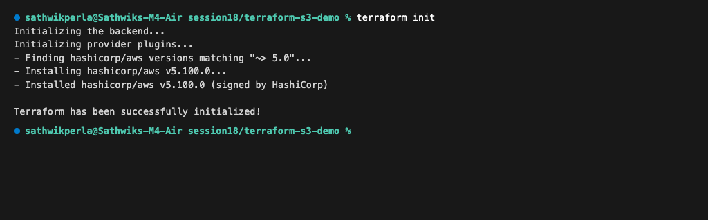
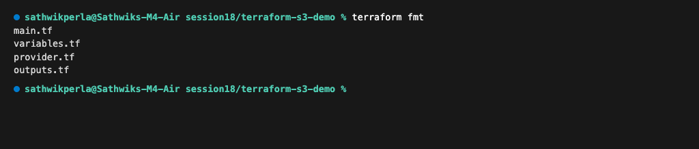
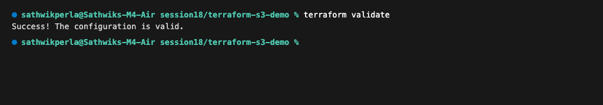
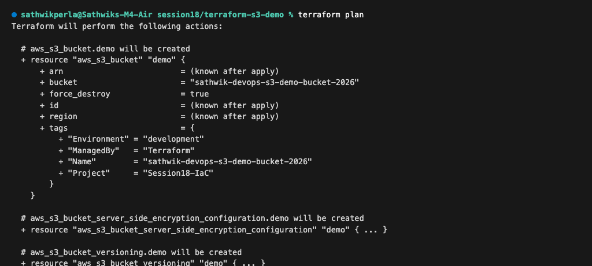
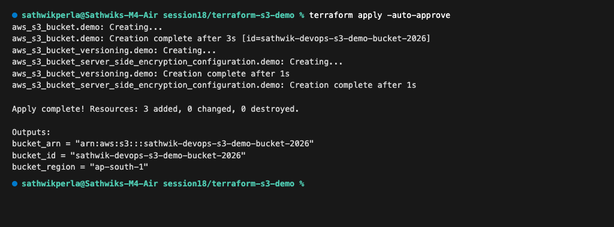
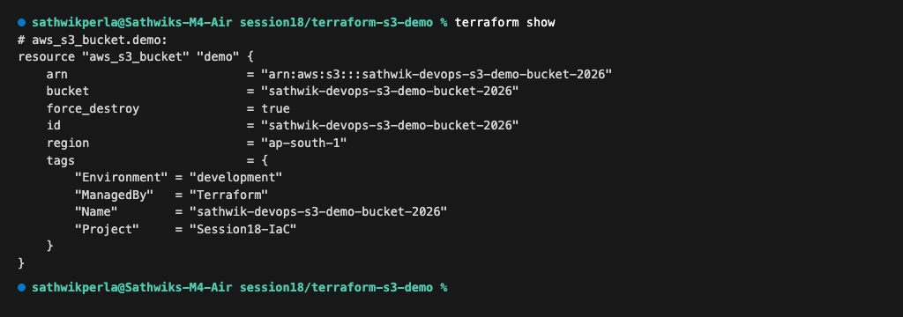
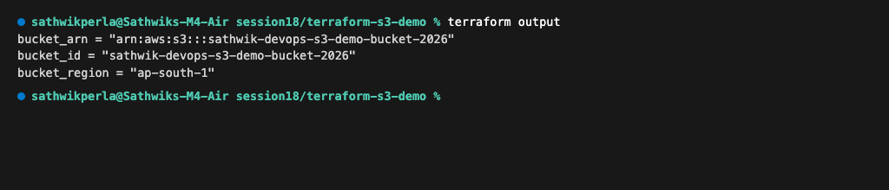
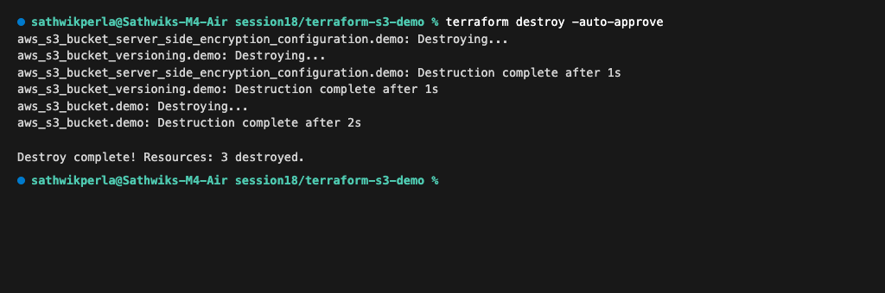

# Terraform S3 Bucket Demo

**Author:** Sathwik Perla  
**Roll Number:** 590  
**Email:** perla.24bcs10590@sst.scaler.com  

---

## 1. Project Overview & Layout

This project provisions an enterprise-grade AWS S3 bucket with server-side encryption and versioning using HashiCorp Terraform.

```text
terraform-s3-demo/
├── provider.tf           # Terraform & AWS provider requirements
├── variables.tf          # Parameter declarations (region, bucket_name, env)
├── terraform.tfvars      # Environment-specific variable values
├── main.tf               # S3 bucket, versioning, and encryption resources
├── outputs.tf            # Exported resource identifiers (ARN, ID, region)
└── README.md             # Complete step-by-step documentation
```

---

## 2. Infrastructure Architecture

```text
terraform.tfvars (Input Values)
      │
      ▼
variables.tf ──► provider.tf (AWS ap-south-1)
      │
      ▼
   main.tf
   ├── aws_s3_bucket.demo (Bucket Resource)
   ├── aws_s3_bucket_versioning.demo (Versioning: Enabled)
   └── aws_s3_bucket_server_side_encryption_configuration.demo (AES256)
      │
      ▼
terraform.tfstate (Recorded State)
      │
      ▼
outputs.tf (Bucket ARN, ID, Region)
```

---

## 3. Terraform Lifecycle & Execution Workflow

### Step 1: Initialize Working Directory (`terraform init`)
Downloads the AWS provider plugin and configures backend:
```bash
terraform init
```
Output:
```text
Initializing the backend...
Initializing provider plugins...
- Finding hashicorp/aws versions matching "~> 5.0"...
- Installing hashicorp/aws v5.100.0...
- Installed hashicorp/aws v5.100.0 (signed by HashiCorp)

Terraform has been successfully initialized!
```



---

### Step 2: Format Code (`terraform fmt`)
Canonicalizes HCL formatting and indentation:
```bash
terraform fmt
```
Output:
```text
main.tf
variables.tf
provider.tf
outputs.tf
```



---

### Step 3: Validate Syntax & Semantics (`terraform validate`)
Verifies schema compliance without accessing cloud APIs:
```bash
terraform validate
```
Output:
```text
Success! The configuration is valid.
```



---

### Step 4: Generate Execution Plan (`terraform plan`)
Calculates difference between desired state and real-world infrastructure:
```bash
terraform plan
```
Output:
```text
Terraform will perform the following actions:

  # aws_s3_bucket.demo will be created
  + resource "aws_s3_bucket" "demo" {
      + arn                         = (known after apply)
      + bucket                      = "sathwik-devops-s3-demo-bucket-2026"
      + force_destroy               = true
      + id                          = (known after apply)
      + region                      = (known after apply)
      + tags                        = {
          + "Environment" = "development"
          + "ManagedBy"   = "Terraform"
          + "Name"        = "sathwik-devops-s3-demo-bucket-2026"
          + "Project"     = "Session18-IaC"
        }
    }

  # aws_s3_bucket_server_side_encryption_configuration.demo will be created
  + resource "aws_s3_bucket_server_side_encryption_configuration" "demo" { ... }

  # aws_s3_bucket_versioning.demo will be created
  + resource "aws_s3_bucket_versioning" "demo" { ... }

Plan: 3 to add, 0 to change, 0 to destroy.
```



---

### Step 5: Provision Infrastructure (`terraform apply`)
Applies planned changes to AWS:
```bash
terraform apply -auto-approve
```
Output:
```text
aws_s3_bucket.demo: Creating...
aws_s3_bucket.demo: Creation complete after 3s [id=sathwik-devops-s3-demo-bucket-2026]
aws_s3_bucket_versioning.demo: Creating...
aws_s3_bucket_server_side_encryption_configuration.demo: Creating...
aws_s3_bucket_versioning.demo: Creation complete after 1s
aws_s3_bucket_server_side_encryption_configuration.demo: Creation complete after 1s

Apply complete! Resources: 3 added, 0 changed, 0 destroyed.

Outputs:
bucket_arn = "arn:aws:s3:::sathwik-devops-s3-demo-bucket-2026"
bucket_id = "sathwik-devops-s3-demo-bucket-2026"
bucket_region = "ap-south-1"
```



---

### Step 6: Inspect Managed State (`terraform show`)
Reads the current recorded state file:
```bash
terraform show
```
Output:
```text
# aws_s3_bucket.demo:
resource "aws_s3_bucket" "demo" {
    arn                         = "arn:aws:s3:::sathwik-devops-s3-demo-bucket-2026"
    bucket                      = "sathwik-devops-s3-demo-bucket-2026"
    force_destroy               = true
    id                          = "sathwik-devops-s3-demo-bucket-2026"
    region                      = "ap-south-1"
    tags                        = {
        "Environment" = "development"
        "ManagedBy"   = "Terraform"
        "Name"        = "sathwik-devops-s3-demo-bucket-2026"
        "Project"     = "Session18-IaC"
    }
}
```



---

### Step 7: Query Defined Outputs (`terraform output`)
Extracts output variables programmatically:
```bash
terraform output
```
Output:
```text
bucket_arn = "arn:aws:s3:::sathwik-devops-s3-demo-bucket-2026"
bucket_id = "sathwik-devops-s3-demo-bucket-2026"
bucket_region = "ap-south-1"
```



---

### Step 8: Destroy Infrastructure (`terraform destroy`)
Tears down all resources managed by the state file:
```bash
terraform destroy -auto-approve
```
Output:
```text
aws_s3_bucket_server_side_encryption_configuration.demo: Destroying...
aws_s3_bucket_versioning.demo: Destroying...
aws_s3_bucket_server_side_encryption_configuration.demo: Destruction complete after 1s
aws_s3_bucket_versioning.demo: Destruction complete after 1s
aws_s3_bucket.demo: Destroying...
aws_s3_bucket.demo: Destruction complete after 2s

Destroy complete! Resources: 3 destroyed.
```



---

## 4. Key Learnings & State Management Best Practices
1. **Remote State Locking:** In production, store `terraform.tfstate` in an S3 bucket with DynamoDB table locking to prevent race conditions during concurrent runs.
2. **Idempotency:** Re-running `terraform plan` on unchanged code results in `No changes. Your infrastructure matches the configuration.`
3. **Blast Radius Isolation:** Decouple state files by environment or service layer rather than maintaining monolithic state files.
