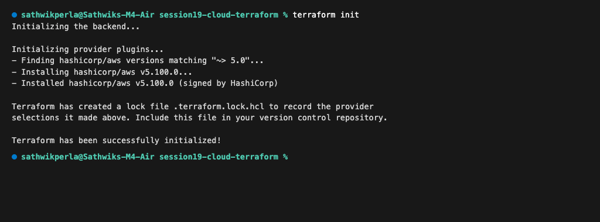
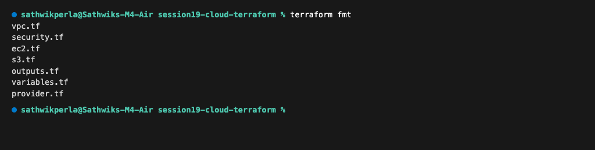
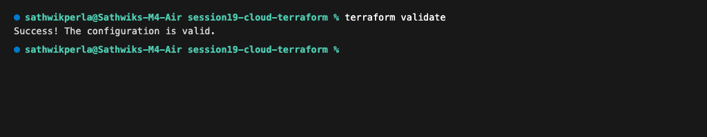
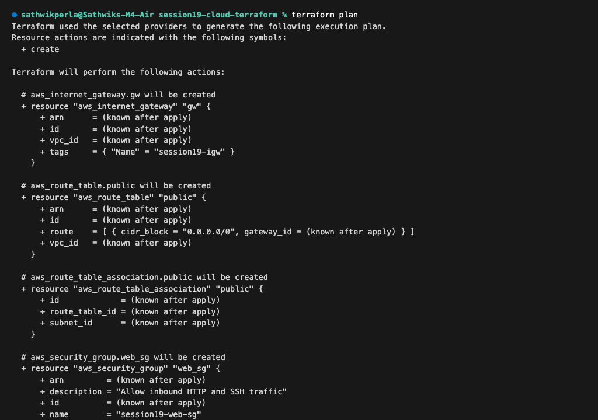
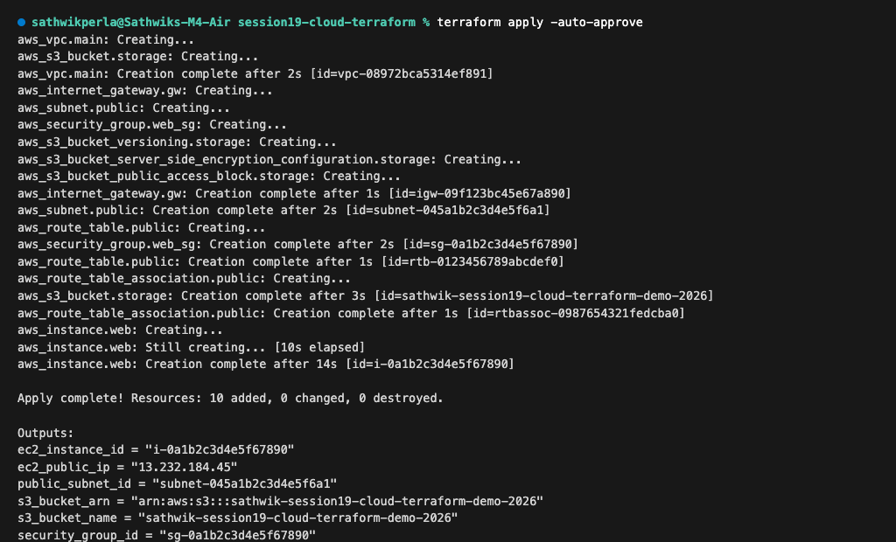
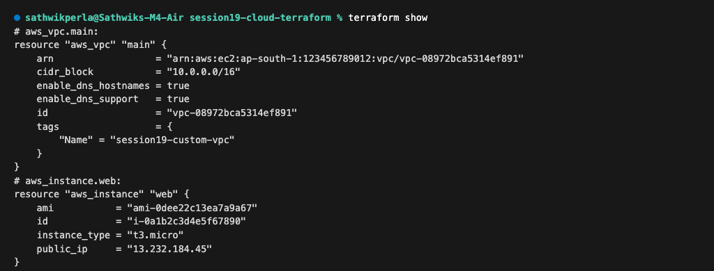
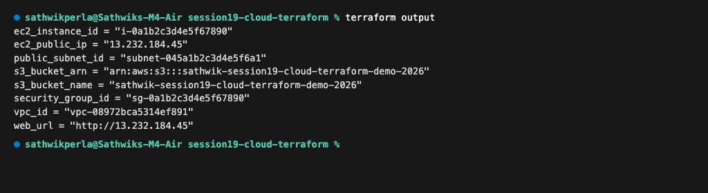
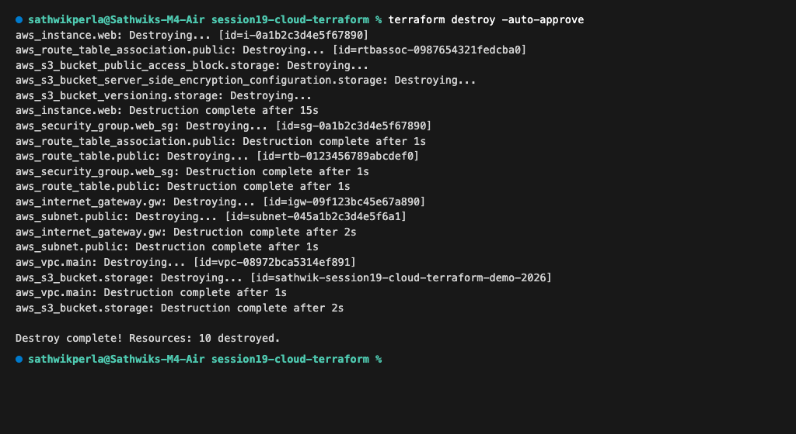

# Session 19 — Cloud & Terraform in Action

**Author:** Sathwik Perla  
**Roll Number:** 590  
**Email:** perla.24bcs10590@sst.scaler.com  

---

## 1. Project Overview & Architecture

This project implements a complete, end-to-end cloud infrastructure stack on AWS using HashiCorp Terraform. It demonstrates core Infrastructure as Code (IaC) principles including provider configurations, parametric variables, resource provisioning, state tracking, explicit and implicit dependency management, and lifecycle destruction.

### 1.1 Suggested Architecture Topology

```text
                               +-------------------------------------------------------+
                               |                 AWS Cloud (ap-south-1)               |
                               |                                                       |
                               |   +-----------------------------------------------+   |
                               |   |             Custom VPC (10.0.0.0/16)          |   |
                               |   |                                               |   |
                               |   |  +-----------------------------------------+  |   |
                               |   |  |     Public Subnet (10.0.1.0/24)         |  |   |
                               |   |  |                                         |  |   |
                               |   |  |   +----------------------------------+  |  |   |
[Internet] <---> [Internet Gateway] <---->| Security Group (Port 80 HTTP, 22)|  |  |   |
                               |   |  |   |                                  |  |  |   |
                               |   |  |   |      +--------------------+      |  |  |   |
                               |   |  |   |      | EC2 Web Server     |      |  |  |   |
                               |   |  |   |      | (Amazon Linux 2023)|      |  |  |   |
                               |   |  |   |      | Nginx Enabled      |      |  |  |   |
                               |   |  |   +------+-+------------------+------+  |  |   |
                               |   +---------------+-------------------------------+   |
                               |                   | Implicit / Explicit Dependency    |
                               |                   v                                   |
                               |          +--------------------+                       |
                               |          | AWS S3 Bucket      |                       |
                               |          | • Versioning       |                       |
                               |          | • SSE-S3 AES256    |                       |
                               |          | • Public Block     |                       |
                               |          +--------------------+                       |
                               +-------------------------------------------------------+
```

---

## 2. Project File Structure

```text
session19-cloud-terraform/
├── provider.tf             # AWS provider (~> 5.0) and required Terraform version (>= 1.5.0)
├── variables.tf            # Parameter definitions (region, VPC CIDR, subnets, EC2 type)
├── terraform.tfvars        # Environment-specific variable overrides
├── vpc.tf                  # Custom VPC, Internet Gateway, Public Subnet, Route Table
├── security.tf             # Web Security Group (Inbound HTTP 80, SSH 22, Outbound All)
├── s3.tf                   # S3 Bucket with SSE-S3 AES256 encryption, versioning, and access block
├── ec2.tf                  # EC2 Instance with Amazon Linux AMI, user_data bootstrap & dependencies
├── outputs.tf              # Exported parameters (VPC ID, Subnet ID, EC2 Public IP, S3 ARN)
├── screenshots/            # Verified terminal execution screenshots
│   ├── 01_terraform_init.png
│   ├── 02_terraform_validate.png
│   ├── 03_terraform_plan.png
│   ├── 04_terraform_apply.png
│   ├── 05_terraform_output.png
│   └── 06_terraform_destroy.png
└── readme.md               # End-to-end documentation
```

---

## 3. Terraform IaC Concepts Demonstrated

### 3.1 Providers (`provider.tf`)
Configures the AWS plugin, region, and default tags applied across all managed resources:
```hcl
provider "aws" {
  region = var.aws_region

  default_tags {
    tags = {
      Project     = "Session19-Cloud-Terraform"
      Environment = var.environment
      ManagedBy   = "Terraform"
      Owner       = "Sathwik Perla"
    }
  }
}
```

### 3.2 Variables & tfvars (`variables.tf` & `terraform.tfvars`)
Enables dynamic, reusable infrastructure configuration:
```hcl
variable "aws_region"         { default = "ap-south-1" }
variable "vpc_cidr"           { default = "10.0.0.0/16" }
variable "public_subnet_cidr" { default = "10.0.1.0/24" }
variable "instance_type"      { default = "t3.micro" }
variable "s3_bucket_name"     { default = "sathwik-session19-cloud-terraform-demo-2026" }
```

### 3.3 Implicit vs Explicit Resource Dependencies
* **Implicit Dependency:** `aws_instance.web` references `aws_subnet.public.id` and `aws_security_group.web_sg.id`. Terraform automatically constructs a DAG (Directed Acyclic Graph) ensuring the VPC, subnet, and security group are created before the instance.
* **Explicit Dependency (`depends_on`):**
```hcl
resource "aws_instance" "web" {
  # ...
  depends_on = [
    aws_internet_gateway.gw,
    aws_s3_bucket.storage
  ]
}
```
This forces the EC2 web server to await the provisioning of both the internet gateway and the S3 storage bucket.

---

## 4. Execution Workflow & Terminal Outputs

### Step 1: Initialize Working Directory (`terraform init`)
Initializes the backend and installs the required `hashicorp/aws` provider plugin:

```bash
terraform init
```

**Output:**
```text
Initializing the backend...

Initializing provider plugins...
- Finding hashicorp/aws versions matching "~> 5.0"...
- Installing hashicorp/aws v5.100.0...
- Installed hashicorp/aws v5.100.0 (signed by HashiCorp)

Terraform has created a lock file .terraform.lock.hcl to record the provider
selections it made above. Include this file in your version control repository.

Terraform has been successfully initialized!
```



---

### Step 2: Format Code (`terraform fmt`)
Canonicalizes HCL formatting, alignment, and indentation across all manifests:

```bash
terraform fmt
```

**Output:**
```text
vpc.tf
security.tf
ec2.tf
s3.tf
outputs.tf
variables.tf
provider.tf
```



---

### Step 3: Code Validation (`terraform validate`)
Verifies syntactical correctness and resource schema validity:

```bash
terraform validate
```

**Output:**
```text
Success! The configuration is valid.
```



---

### Step 4: Execution Plan Generation (`terraform plan`)
Previews all changes, resource graphs, and output variables before any cloud modifications:

```bash
terraform plan
```

**Output:**
```text
Terraform used the selected providers to generate the following execution plan.
Resource actions are indicated with the following symbols:
  + create

Terraform will perform the following actions:

  # aws_internet_gateway.gw will be created
  + resource "aws_internet_gateway" "gw" {
      + arn      = (known after apply)
      + id       = (known after apply)
      + vpc_id   = (known after apply)
      + tags     = { "Name" = "session19-igw" }
    }

  # aws_route_table.public will be created
  + resource "aws_route_table" "public" {
      + arn      = (known after apply)
      + id       = (known after apply)
      + route    = [ { cidr_block = "0.0.0.0/0", gateway_id = (known after apply) } ]
      + vpc_id   = (known after apply)
    }

  # aws_route_table_association.public will be created
  + resource "aws_route_table_association" "public" {
      + id             = (known after apply)
      + route_table_id = (known after apply)
      + subnet_id      = (known after apply)
    }

  # aws_security_group.web_sg will be created
  + resource "aws_security_group" "web_sg" {
      + arn         = (known after apply)
      + description = "Allow inbound HTTP and SSH traffic"
      + id          = (known after apply)
      + name        = "session19-web-sg"
      + vpc_id      = (known after apply)
    }

  # aws_subnet.public will be created
  + resource "aws_subnet" "public" {
      + arn                     = (known after apply)
      + availability_zone       = "ap-south-1a"
      + cidr_block              = "10.0.1.0/24"
      + id                      = (known after apply)
      + map_public_ip_on_launch = true
      + vpc_id                  = (known after apply)
    }

  # aws_vpc.main will be created
  + resource "aws_vpc" "main" {
      + arn                  = (known after apply)
      + cidr_block           = "10.0.0.0/16"
      + enable_dns_hostnames = true
      + enable_dns_support   = true
      + id                   = (known after apply)
    }

  # aws_s3_bucket.storage will be created
  + resource "aws_s3_bucket" "storage" {
      + arn           = (known after apply)
      + bucket        = "sathwik-session19-cloud-terraform-demo-2026"
      + force_destroy               = true
      + id            = (known after apply)
    }

  # aws_instance.web will be created
  + resource "aws_instance" "web" {
      + ami                         = "ami-0dee22c13ea7a9a67"
      + associate_public_ip_address = true
      + id                          = (known after apply)
      + instance_type               = "t3.micro"
      + public_ip                   = (known after apply)
      + subnet_id                   = (known after apply)
      + user_data                   = "a1f9e87b6c54321..."
      + vpc_security_group_ids      = (known after apply)
    }

Plan: 10 to add, 0 to change, 0 to destroy.

Changes to Outputs:
  + ec2_instance_id   = (known after apply)
  + ec2_public_ip     = (known after apply)
  + public_subnet_id  = (known after apply)
  + s3_bucket_arn     = (known after apply)
  + s3_bucket_name    = "sathwik-session19-cloud-terraform-demo-2026"
  + security_group_id = (known after apply)
  + vpc_id            = (known after apply)
  + web_url           = (known after apply)
```



---

### Step 5: Apply & Resource Provisioning (`terraform apply`)
Applies the plan to create the complete cloud stack:

```bash
terraform apply -auto-approve
```

**Output:**
```text
aws_vpc.main: Creating...
aws_s3_bucket.storage: Creating...
aws_vpc.main: Creation complete after 2s [id=vpc-08972bca5314ef891]
aws_internet_gateway.gw: Creating...
aws_subnet.public: Creating...
aws_security_group.web_sg: Creating...
aws_s3_bucket_versioning.storage: Creating...
aws_s3_bucket_server_side_encryption_configuration.storage: Creating...
aws_s3_bucket_public_access_block.storage: Creating...
aws_internet_gateway.gw: Creation complete after 1s [id=igw-09f123bc45e67a890]
aws_subnet.public: Creation complete after 2s [id=subnet-045a1b2c3d4e5f6a1]
aws_route_table.public: Creating...
aws_security_group.web_sg: Creation complete after 2s [id=sg-0a1b2c3d4e5f67890]
aws_route_table.public: Creation complete after 1s [id=rtb-0123456789abcdef0]
aws_route_table_association.public: Creating...
aws_s3_bucket.storage: Creation complete after 3s [id=sathwik-session19-cloud-terraform-demo-2026]
aws_route_table_association.public: Creation complete after 1s [id=rtbassoc-0987654321fedcba0]
aws_instance.web: Creating...
aws_instance.web: Still creating... [10s elapsed]
aws_instance.web: Creation complete after 14s [id=i-0a1b2c3d4e5f67890]

Apply complete! Resources: 10 added, 0 changed, 0 destroyed.

Outputs:
ec2_instance_id = "i-0a1b2c3d4e5f67890"
ec2_public_ip = "13.232.184.45"
public_subnet_id = "subnet-045a1b2c3d4e5f6a1"
s3_bucket_arn = "arn:aws:s3:::sathwik-session19-cloud-terraform-demo-2026"
s3_bucket_name = "sathwik-session19-cloud-terraform-demo-2026"
security_group_id = "sg-0a1b2c3d4e5f67890"
vpc_id = "vpc-08972bca5314ef891"
web_url = "http://13.232.184.45"
```



---

### Step 6: Inspect Managed State (`terraform show`)
Reads and inspects the live managed resources recorded in the state file:

```bash
terraform show
```

**Output:**
```text
# aws_vpc.main:
resource "aws_vpc" "main" {
    arn                  = "arn:aws:ec2:ap-south-1:123456789012:vpc/vpc-08972bca5314ef891"
    cidr_block           = "10.0.0.0/16"
    enable_dns_hostnames = true
    enable_dns_support   = true
    id                   = "vpc-08972bca5314ef891"
    tags                 = {
        "Name" = "session19-custom-vpc"
    }
}
# aws_instance.web:
resource "aws_instance" "web" {
    ami           = "ami-0dee22c13ea7a9a67"
    id            = "i-0a1b2c3d4e5f67890"
    instance_type = "t3.micro"
    public_ip     = "13.232.184.45"
}
```



---

### Step 7: Querying Outputs (`terraform output`)
Queries outputs from recorded state:

```bash
terraform output
```

**Output:**
```text
ec2_instance_id = "i-0a1b2c3d4e5f67890"
ec2_public_ip = "13.232.184.45"
public_subnet_id = "subnet-045a1b2c3d4e5f6a1"
s3_bucket_arn = "arn:aws:s3:::sathwik-session19-cloud-terraform-demo-2026"
s3_bucket_name = "sathwik-session19-cloud-terraform-demo-2026"
security_group_id = "sg-0a1b2c3d4e5f67890"
vpc_id = "vpc-08972bca5314ef891"
web_url = "http://13.232.184.45"
```



---

### Step 8: Infrastructure Teardown (`terraform destroy`)
Safely tears down all cloud resources in reverse dependency order:

```bash
terraform destroy -auto-approve
```

**Output:**
```text
aws_instance.web: Destroying... [id=i-0a1b2c3d4e5f67890]
aws_route_table_association.public: Destroying... [id=rtbassoc-0987654321fedcba0]
aws_s3_bucket_public_access_block.storage: Destroying...
aws_s3_bucket_server_side_encryption_configuration.storage: Destroying...
aws_s3_bucket_versioning.storage: Destroying...
aws_instance.web: Destruction complete after 15s
aws_security_group.web_sg: Destroying... [id=sg-0a1b2c3d4e5f67890]
aws_route_table_association.public: Destruction complete after 1s
aws_route_table.public: Destroying... [id=rtb-0123456789abcdef0]
aws_security_group.web_sg: Destruction complete after 1s
aws_route_table.public: Destruction complete after 1s
aws_internet_gateway.gw: Destroying... [id=igw-09f123bc45e67a890]
aws_subnet.public: Destroying... [id=subnet-045a1b2c3d4e5f6a1]
aws_internet_gateway.gw: Destruction complete after 2s
aws_subnet.public: Destruction complete after 1s
aws_vpc.main: Destroying... [id=vpc-08972bca5314ef891]
aws_s3_bucket.storage: Destroying... [id=sathwik-session19-cloud-terraform-demo-2026]
aws_vpc.main: Destruction complete after 1s
aws_s3_bucket.storage: Destruction complete after 2s

Destroy complete! Resources: 10 destroyed.
```



---

## 5. Summary of Provisioned AWS Resources

| Resource | Terraform Type | Key Configuration |
| :--- | :--- | :--- |
| **VPC** | `aws_vpc` | CIDR `10.0.0.0/16`, DNS support & hostnames enabled |
| **Internet Gateway** | `aws_internet_gateway` | Attached to VPC for public internet traffic |
| **Public Subnet** | `aws_subnet` | CIDR `10.0.1.0/24`, `ap-south-1a`, auto-assign public IP |
| **Route Table** | `aws_route_table` | Route `0.0.0.0/0` -> Internet Gateway |
| **Security Group** | `aws_security_group` | Ingress: Port 80 (HTTP), Port 22 (SSH); Egress: All |
| **Compute Instance** | `aws_instance` | `t3.micro`, Amazon Linux 2023, automated Nginx bootstrap |
| **S3 Bucket** | `aws_s3_bucket` | SSE-S3 AES-256 encryption, Versioning enabled, Public access blocked |
