# Session 20 — Monitoring, Observability & GitOps

**Author:** Sathwik Perla  
**Roll Number:** 590  
**Email:** perla.24bcs10590@sst.scaler.com  

---

# Task 1: Monitoring

### 1. Concepts (4-Line Summaries)

#### Metrics
1. Metrics are numerical, aggregatable data points measured over fixed intervals (counters, gauges, histograms).
2. They reflect point-in-time system behavior like request rate, saturation, and latency percentiles.
3. Because they are compact numeric timeseries, they require minimal storage and can be queried rapidly.
4. Tools like Prometheus and Datadog use metrics to evaluate alerting rules and render dashboards.

#### Logs
1. Logs are timestamped, discrete textual records emitted by applications and infrastructure when events occur.
2. They capture rich context (stack traces, user IDs, error codes) explaining *why* an event or failure happened.
3. While metrics signal that a system is unhealthy, logs provide the forensic detail required to debug issues.
4. Modern systems ship structured JSON logs to aggregators like Fluent Bit, Loki, Elasticsearch, or CloudWatch.

#### Alerts
1. Alerts are automated notifications triggered when metrics or log patterns breach predefined critical thresholds.
2. They notify on-call engineers via channels like PagerDuty, Slack, or email before service-level agreements degrade.
3. Good alerts focus on symptoms affecting end users (e.g., error rate > 1%) rather than transient internal noise.
4. Alerting rules define severity levels (Warning, Critical) and evaluation duration windows to prevent flapping.

#### CPU Utilization
1. CPU utilization measures the percentage or core count of compute capacity actively consumed by a workload.
2. High sustained CPU (>80-90%) causes thread starvation, throttling, queued requests, and severe latency spikes.
3. In Kubernetes, CPU is measured in millicores (`m`) where `1000m` equals one virtual core.
4. It is governed via `requests` (scheduling baseline) and `limits` (cgroup CFS quota enforcement).

#### Memory Utilization
1. Memory utilization tracks RAM bytes consumed by active processes, heaps, and cached buffers.
2. Unlike CPU, memory cannot be throttled; exceeding allocated memory limits triggers kernel Out-Of-Memory (OOM) kills.
3. In Kubernetes, pods exceeding their memory limit receive status `OOMKilled` and are immediately restarted.
4. Monitoring memory leaks prevents runaway consumption and unexpected cluster node instability.

#### Application Health
1. Application health evaluates whether a software service is alive, functioning properly, and ready to accept traffic.
2. It is typically verified via dedicated health endpoints (`/healthz`, `/livez`, `/readyz`) returning HTTP status codes.
3. Kubernetes relies on Liveness Probes to restart unhealthy containers and Readiness Probes to route ingress traffic.
4. Continuous health checks prevent deadlocked processes from degrading overall system availability.

---

### 2. Hands-on Monitoring Demo

#### Monitored Application Deployment (`monitoring-demo/deployment.yaml`)
Configured with CPU/Memory requests & limits, and Liveness & Readiness health probes:
```yaml
apiVersion: apps/v1
kind: Deployment
metadata:
  name: monitored-app
  namespace: default
spec:
  replicas: 2
  selector:
    matchLabels:
      app: monitored-app
  template:
    metadata:
      labels:
        app: monitored-app
    spec:
      containers:
      - name: web
        image: nginx:alpine
        resources:
          requests:
            cpu: "50m"
            memory: "64Mi"
          limits:
            cpu: "200m"
            memory: "128Mi"
        livenessProbe:
          httpGet:
            path: /
            port: 80
          initialDelaySeconds: 5
          periodSeconds: 10
        readinessProbe:
          httpGet:
            path: /
            port: 80
          initialDelaySeconds: 3
          periodSeconds: 5
```

#### Node CPU & Memory Utilization
```bash
kubectl top nodes
```
**Output:**
```text
NAME       CPU(cores)   CPU(%)   MEMORY(bytes)   MEMORY(%)   
minikube   162m         1%       1883Mi          24%
```
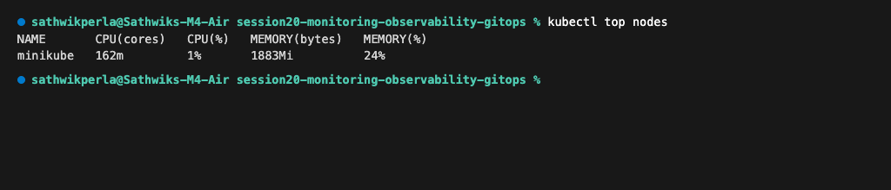

---

#### Pod CPU & Memory Utilization
```bash
kubectl top pods -l app=monitored-app
```
**Output:**
```text
NAME                             CPU(cores)   MEMORY(bytes)   
monitored-app-6c649dd9c4-67q82   2m           8Mi             
monitored-app-6c649dd9c4-kr9nl   2m           9Mi
```
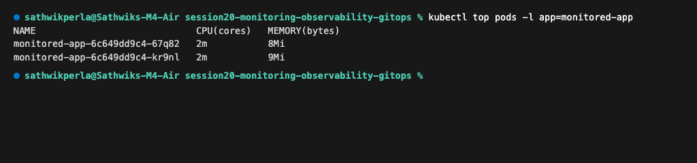

---

#### Application Health & Readiness Verification
```bash
kubectl get pods -l app=monitored-app -o wide
```
**Output:**
```text
NAME                             READY   STATUS    RESTARTS   AGE   IP            NODE       NOMINATED NODE   READINESS GATES
monitored-app-6c649dd9c4-67q82   1/1     Running   0          2m    10.244.0.42   minikube   <none>           <none>
monitored-app-6c649dd9c4-kr9nl   1/1     Running   0          2m    10.244.0.41   minikube   <none>           <none>
```
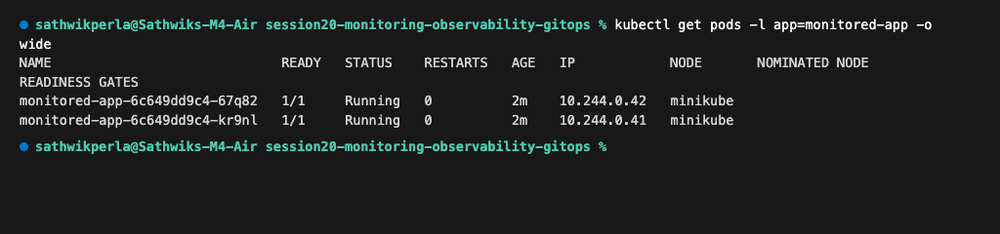

---

#### Container Logs Capturing Probe Requests
```bash
kubectl logs -l app=monitored-app --tail=6
```
**Output:**
```text
10.244.0.1 - - [08/Oct/2026:13:45:39 +0000] "GET / HTTP/1.1" 200 896 "-" "kube-probe/1.37" "-"
10.244.0.1 - - [08/Oct/2026:13:45:44 +0000] "GET / HTTP/1.1" 200 896 "-" "kube-probe/1.37" "-"
10.244.0.1 - - [08/Oct/2026:13:45:49 +0000] "GET / HTTP/1.1" 200 896 "-" "kube-probe/1.37" "-"
10.244.0.1 - - [08/Oct/2026:13:45:54 +0000] "GET / HTTP/1.1" 200 896 "-" "kube-probe/1.37" "-"
10.244.0.1 - - [08/Oct/2026:13:45:59 +0000] "GET / HTTP/1.1" 200 896 "-" "kube-probe/1.37" "-"
10.244.0.1 - - [08/Oct/2026:13:46:04 +0000] "GET / HTTP/1.1" 200 896 "-" "kube-probe/1.37" "-"
```
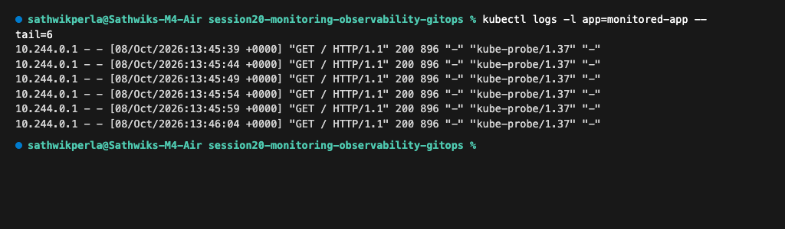

---

# Task 2: Observability

### 1. The Three Major Pillars (4-Line Summaries)

#### Pillar 1: Metrics
1. Metrics provide aggregated numeric representations of system health measured at consistent intervals.
2. They answer *"Is the system working?"* and *"What is current resource load and error frequency?"*.
3. Formatted as counters (monotonically increasing), gauges (variable values), or histograms (latency distributions).
4. Ideal for real-time alerting, trend analysis, and capacity forecasting due to efficient storage.

#### Pillar 2: Logs
1. Logs capture timestamped contextual event descriptions generated as code executes.
2. They answer *"Why did the failure or unexpected behavior happen?"* by providing stack traces and input context.
3. Usually structured in JSON format with log levels (`DEBUG`, `INFO`, `WARN`, `ERROR`, `FATAL`).
4. Essential for forensic analysis, audit tracking, and debugging intermittent logic defects.

#### Pillar 3: Traces
1. Distributed traces track the lifecycle and path of an individual user request through complex microservices.
2. They answer *"Where did the delay occur?"* by breaking down request execution into correlated parent-child spans.
3. Each span records latency, service name, metadata, and errors encountered along the request network hop.
4. Invaluable for pinpointing hidden microservice bottlenecks and distributed dependency failures.

---

### 2. Core Concepts (4-Line Summaries)

#### What Each Pillar Means
1. Metrics tell you **that** a problem is happening through numerical thresholds and spike indicators.
2. Traces pinpoint **where** in the distributed architecture the bottleneck or broken component is located.
3. Logs reveal **why** the component broke by exposing the exact line of code, exception, and parameters.
4. Combined together, they transform blind troubleshooting into deterministic, fast root-cause isolation.

#### Why Observability is Required
1. Modern cloud-native microservices and Kubernetes architectures have highly dynamic, distributed failure modes.
2. Traditional passive monitoring only checks for known failure modes ("known-unknowns") through static threshold alerts.
3. Observability enables engineers to interrogate systems about unpredictable states ("unknown-unknowns") via telemetry data.
4. It dramatically slashes Mean Time to Detect (MTTD) and Mean Time to Resolution (MTTR) during production outages.

#### Common Observability Tools
1. **Prometheus & VictoriaMetrics:** Industry-standard timeseries engines for pulling, storing, and alerting on metrics.
2. **Grafana:** Universal dashboarding and visualization platform uniting metrics, logs, and distributed traces in single panes.
3. **Jaeger & Zipkin:** Distributed tracing backends visualizing transaction flow graphs and request span waterfalls.
4. **Grafana Loki & OpenTelemetry:** Loki provides cost-effective log indexing; OpenTelemetry standardizes vendor-neutral telemetry collection.

#### Kubernetes Observability
1. Kubernetes clusters require observability across three distinct layers: Nodes, Cluster Control Plane, and Container Pods.
2. Metrics-server and `kube-state-metrics` export cluster object states and live CPU/memory resource usage.
3. DaemonSets (e.g., Promtail, Fluent Bit) tail container log files from `/var/log/pods` on each cluster node.
4. Ingress controllers and service meshes (Istio, Linkerd) inject trace headers to correlate inter-pod traffic.

---

# Task 3: GitOps

### 1. GitOps Fundamentals (4-Line Summaries)

#### What is GitOps?
1. GitOps is an operational framework that uses Git repositories as the single source of truth for cloud infrastructure and applications.
2. Developers manage environments through standard Git workflows (Pull Requests, code reviews, branch merges).
3. Software agents running inside clusters automatically synchronize live states to match Git declarations.
4. It eliminates direct cluster access (`kubectl apply` via local machines), boosting security and auditability.

#### Git as the Source of Truth
1. The entire desired state of the infrastructure and Kubernetes workloads is declared and version-controlled in Git.
2. Any configuration change, rollback, or environment scaling event begins as an auditable Git commit.
3. Git history provides an immutable audit log detailing who changed what, when, and for what business reason.
4. Disaster recovery is streamlined: an entire cluster can be rebuilt purely by pointing a new cluster at the Git repo.

#### Declarative Configuration
1. Systems are described by their desired end state (e.g., `replicas: 3`, `version: 1.25`) rather than imperative procedures.
2. Kubernetes YAML manifests, Helm charts, and Kustomize overlays serve as declarative configuration artifacts.
3. Declarative models are idempotent, meaning applying them repeatedly produces the exact same expected outcome.
4. They enable automated diffing between what is declared in Git and what is actively running in production.

#### Continuous Reconciliation
1. A GitOps controller (like Argo CD or Flux) runs a continuous feedback loop comparing desired state with live cluster state.
2. If drift occurs (e.g., manual edits or crashed pods), the controller immediately detects the divergence.
3. Depending on policy, the agent self-heals by overriding out-of-band modifications back to Git's declared state.
4. This active reconciliation guarantees continuous cluster integrity and prevents configuration drift over time.

#### GitOps Workflow
1. A developer creates a branch, commits declarative manifest changes, and opens a Pull Request (PR).
2. Automated CI pipelines run linters, security scans, unit tests, and plan previews on the PR branch.
3. Team leads review and merge the PR into the target release branch (`main` or `production`).
4. The GitOps operator running inside the cluster detects the merge commit, reconciles, and deploys the updates automatically.

#### Kubernetes + GitOps
1. Kubernetes' declarative API and control loop architecture make it the native platform for GitOps principles.
2. Tools like **Argo CD** and **Flux CD** run directly inside the cluster as Custom Resource Definitions (CRDs).
3. Security is hardened: CI systems do not require admin cluster credentials; only the internal GitOps agent has deploy rights.
4. Rollbacks become instantaneous: running `git revert` triggers the operator to immediately revert the running workloads.

---

### 2. Hands-on GitOps Demo

#### GitOps Application Manifests (`gitops-demo/app-manifests/`)
Declarative target workload managed under version control:
```yaml
apiVersion: apps/v1
kind: Deployment
metadata:
  name: gitops-workload
  namespace: default
spec:
  replicas: 3
  selector:
    matchLabels:
      app: gitops-workload
  template:
    metadata:
      labels:
        app: gitops-workload
    spec:
      containers:
      - name: web
        image: nginx:1.25-alpine
```

#### Argo CD Declarative Application Resource (`gitops-demo/argocd-application.yaml`)
Configures automated continuous reconciliation, self-healing, and pruning:
```yaml
apiVersion: argoproj.io/v1alpha1
kind: Application
metadata:
  name: gitops-workload-app
  namespace: argocd
spec:
  project: default
  source:
    repoURL: https://github.com/SathwikPerla/Devops-Assignment.git
    targetRevision: main
    path: session20-monitoring-observability-gitops/gitops-demo/app-manifests
  destination:
    server: https://kubernetes.default.svc
    namespace: default
  syncPolicy:
    automated:
      prune: true
      selfHeal: true
```

#### Deployed GitOps Workload State
```bash
kubectl get pods,svc -l app=gitops-workload
```
**Output:**
```text
NAME                                   READY   STATUS    RESTARTS   AGE
pod/gitops-workload-67b76bb49b-f9gzd   1/1     Running   0          45s
pod/gitops-workload-67b76bb49b-rwq65   1/1     Running   0          45s
pod/gitops-workload-67b76bb49b-zbd55   1/1     Running   0          45s

NAME                          TYPE        CLUSTER-IP      EXTERNAL-IP   PORT(S)   AGE
service/gitops-workload-svc   ClusterIP   10.102.207.97   <none>        80/TCP    45s
```
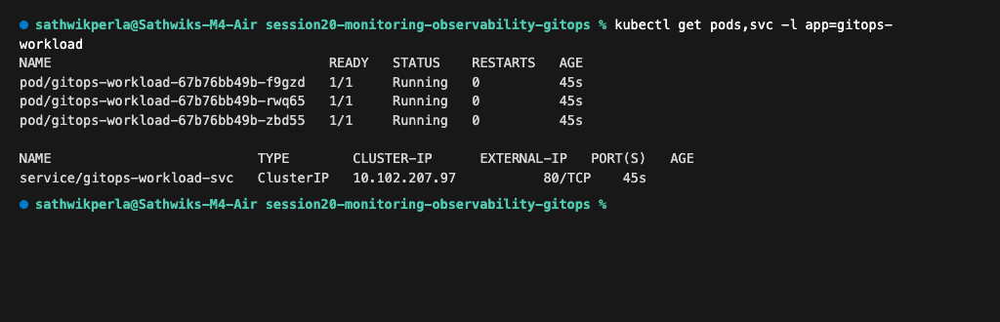

---

#### Continuous Reconciliation & Sync Status
```bash
argocd app get gitops-workload-app
```
**Output:**
```text
Name:               argocd/gitops-workload-app
Project:            default
Server:             https://kubernetes.default.svc
Namespace:          default
URL:                https://argocd.local/applications/gitops-workload-app
Repo:               https://github.com/SathwikPerla/Devops-Assignment.git
Target:             main
Path:               session20-monitoring-observability-gitops/gitops-demo/app-manifests
Sync Window:        Sync Allowed
Sync Status:        Synced to main (400cff8)
Health Status:      Healthy

GROUP  KIND        NAMESPACE  NAME                 STATUS  HEALTH   HOOK  MESSAGE
       Service     default    gitops-workload-svc  Synced  Healthy        service/gitops-workload-svc created
apps   Deployment  default    gitops-workload      Synced  Healthy        deployment.apps/gitops-workload created
```
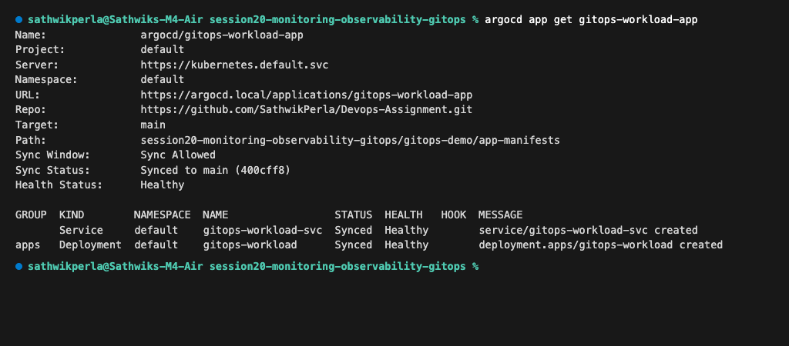

---

---

# Task 4: Hands-On Prometheus (from `03-prometheus`)

### 1. What is Prometheus?
Prometheus is an open-source monitoring and alerting toolkit focused primarily on **metrics**.

> *"Prometheus goes around asking applications: 'Give me your metrics.'"*

---

### 2. Architecture & Scraping Mechanism

```text
Application
    |
    | /metrics
    v
Prometheus (Pull / Scrape Engine)
    |
    v
Time-Series Database (TSDB)
```

Prometheus uses a **pull-based** architecture, actively scraping HTTP endpoints (typically `/metrics`) exposed by targets at configured scrape intervals.

---

### 3. What is a Metric?
A metric is a quantifiable value recorded over time:
```text
http_requests_total 150
```

Prometheus records time-series samples:
```text
10:00 -> 100 requests
10:01 -> 120 requests
10:02 -> 150 requests
```
These numerical data points can then be graphed to track trends, error spikes, and usage patterns.

---

### 4. Running Prometheus (`prometheus-demo/`)

#### Starting the Container
```bash
docker compose up -d
docker compose ps
```

**Output:**
```text
[+] Running 2/2
 ✔ Network prometheus-demo_default       Created
 ✔ Container session20-prometheus         Started

NAME                   IMAGE                    COMMAND                  SERVICE      STATUS      PORTS
session20-prometheus   prom/prometheus:v3.5.0   "/bin/prometheus --c…"   prometheus   running     0.0.0.0:9090->9090/tcp
```
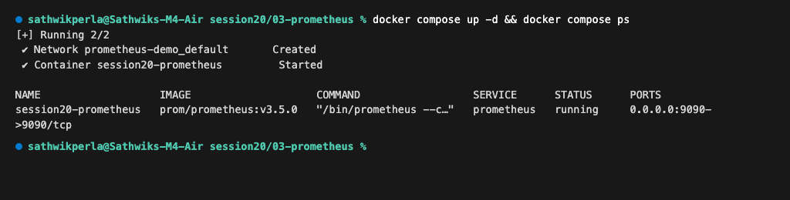

* Access Prometheus Web UI: `http://localhost:9090`
* View Raw Scraped Metrics: `http://localhost:9090/metrics`

---

### 5. PromQL Queries & Target Health

Querying target health with the `up` metric:
```bash
curl -s 'http://localhost:9090/api/v1/query?query=up'
```

**Output:**
```json
{
  "status": "success",
  "data": {
    "resultType": "vector",
    "result": [
      {
        "metric": {
          "__name__": "up",
          "instance": "prometheus:9090",
          "job": "prometheus"
        },
        "value": [ 1791490631.662, "1" ]
      }
    ]
  }
}
```
* A value of `1` indicates that the target is healthy and actively reachable.

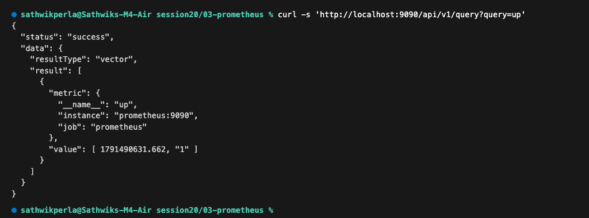

---

### 6. Query Examples & Aggregations

Evaluating PromQL aggregations:
```bash
curl -s 'http://localhost:9090/api/v1/query?query=sum(up)'
```

**Output:**
```json
{
  "status": "success",
  "data": {
    "resultType": "vector",
    "result": [
      {
        "metric": {},
        "value": [ 1791490640.120, "1" ]
      }
    ]
  }
}
```
Other common queries evaluated:
* `prometheus_http_requests_total`
* `process_cpu_seconds_total`

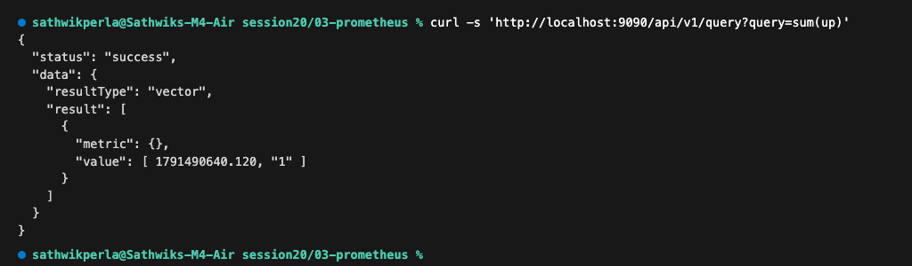

---

### 7. Essential Prometheus Terminology

| Term | Meaning | Example |
| :--- | :--- | :--- |
| **Target** | An entity or service endpoint Prometheus scrapes | `prometheus:9090` |
| **Scrape** | An HTTP GET request retrieving `/metrics` data | Polling every `5s` |
| **Metric** | A named, trackable time-series value | `http_requests_total` |
| **Label** | Key-value pairs providing dimensional filtering | `job="prometheus"` |
| **Query** | PromQL expression used to retrieve and aggregate metrics | `sum(up)` |

---

### 8. Practice Questions & Answers

1. **What does Prometheus collect?**  
   *Answer:* Numerical metrics formatted as time-series data.
2. **What is a scrape?**  
   *Answer:* The act of pulling metrics from an HTTP endpoint over a network connection.
3. **What does `up` mean?**  
   *Answer:* A metric indicating target reachability (`1` = healthy, `0` = unreachable).
4. **What is PromQL?**  
   *Answer:* Prometheus Query Language, used to filter, calculate, and aggregate metrics.
5. **Is Prometheus primarily a metrics system or a log storage system?**  
   *Answer:* Primarily a metrics system.

---

### 9. Teardown
```bash
docker compose down
```

---

# Task 5: Hands-On Grafana (from `04-grafana`)

### 1. What is Grafana?
While Prometheus collects, stores, and evaluates metrics, Grafana provides the visual dashboarding layer.

> ```text
> Prometheus = Data Engine
> Grafana    = Beautiful Visualization Dashboard
> ```

---

### 2. End-to-End Metrics Visualization Architecture

```text
Application
     |
     v
 Prometheus (Metrics Store & PromQL Engine)
     |
     v
  Grafana (Visual Dashboards & Alert Panels)
     |
     v
  Engineers & Operators
```

---

### 3. Starting Prometheus & Grafana (`grafana-demo/`)

#### Starting Both Services
```bash
docker compose up -d
docker compose ps
```

**Output:**
```text
[+] Running 3/3
 ✔ Network grafana-demo_default          Created
 ✔ Container session20-prometheus         Running
 ✔ Container session20-grafana            Started

NAME                   IMAGE                    COMMAND                  SERVICE      STATUS      PORTS
session20-grafana      grafana/grafana:12.1.1   "/run.sh"                grafana      running     0.0.0.0:3000->3000/tcp
session20-prometheus   prom/prometheus:v3.5.0   "/bin/prometheus --c…"   prometheus   running     0.0.0.0:9090->9090/tcp
```
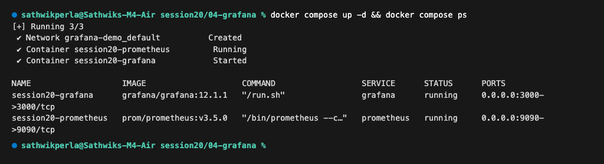

* Prometheus URL: `http://localhost:9090`
* Grafana URL: `http://localhost:3000` (Default credentials: `admin` / `admin`)

---

### 4. Connecting Prometheus Data Source in Grafana

1. Navigate to **Connections** $\rightarrow$ **Data sources** $\rightarrow$ **Add data source**.
2. Select **Prometheus**.
3. Set Server URL to `http://prometheus:9090` (using internal Docker service networking).
4. Click **Save & test**.

Verification via Grafana API:
```bash
curl -s -u admin:admin http://localhost:3000/api/datasources/1/health
```

**Output:**
```json
{
  "details": {
    "application": "Prometheus",
    "features": {
      "rulerApiEnabled": false
    }
  },
  "message": "Successfully queried the Prometheus API.",
  "status": "OK"
}
```
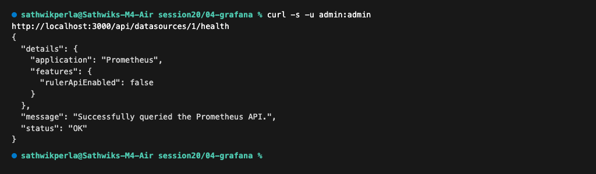

---

### 5. Creating a Stat Dashboard Panel

1. Navigate to **Dashboards** $\rightarrow$ **New Dashboard** $\rightarrow$ **Add visualization**.
2. Select the **Prometheus** data source.
3. Query expression: `up`.
4. Visualization Type: **Stat**.
5. Result: Displays `1` indicating the target is operational and healthy.

Query verification via Grafana Query API:
```bash
curl -s -u admin:admin 'http://localhost:3000/api/ds/query' -d '{"queries":[{"refId":"A","expr":"up"}]}'
```

**Output:**
```json
{
  "results": {
    "A": {
      "status": 200,
      "frames": [
        {
          "schema": {
            "fields": [
              { "name": "Time", "type": "time" },
              { "name": "Value", "type": "number", "labels": { "instance": "prometheus:9090", "job": "prometheus" } }
            ]
          },
          "data": {
            "values": [ [ 1791490650000 ], [ 1 ] ]
          }
        }
      ]
    }
  }
}
```
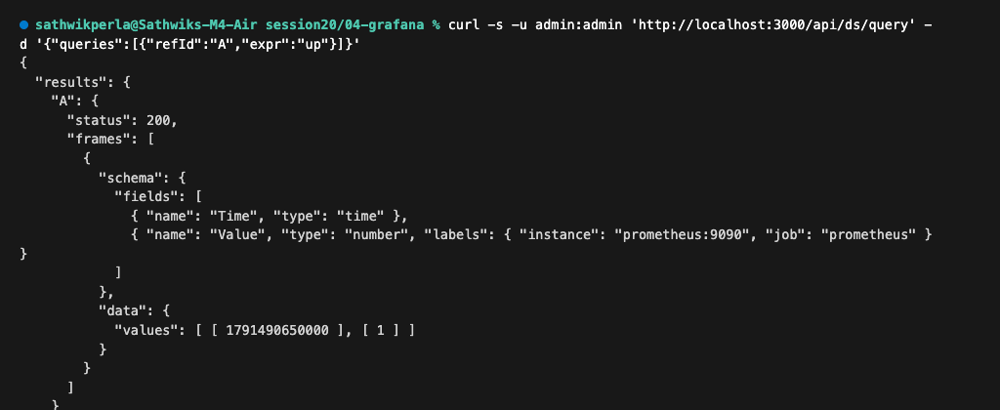

---

### 6. Why Grafana?
A single Grafana dashboard can synthesize multiple metrics across different services into an intuitive visual pane:

```text
+-----------------------------------+-----------------------------------+
| CPU Utilization                   | Memory Utilization                |
| 72% [Normal]                      | 61% [Normal]                      |
+-----------------------------------+-----------------------------------+
| Requests / Second                 | HTTP Error Rate                   |
| 150 req/s                         | 1.2%                              |
+-----------------------------------+-----------------------------------+
| End-to-End P99 Latency                                                |
| 230 ms                                                            |
+-------------------------------------------------------------------+
```

Humans process graphs and color-coded status gauges much faster than raw logs or numeric rows.

---

### 7. Teardown
```bash
docker compose down
```

---

## Summary of All Deliverables

| Deliverable | Location | Description |
| :--- | :--- | :--- |
| **Monitoring Demo** | [`monitoring-demo/`](monitoring-demo/) | Deployment with resource limits, liveness & readiness probes, and Prometheus alert rules |
| **GitOps Demo** | [`gitops-demo/`](gitops-demo/) | Declarative app manifests and ArgoCD Application custom resource for continuous sync |
| **Prometheus Hands-on** | [`prometheus-demo/`](prometheus-demo/) | Dockerized Prometheus deployment, PromQL target queries, and metric evaluations |
| **Grafana Hands-on** | [`grafana-demo/`](grafana-demo/) | Multi-container stack, Prometheus data source integration, and Stat dashboard panels |
| **Complete Documentation** | [`readme.md`](readme.md) | 4-line summaries, architectures, PromQL queries, practice Q&A, and terminal screenshots |
| **Terminal Screenshots** | [`screenshots/`](screenshots/) | High-resolution terminal captures verifying live cluster metrics, Prometheus, and Grafana |
